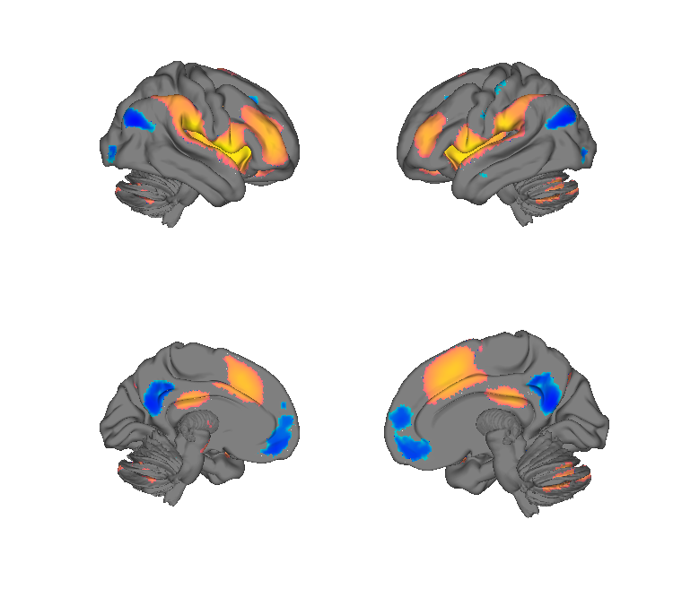
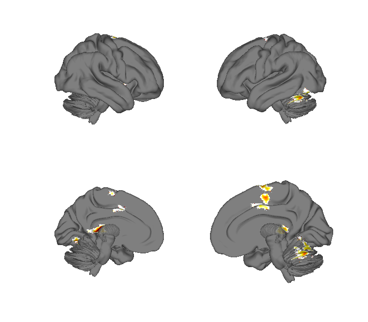
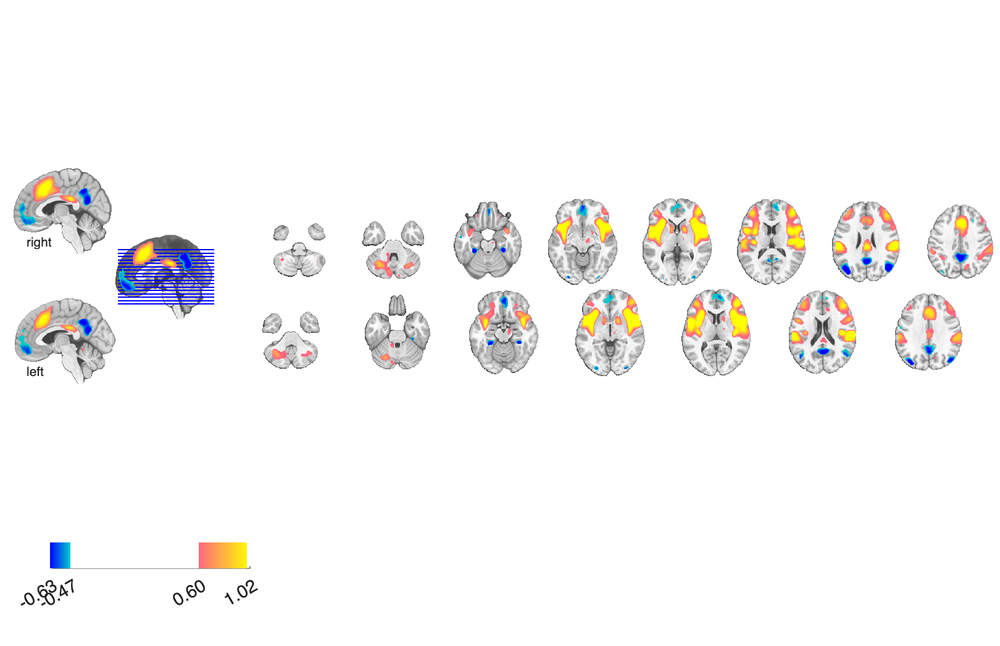
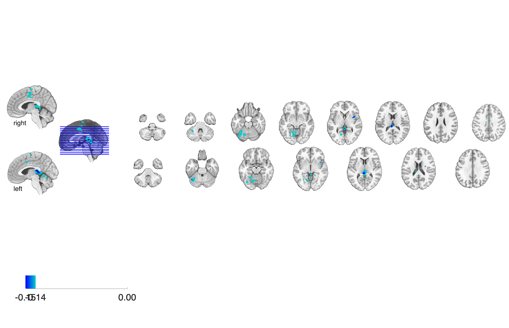

# Image-based pain & placebo meta-analysis, N = 603 (Zunhammer et al. 2021)

## Overview

Image-based meta-analysis of placebo analgesia in **N = 603** healthy
participants from 20 fMRI studies. Unlike coordinate-based methods,
this analysis pools voxelwise effect-size maps (Hedges' g), and reports
multiple sensitivity analyses: study as a **fixed effect** vs. as a
**random effect**, and three families of effects — (1) the **pain
effect** (pain vs. control stimulation), (2) the **placebo effect**
(placebo vs. control), and (3) the **placebo × rating correlation**
(voxelwise correlation with subject-level placebo analgesia magnitude).
Thresholds include Pareto-regularized permutation FDR / FWE05 and
probabilistic TFCE.

See [`Readme.rtf`](./Readme.rtf) for the authoritative author write-up
on the file-naming convention (also summarised below).

## Primary reference

Zunhammer, M., Spisák, T., Wager, T. D., Bingel, U., & the Placebo
Imaging Consortium (2021). Meta-analysis of neural systems underlying
placebo analgesia from individual participant fMRI data. *Nature
Communications*, 12, 1391.
[doi:10.1038/s41467-021-21179-3](https://doi.org/10.1038/s41467-021-21179-3)
· [local PDF](./zunhammer_2021_placebo_meta-analysis_final.pdf)

## Key images

| Pain effect (FWE05) | Placebo effect (TFCE-FWE05) |
| --- | --- |
|  |  |
|  |  |

The two principal study-level random-effects meta-maps: pain
activation and placebo-induced reduction. Unthresholded variants and
the placebo-rating correlation map (`Zunhammer2021_PlaceboRatingCorr_*`)
are also in `png_images/`; rendered by
[`visualize_contents.m`](./visualize_contents.m).

## How to load

Not registered in `load_image_set`. Load directly (file names follow a
consistent template — see the Readme):

```matlab
root = fileparts(which('zunhammer_2021_placebo_meta-analysis_final.pdf'));

% Placebo effect, random-effects study model:
pla_g_unthresh = fmri_data(fullfile(root, 'placebo_effect_study_as_random_effect', 'full_pla_g_unthresh.nii.gz'));
pla_tfce       = fmri_data(fullfile(root, 'placebo_effect_study_as_random_effect', 'full_pla_g_pperm_tfce_FWE05.nii.gz'));

% Pain effect:
pain_unthresh  = fmri_data(fullfile(root, 'pain_effect_study_as_random_effect', 'full_pain_g_unthresh.nii.gz'));
pain_fwe05     = fmri_data(fullfile(root, 'pain_effect_study_as_random_effect', 'full_pain_g_pperm_FWE05.nii.gz'));

% Placebo-rating correlation:
rcorr_unthresh = fmri_data(fullfile(root, 'placebo_rating_correlation_study_as_random_effect', 'full_pla_rrating_unthresh.nii.gz'));
```

### File-naming convention (per Readme.rtf)

For each effect family the file template is
`full_<effect>_g_<stat>.nii.gz` where `<effect>` is `pain`,
`pla` (placebo), or `pla_rrating` (placebo × rating r), and `<stat>` is:

| Suffix | Meaning |
| --- | --- |
| `_g_unthresh` | Hedges' g effect-size map (unthresholded). |
| `_g_SE` | Standard error of the g map. |
| `_g_z` | Z-transformed effect map. |
| `_g_p_map` | Parametric p-value map. |
| `_g_p_map_perm` | Permutation-based p-value map. |
| `_g_pperm_FDR` | Pareto-permutation FDR-thresholded map. |
| `_g_pperm_FWE05` | Pareto-permutation FWE p < 0.05. |
| `_g_pperm_FWE05_{pos,neg}` | Same, positive- / negative-only. |
| `_g_pperm_tfce_FWE05`, `_g_pperm_tfce_FDR` | Probabilistic TFCE-enhanced versions of the above. |

## Construction scripts

| File | What it does |
| --- | --- |
| `scripts/viz zunhammer placebo decreases.m` | Author's visualisation script for placebo-decrease maps. |

## File inventory (top-level)

| Path | Type | What it is |
| --- | --- | --- |
| `pain_effect_study_as_random_effect/` | dir | Pain-effect g maps, random-effects model (10 NIfTIs). |
| `pain_effect_study_as_fixed_effect/` | dir | Pain-effect g maps, fixed-effects model. |
| `placebo_effect_study_as_random_effect/` | dir | Placebo-effect g maps, random-effects model (incl. TFCE). |
| `placebo_effect_study_as_fixed_effect/` | dir | Placebo-effect g maps, fixed-effects model. |
| `placebo_rating_correlation_study_as_random_effect/` | dir | Voxelwise correlation between placebo g and subject-level rating, random-effects model. |
| `placebo_rating_correlation_study_as_fixed_effect/` | dir | Same, fixed-effects model. |
| `scripts/` | dir | Author MATLAB visualisation. |
| `Readme.rtf` | text | Author readme (file naming + TFCE description). |
| `zunhammer_2021_placebo_meta-analysis_final.pdf` | PDF | Primary reference. |
| `visualize_contents.m` | MATLAB | Regenerates `png_images/`. |

## Citations

- Zunhammer M, Spisák T, Wager TD, Bingel U, Placebo Imaging Consortium
  (2021). Meta-analysis of neural systems underlying placebo analgesia
  from individual participant fMRI data. *Nat Commun* 12:1391.
  [doi:10.1038/s41467-021-21179-3](https://doi.org/10.1038/s41467-021-21179-3)
- Spisák T, Spisák Z, Zunhammer M, et al. (2019). Probabilistic TFCE: a
  generalized combination of cluster size and voxel intensity to
  increase statistical power. *NeuroImage* 185:12–26.
  [doi:10.1016/j.neuroimage.2018.09.078](https://doi.org/10.1016/j.neuroimage.2018.09.078)
