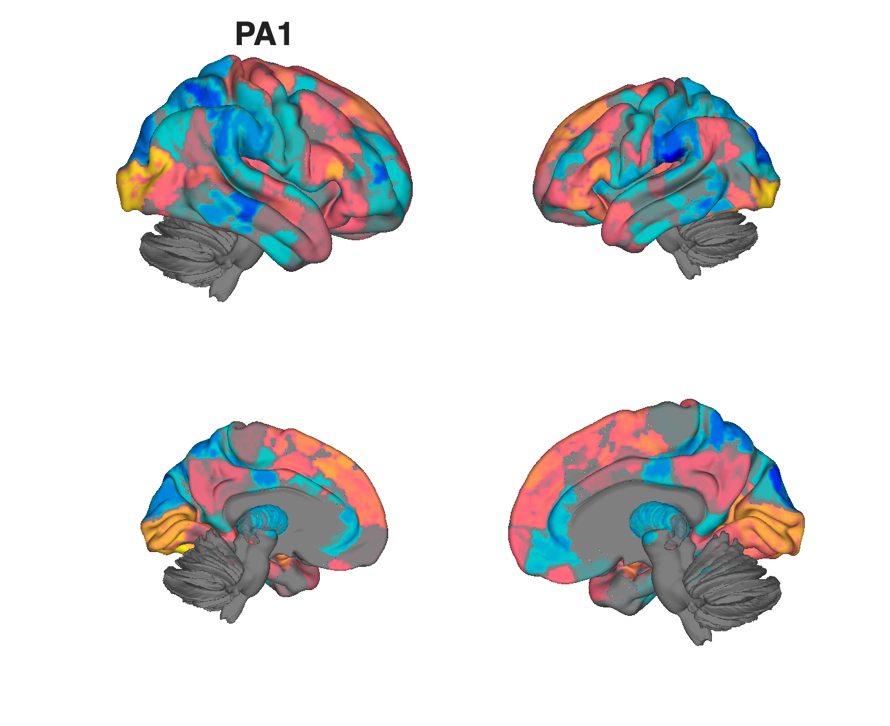
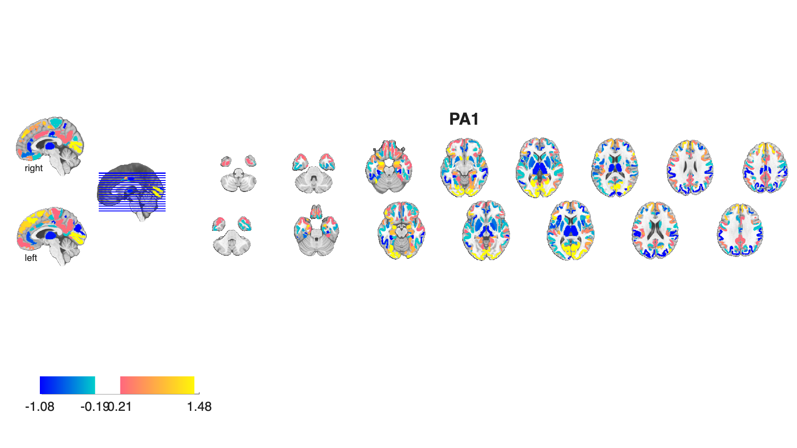
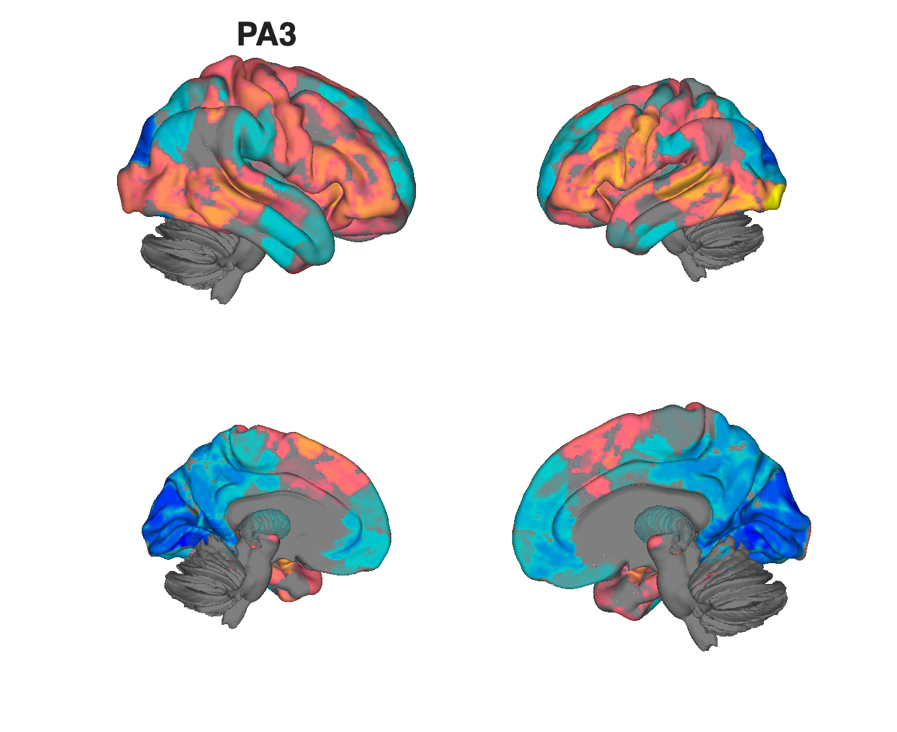
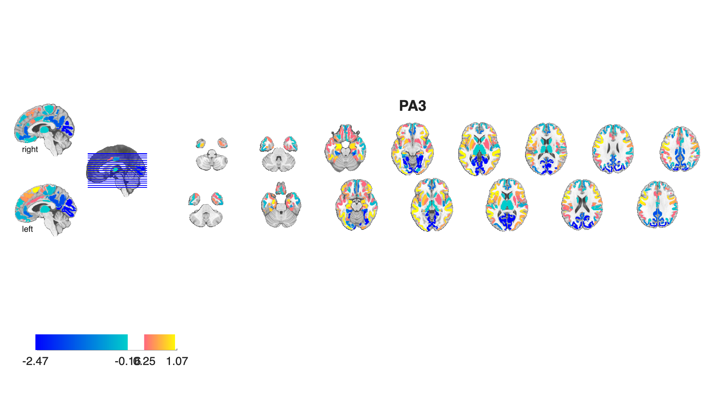
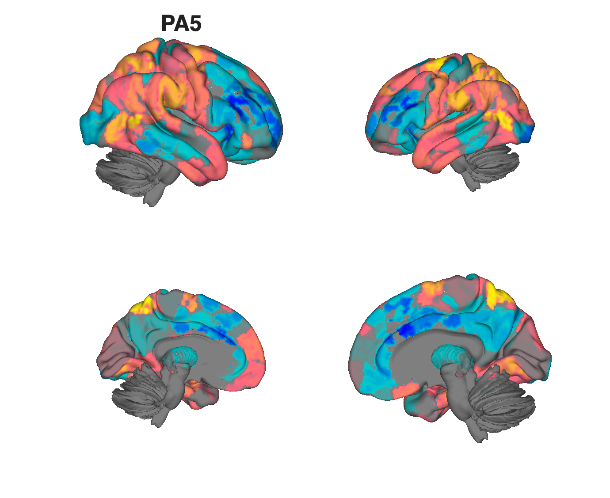
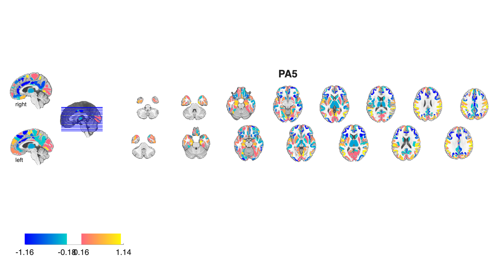
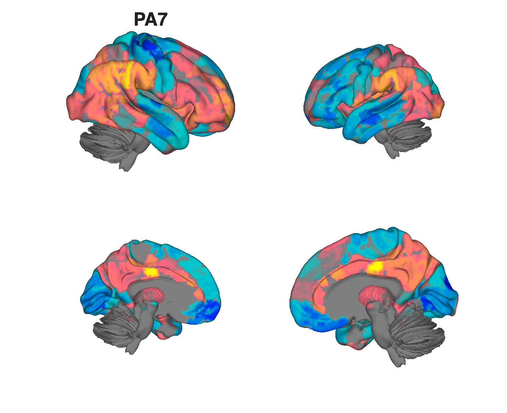
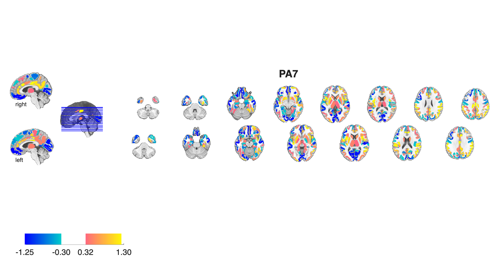

# RDoC factor maps (Quah, Saggar et al. 2025)

## Overview

Eight **data-driven latent factor maps** (`PA1`–`PA8`) derived from a
**bifactor analysis of task-fMRI activations** across a wide RDoC
(Research Domain Criteria) battery. The factors operationalise
transdiagnostic dimensions of brain function and complement the verbal
RDoC framework with empirical, data-driven maps. Each factor map is
provided as a standalone NIfTI plus a combined CANlab `fmri_data`
object with attached metadata (Neurosynth topic labels and the
original factor names).

This folder is one of the most fully built-out in the repo: the original
[`readme.txt`](./readme.txt) contains a per-file description, and a
ready-to-run publish workflow regenerates an HTML report into
`published_output/`.

**Primary reference (open access).** Quah, S. K. L., Jo, B., Geniesse, C.,
Uddin, L. Q., Mumford, J. A., Barch, D. M., Fair, D. A., Gotlib, I. H.,
Poldrack, R. A., & Saggar, M. (2025). *A data-driven latent variable
approach to validating the research domain criteria framework.*
**Nature Communications, 16**, 830.
[doi:10.1038/s41467-025-55831-z](https://doi.org/10.1038/s41467-025-55831-z)
· [local PDF](./Quah_2025_Saggar_factor_maps_natcomms.pdf)

> The folder is named `2024_…` but the paper was published in Jan 2025.

## Key images

Author-curated surfaces from [`figures/`](./figures) — one row per
factor (showing PA1, PA3, PA5, PA7 here; PA2/PA4/PA6/PA8 are the
companion factors):

| Factor | Surface | Axial montage |
| --- | --- | --- |
| PA1 |  |  |
| PA3 |  |  |
| PA5 |  |  |
| PA7 |  |  |

Cached pages from the source PDF are also included:
`pdf_page-05.png`, `pdf_page-06.png`, `pdf_page-07.png`,
`page7_bottom_center.png`, `page7_datadriven_zoom.png`.

[`visualize_contents.m`](./visualize_contents.m) regenerates the same
figures into `png_images/` using `canlab_render_patterns`. A richer
HTML report is produced by `publish_quah_factor_map_report.m`.

## How to load

These maps are not yet registered as a `load_image_set` keyword. Load
the combined `fmri_data` object directly:

```matlab
S = load(which('quah_factor_obj_combined.mat'));   % loads factor_obj_combined
factor_obj_combined.metadata_table                  % image names + topic labels
```

Or load any individual factor:

```matlab
pa3 = fmri_data(which('PA3.nii.gz'));
```

## Construction scripts

| File | What it does |
| --- | --- |
| [`quah_factor_map_montages.m`](./quah_factor_map_montages.m) | Loads each `PA*.nii.gz`, renders montage + surface PNGs into `figures/`, concatenates into `factor_obj_combined`, computes spatial correlations, derives Neurosynth topic labels, writes `quah_factor_obj_combined.mat`. |
| [`publish_quah_factor_map_report.m`](./publish_quah_factor_map_report.m) | Wraps the above with MATLAB `publish` to produce HTML into `published_output/`. |

## File inventory

| File | Type | What it is |
| --- | --- | --- |
| `PA1.nii.gz` … `PA8.nii.gz` | NIfTI | **Factor maps** — one per latent factor (8 in total). |
| `quah_factor_obj_combined.mat` | MAT (`fmri_data`) | Concatenated `fmri_data` object with all 8 factors and metadata. |
| `factor_names.txt` | text | Human-readable F1–F8 + general-factor G labels (from the paper). |
| `rdoc_fscores.csv` | CSV | Per-RDoC-construct factor scores. |
| `Shine_375_2mm.nii` | NIfTI | Reference Shine-et-al. 375-parcel atlas used in the analysis (Shine et al. 2019, *NeuroImage*). |
| `Shine_375_labels.csv` | CSV | Parcel labels for the Shine atlas. |
| `figures/` | dir | Author-curated montage + surface PNGs per factor. |
| `published_output/` | dir | Published HTML / image outputs. |
| `quah_factor_map_montages.m` | MATLAB | Constructor / figure-generation script. |
| `publish_quah_factor_map_report.m` | MATLAB | Wraps `montages.m` into an HTML report. |
| `Quah_2025_Saggar_factor_maps_natcomms.pdf` | PDF | Primary reference (OA). |
| `pdf_page-05.png`, `pdf_page-06.png`, `pdf_page-07.png` | PNG | Cached PDF excerpts. |
| `page7_bottom_center.png`, `page7_datadriven_zoom.png` | PNG | Cached PDF excerpts. |
| `readme.txt` | text | Original author readme (authoritative file list). |
| `visualize_contents.m` | MATLAB | Regenerates `png_images/`. |

## Citations

- Quah SKL, Jo B, Geniesse C, Uddin LQ, Mumford JA, Barch DM, Fair DA,
  Gotlib IH, Poldrack RA, Saggar M (2025). A data-driven latent
  variable approach to validating the research domain criteria
  framework. *Nat Commun* 16:830.
  [doi:10.1038/s41467-025-55831-z](https://doi.org/10.1038/s41467-025-55831-z)
- Shine JM, Breakspear M, Bell PT, et al. (2019). Human cognition
  involves the dynamic integration of neural activity and
  neuromodulatory systems. *Nat Neurosci* 22:289–296.
  [doi:10.1038/s41593-018-0312-0](https://doi.org/10.1038/s41593-018-0312-0)
