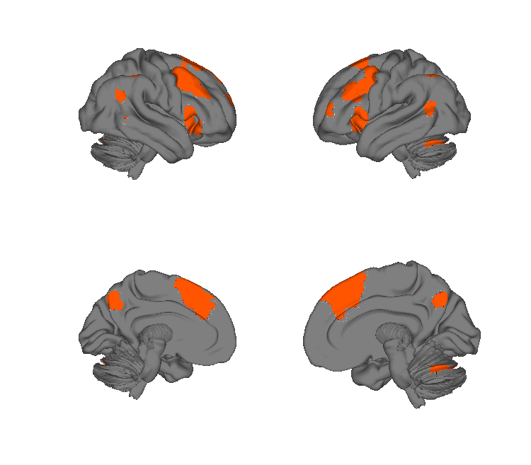
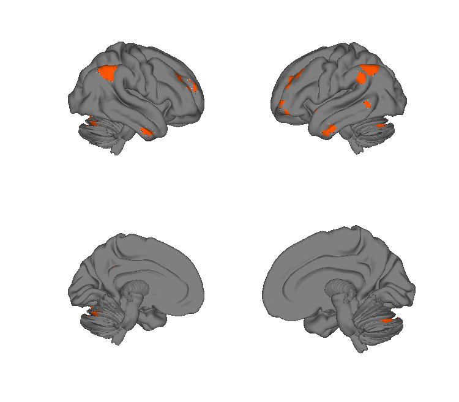
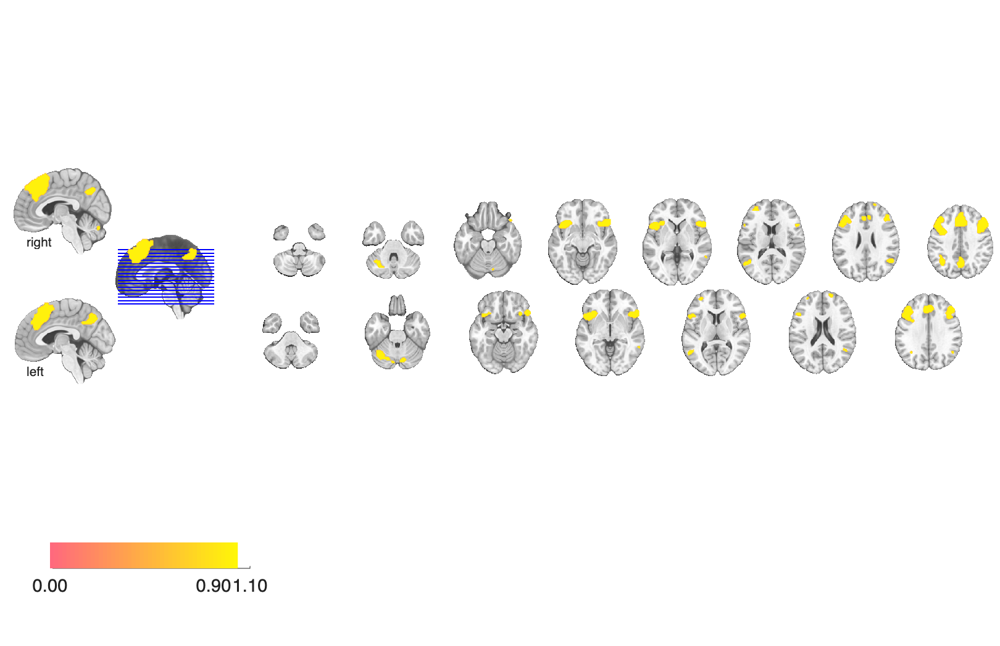
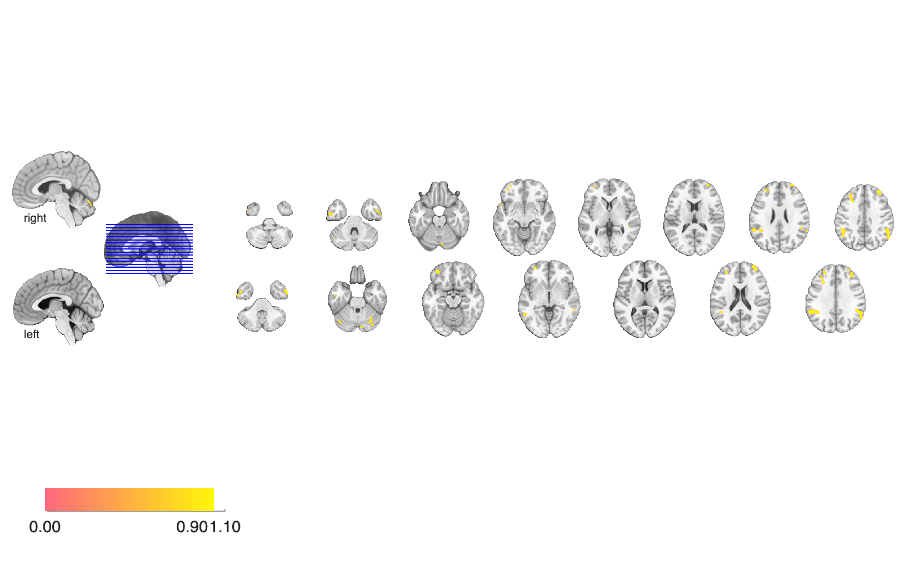

# Emotion-regulation Bayes-factor maps (Bo et al. 2024)

## Overview

Three Bayes-factor / consensus brain maps from a large pre-registered
emotion-regulation study, dissociating brain systems that support:

- **Common Appraisal** — activity shared across reappraisal and other
  emotion-regulation strategies,
- **Modifiable Emotion** — emotion-related activity that is amenable
  to cognitive regulation,
- **Non-modifiable Emotion** — emotion-related activity that resists
  cognitive regulation,
- **Reappraisal Only** — activity specific to cognitive reappraisal
  (above other regulation strategies).

The combined consensus is also provided as a `.mat` system-component
object.

**Primary reference.** Bo, K., Kraynak, T. E., Kwon, M., Sun, M.,
Gianaros, P. J., & Wager, T. D. (2024). *A systems identification
approach using Bayes factors to deconstruct the brain bases of emotion
regulation.* **Nature Neuroscience, 27**(5), 975–987.
[doi:10.1038/s41593-024-01605-7](https://doi.org/10.1038/s41593-024-01605-7)
· [local PDF](./Bo_2024_NatNeurosci_BayesFactor_emotion_regulation.pdf)

The four maps in this folder correspond to the four reappraisal-related
brain systems identified by the systems-identification analysis in two
independent fMRI cohorts (*n* = 182 and *n* = 176).

## Key images

| Common Appraisal | Reappraisal Only |
| --- | --- |
|  |  |
|  |  |

Two of the four reappraisal-related Bayes-factor system maps —
*Common Appraisal* (fronto-parietal-insular system engaged by both
reappraisal and emotion generation) and *Reappraisal Only* (anterior
prefrontal system selectively engaged by reappraisal). The companion
*Modifiable Emotion* and *Non-modifiable Emotion* maps are also in
`png_images/`. Rendered by
[`visualize_contents.m`](./visualize_contents.m).

## How to load

Not registered in `load_image_set`. Load each NIfTI directly:

```matlab
appr  = fmri_data(which('Common Appraisal.nii'));
mod   = fmri_data(which('Modifiable Emotion.nii'));
nmod  = fmri_data(which('Non-modifiable Emotion.nii'));
reapp = fmri_data(which('Reappraisal Only.nii'));
```

Or load the consensus system-component object:

```matlab
S = load(which('Final_SystemComponentMap_Consensus.mat'));
```

## File inventory

| File | Type | What it is |
| --- | --- | --- |
| `Common Appraisal.nii` | NIfTI | Bayes-factor map for activity common to appraisal strategies. |
| `Modifiable Emotion.nii` | NIfTI | Bayes-factor map for emotion activity amenable to regulation. |
| `Non-modifiable Emotion.nii` | NIfTI | Bayes-factor map for emotion activity that resists regulation. |
| `Reappraisal Only.nii` | NIfTI | Reappraisal-specific Bayes-factor map. |
| `Final_SystemComponentMap_Consensus.mat` | MAT | Consensus system-component object. |
| `Readme.txt` | text | Author notes (primary reference). |
| `visualize_contents.m` | MATLAB | Generates `png_images/`. |

## Citations

- Bo K et al. (2024). Emotion-regulation Bayes-factor meta-analysis.
  See [`Readme.txt`](./Readme.txt) for the precise venue and DOI.
