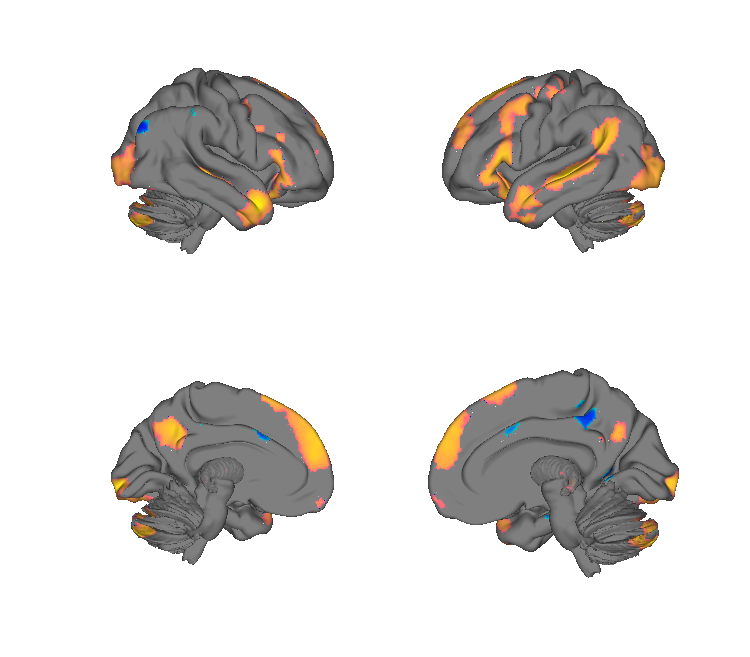
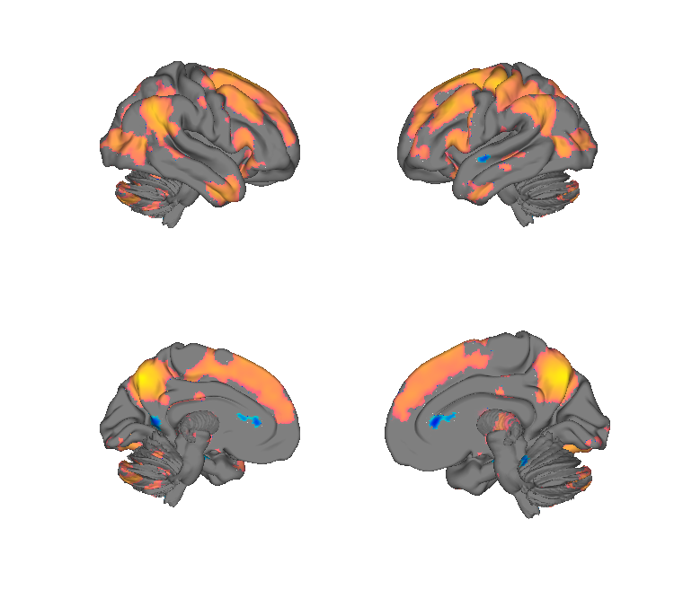
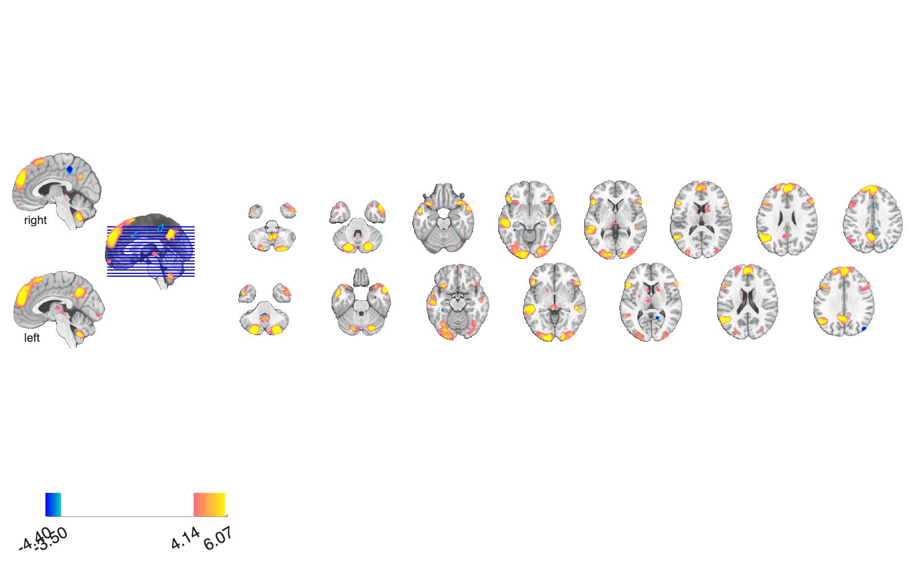
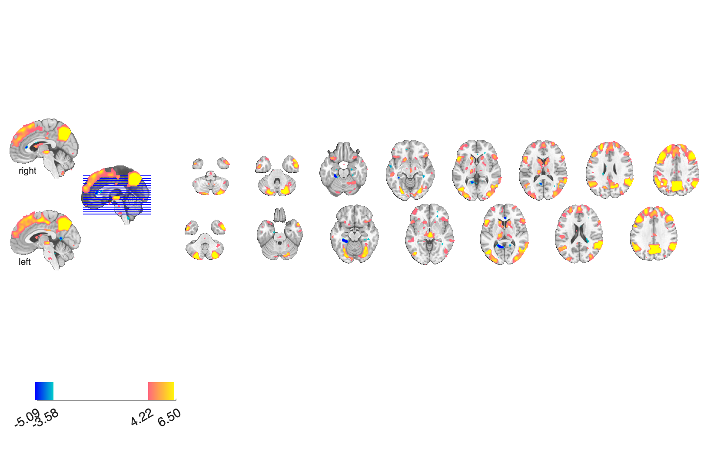

# Social vs Theory-of-Mind Bayes-factor maps (Miao et al. 2026)

## Overview

Voxel-wise **t-statistic** and **Bayes-factor classification** maps
dissociating brain systems supporting **social interaction** processing
from **Theory-of-Mind (ToM)** processing, across two presentation
modalities (audio narratives and written text) and their **modality-
conjunction**. For each modality, three image types are provided:

- `t_social_with_tom_*` — t-stat for *social with ToM controlled* (i.e.
  social-interaction activity over and above ToM).
- `t_tom_with_social_*` — t-stat for *ToM with social controlled*.
- `BF_class_*` — Bayes-factor classification map: positive values
  favour social-specific, negative values favour ToM-specific, near-
  zero values are ambiguous; the precise mapping is documented in the
  source paper.

These maps support voxel-level inference about whether a given brain
region is preferentially recruited by social-interaction perception,
ToM mentalising, or both, in either modality.

**Primary reference.** Miao et al. (2026). *Dissociating brain systems
for social interaction and Theory of Mind perception across modalities
using Bayes factors.* (In preparation / in press; consult the CANlab
publications page or contact the corresponding author for the
authoritative citation and DOI when available.)

## Key images

| Social > ToM (conjunction t-map) | ToM > Social (conjunction t-map) |
| --- | --- |
|  |  |
|  |  |

Conjunction (audio ∩ text) t-maps for the two competing contrasts
that dissociate social-interaction processing from theory-of-mind
processing. Modality-specific (audio, text) t-maps and the matching
three-level Bayes-factor classification maps
(`BF_class_audio / text / conjunction`) plus isosurfaces are all in
`png_images/`; rendered by [`visualize_contents.m`](./visualize_contents.m).

## How to load

Not registered in `load_image_set`. Load each NIfTI directly:

```matlab
% t-statistic maps
t_soc_aud  = fmri_data(which('t_social_with_tom_audio.nii'));
t_soc_txt  = fmri_data(which('t_social_with_tom_text.nii'));
t_soc_cnj  = fmri_data(which('t_social_with_tom_conjunction.nii'));

t_tom_aud  = fmri_data(which('t_tom_with_social_audio.nii'));
t_tom_txt  = fmri_data(which('t_tom_with_social_text.nii'));
t_tom_cnj  = fmri_data(which('t_tom_with_social_conjunction.nii'));

% Bayes-factor classification maps
bf_aud     = fmri_data(which('BF_class_audio.nii'));
bf_txt     = fmri_data(which('BF_class_text.nii'));
bf_cnj     = fmri_data(which('BF_class_conjunction.nii'));
```

## File inventory

| File | Type | What it is |
| --- | --- | --- |
| `t_social_with_tom_audio.nii` | NIfTI | Social>ToM t-map, audio narratives. |
| `t_social_with_tom_text.nii` | NIfTI | Social>ToM t-map, text. |
| `t_social_with_tom_conjunction.nii` | NIfTI | Social>ToM t-map, audio∩text conjunction. |
| `t_tom_with_social_audio.nii` | NIfTI | ToM>Social t-map, audio. |
| `t_tom_with_social_text.nii` | NIfTI | ToM>Social t-map, text. |
| `t_tom_with_social_conjunction.nii` | NIfTI | ToM>Social t-map, conjunction. |
| `BF_class_audio.nii` | NIfTI | Bayes-factor classification (social vs ToM), audio. |
| `BF_class_text.nii` | NIfTI | Bayes-factor classification, text. |
| `BF_class_conjunction.nii` | NIfTI | Bayes-factor classification, conjunction. |
| `visualize_contents.m` | MATLAB | Generates `png_images/`. |

## Citations

- Miao et al. (2026). Social vs Theory-of-Mind Bayes-factor maps. See
  the upcoming publication for the authoritative citation and DOI.
- For the systems-identification / Bayes-factor framework see Bo et
  al. (2024) *Nat Neurosci*
  [doi:10.1038/s41593-024-01605-7](https://doi.org/10.1038/s41593-024-01605-7).
