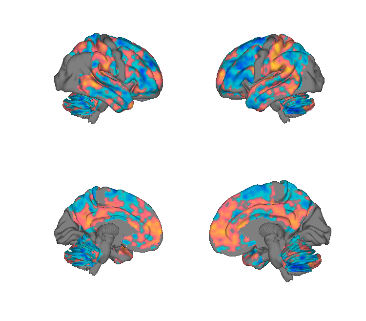
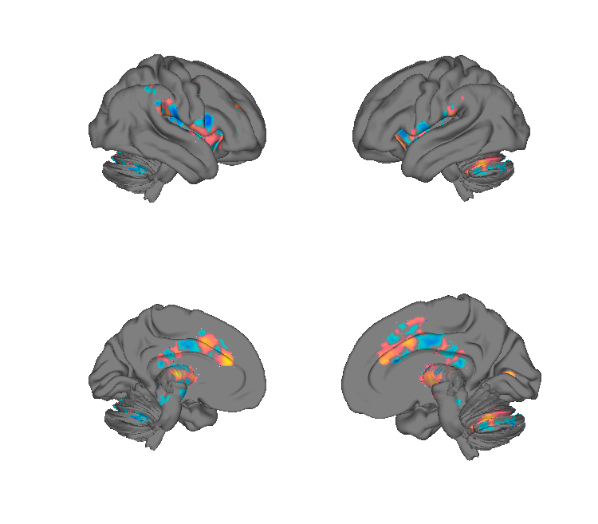
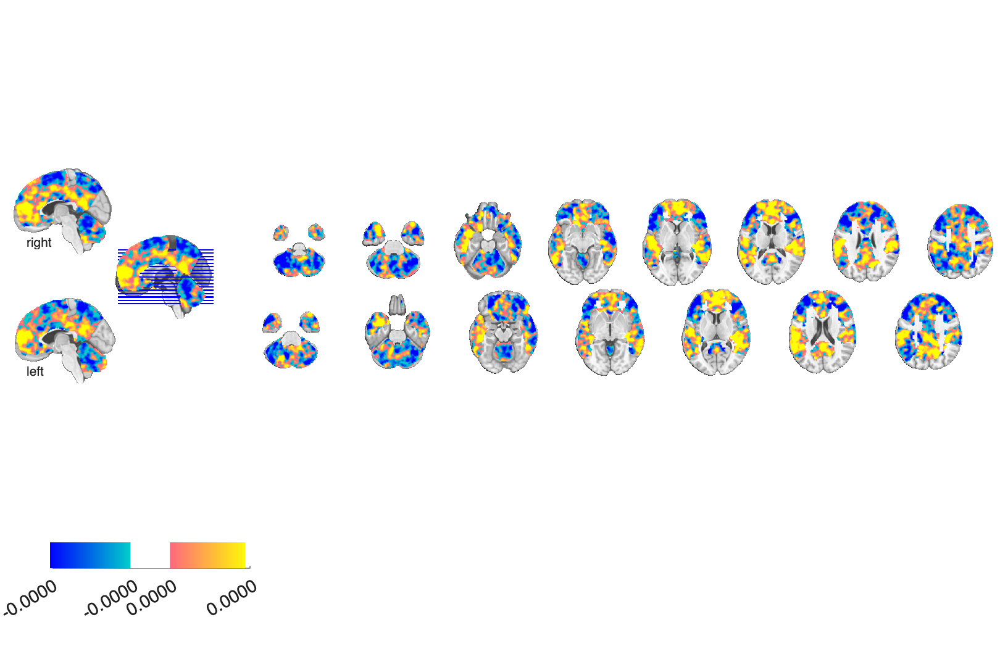
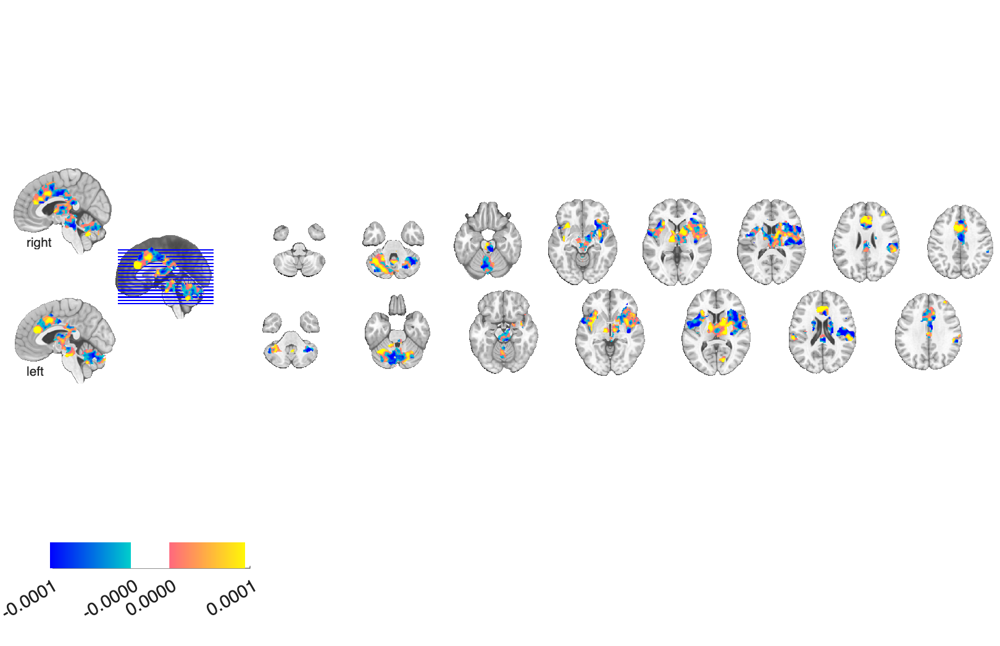

# Placebo-analgesia prediction patterns (Wager et al. 2011)

## Overview

Multivariate brain patterns that **predict the magnitude of individual
placebo analgesia** from pre-treatment fMRI activity. Two patterns are
provided: one derived from **anticipation of pain** and one from the
**pain period itself**. Trained with cross-validated multivariate
prediction (LASSO-PCR style) on N=47 healthy participants.

**Primary reference.** Wager, T. D., Atlas, L. Y., Leotti, L. A., & Rilling, J. K.
(2011). *Predicting individual differences in placebo analgesia: contributions
of brain activity during anticipation and pain experience.* **The Journal of
Neuroscience, 31**(2), 439–452.
[doi:10.1523/JNEUROSCI.3420-10.2011](https://doi.org/10.1523/JNEUROSCI.3420-10.2011)
· [local PDF](./Wager_2011_JNeurosci_placebo_prediction.pdf)

## Key images

| Anticipation pattern | Pain-period pattern |
| --- | --- |
|  |  |
|  |  |

The two main predictors. The anticipation pattern emphasises
fronto-parietal and posterior temporal regions; the pain-period
pattern shows decreases in limbic / paralimbic areas (insula, ACC)
that scale with placebo response. The alternate-anticipation
predictor (`PlaceboBrainPredict_Anticipation_*`) is also in
`png_images/`. Rendered by [`visualize_contents.m`](./visualize_contents.m).

## How to load

The maps live in Analyze (`.img`/`.hdr`) format under three subfolders.
Load directly with `fmri_data`:

```matlab
ant   = fmri_data(which('PlaceboPredict_Anticipation.img'));
pain  = fmri_data(which('PlaceboPredict_PainPeriod.img'));
ant2  = fmri_data(which('PlaceboBrainPredict_Anticipation.img'));
```

These patterns are not yet registered as a keyword in
[`load_image_set.m`](https://github.com/canlab/CanlabCore/blob/master/CanlabCore/Data_extraction/load_image_set.m);
add them by referencing the `.img` filenames in a `load_image_set` case.

## File inventory

| File | Type | What it is |
| --- | --- | --- |
| `Multivariate_PlaceboPredict_Anticipation/PlaceboPredict_Anticipation.img` (+ `.hdr`) | Analyze | Multivariate weights predicting placebo response from the anticipation period. |
| `Multivariate_PlaceboPredict_PainPeriod/PlaceboPredict_PainPeriod.img` (+ `.hdr`) | Analyze | Multivariate weights from the pain period. |
| `PlaceboBrainPredict_Anticipation/PlaceboBrainPredict_Anticipation.img` (+ `.hdr`) | Analyze | Alternate anticipation-period predictor (separate analysis). |
| `visualize_contents.m` | MATLAB | Generates the figures in `png_images/`. |

## Citations

- Wager TD, Atlas LY, Leotti LA, Rilling JK (2011). Predicting individual
  differences in placebo analgesia. *J Neurosci* 31:439–452.
  [doi:10.1523/JNEUROSCI.3420-10.2011](https://doi.org/10.1523/JNEUROSCI.3420-10.2011)
