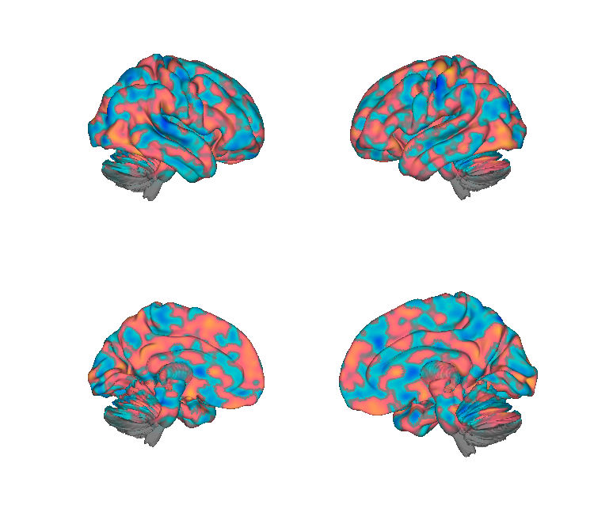
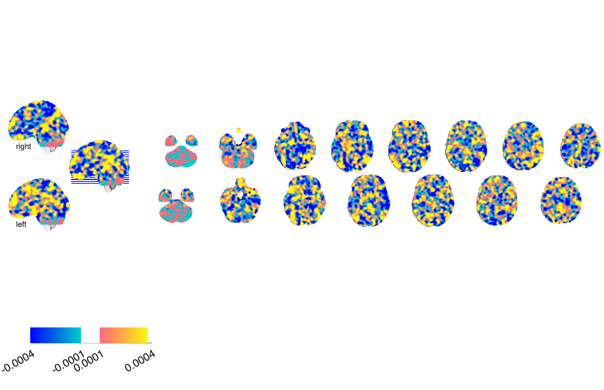

# PINES — Picture-Induced Negative Emotion Signature (Chang et al. 2015)

## Overview

The **Picture-Induced Negative Emotion Signature (PINES)** is a multivariate
fMRI brain pattern that predicts the **intensity of subjectively reported
negative emotion** in response to evocative pictures (IAPS). Developed using
LASSO-PCR with leave-one-subject-out cross-validation. PINES is sensitive
and specific to negative affect and dissociable from physical-pain signatures.

**Primary reference (open access).** Chang, L. J., Gianaros, P. J., Manuck,
S. B., Krishnan, A., & Wager, T. D. (2015). *A sensitive and specific
neural signature for picture-induced negative affect.* **PLoS Biology, 13**(6),
e1002180.
[doi:10.1371/journal.pbio.1002180](https://doi.org/10.1371/journal.pbio.1002180)
· [local PDF](./Chang_2015_PLoSBiol_PINES.pdf)

## Key images

| PINES — cortical surface | PINES — axial montage |
| --- | --- |
|  |  |

The leave-one-subject-out (LOSO) PINES weights —
`Rating_Weights_LOSO_2.nii`. Bootstrap-thresholded variants
(p<0.001 uncorrected and FDR q<0.05 k≥10) are also in `png_images/`.
Rendered by [`visualize_contents.m`](./visualize_contents.m).

## How to load

Registered as the `'pines'` keyword in
[`load_image_set.m`](https://github.com/canlab/CanlabCore/blob/master/CanlabCore/Data_extraction/load_image_set.m):

```matlab
[obj, networknames, imagenames] = load_image_set('pines');
% Or with NPS / SIIPS / VPS bundled:
[obj, networknames, imagenames] = load_image_set('npsplus');
```

Apply to new data:

```matlab
new_data    = fmri_data('my_contrast.nii');
pines_resp  = apply_mask(new_data, obj, 'pattern_expression', 'ignore_missing');
```

Or load the raw NIfTI:

```matlab
pines = fmri_data(which('Rating_Weights_LOSO_2.nii'));
```

## File inventory

| File | Type | What it is |
| --- | --- | --- |
| `Rating_Weights_LOSO_2.nii` (+ `.nii.gz`) | NIfTI | **PINES pattern** — leave-one-subject-out averaged weights. Loaded by `load_image_set('pines')`. |
| `Rating_LASSO_PCR_Boot5000_2_001_unc.nii.gz` | NIfTI | Bootstrap z-map (5000 iters, p<0.001 uncorrected). |
| `Rating_LASSO_PCR_boot5000_fdr05_k10_2.nii.gz` | NIfTI | FDR q<0.05, k≥10 thresholded bootstrap map. |
| `readme_apply_PINES_signature.mlx` | MATLAB live | Worked example of applying the signature. |
| `Chang_2015_PLoSBiol_PINES.pdf` | PDF | Primary reference (PLoS Biology, OA). |
| `visualize_contents.m` | MATLAB | Generates `png_images/`. |

## Citations

- Chang LJ, Gianaros PJ, Manuck SB, Krishnan A, Wager TD (2015). A sensitive
  and specific neural signature for picture-induced negative affect. *PLoS
  Biology* 13:e1002180.
  [doi:10.1371/journal.pbio.1002180](https://doi.org/10.1371/journal.pbio.1002180)
