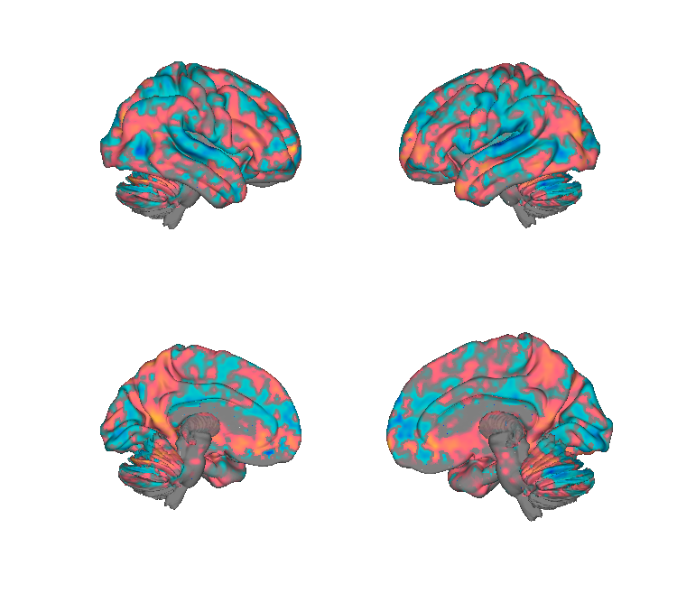
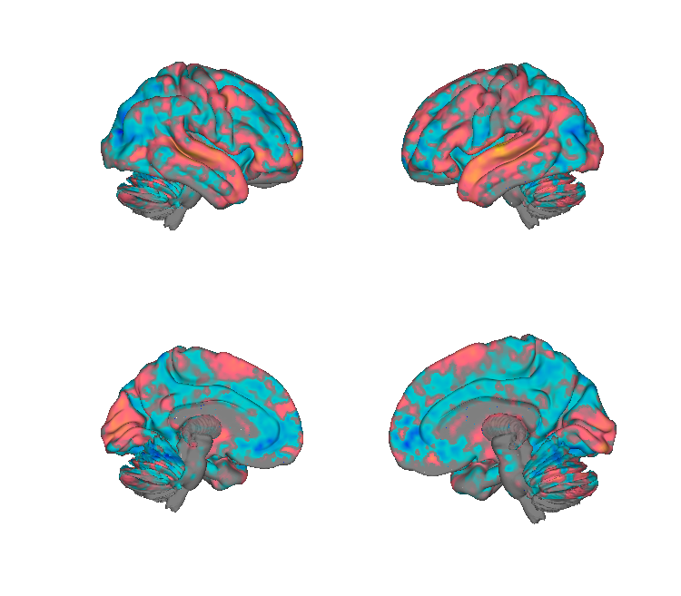
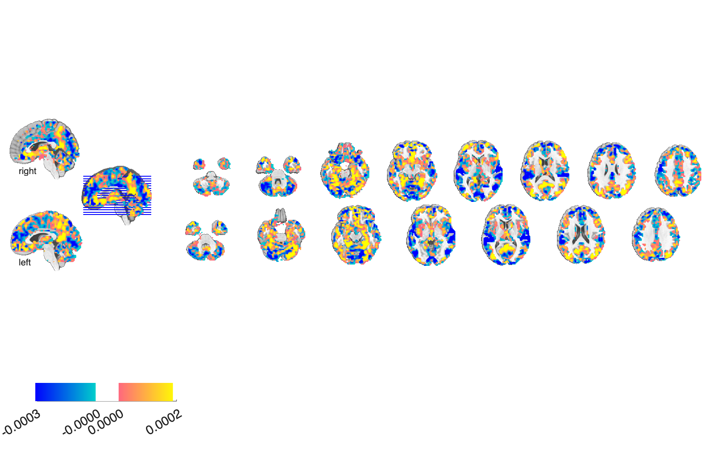
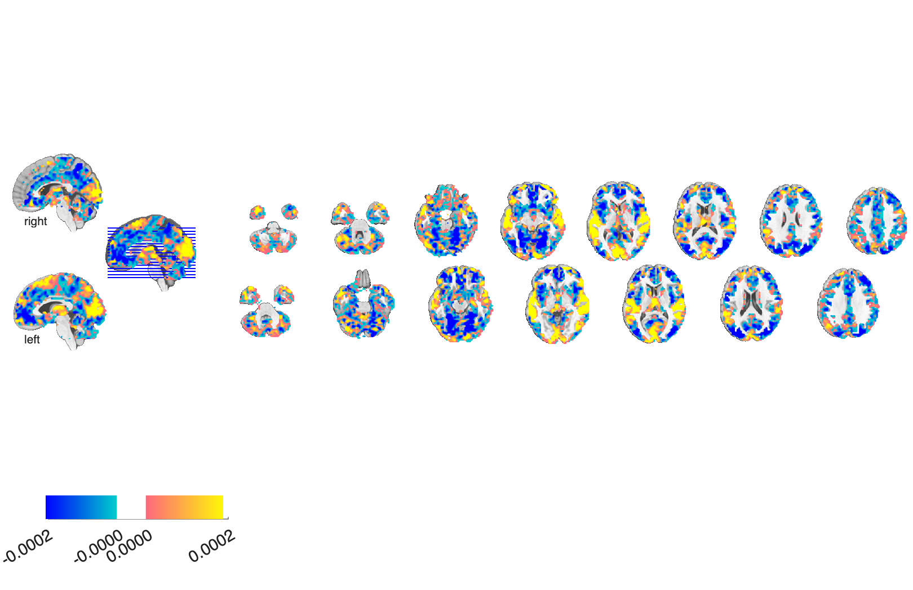

# Emotion-category BPLS patterns (Kragel & LaBar 2015)

## Overview

Seven whole-brain **bootstrapped partial-least-squares (BPLS) patterns**
that discriminate 7 emotion categories — *amused, angry, content, fearful,
neutral, sad, surprised* — from one another based on fMRI activity during
emotion induction. Each pattern is a bootstrap-z map (`BSz`, 10,000
iterations) of PLS regression weights.

**Primary reference.** Kragel, P. A., & LaBar, K. S. (2015).
*Multivariate neural biomarkers of emotional states are categorically
distinct.* **Social Cognitive and Affective Neuroscience, 10**(11),
1437–1448.
[doi:10.1093/scan/nsv032](https://doi.org/10.1093/scan/nsv032)

PDF not yet checked into this folder — fetch via the DOI above (Oxford OA-on-request).

## Key images

Two of the seven emotion-category BPLS patterns (all seven are
rendered into `png_images/`):

| Fearful | Amused |
| --- | --- |
|  |  |
|  |  |

The Angry, Content, Neutral, Sad, and Surprised patterns share the
same surface / montage / isosurface layout in `png_images/`. Rendered
by [`visualize_contents.m`](./visualize_contents.m).

## How to load

Registered as the `'kragelemotion'` keyword in
[`load_image_set.m`](https://github.com/canlab/CanlabCore/blob/master/CanlabCore/Data_extraction/load_image_set.m):

```matlab
[obj, networknames] = load_image_set('kragelemotion');
% networknames = {'Amused' 'Angry' 'Content' 'Fearful' 'Neutral' 'Sad' 'Surprised'}
```

Apply to new data (multi-pattern):

```matlab
new_data = fmri_data('my_contrast.nii');
[~, sim] = image_similarity_plot(new_data, 'mapset', obj, 'noplot');
```

## File inventory

The volume data are in Analyze `.img`/`.hdr` plus matching FreeSurfer
surface `.gii` files for each hemisphere and a midthickness `mesh` `.gii`,
all under a `Template_T1_IXI555_MNI152_GS` space (per the filename suffix).

| Pattern | Volume | Surfaces |
| --- | --- | --- |
| Amused | `mean_3comp_amused_group_emotion_PLS_beta_BSz_10000it.img` | `{lh,rh,mesh}.intensity_mean_3comp_amused_...gii` |
| Angry | `..._angry_...img` | `..._angry_...gii` |
| Content | `..._content_...img` | `..._content_...gii` |
| Fearful | `..._fearful_...img` | `..._fearful_...gii` |
| Neutral | `..._neutral_...img` | `..._neutral_...gii` |
| Sad | `..._sad_...img` | `..._sad_...gii` |
| Surprised | `..._surprised_...img` | `..._surprised_...gii` |

Additional files:

| File | Type | What it is |
| --- | --- | --- |
| `compare_kragel_wager_emometa.m` | MATLAB | Compares these BPLS patterns to Wager/Kang 2015 emotion-meta maps. |
| `kragel_wager_cross_corr.png` | PNG | Cross-correlation figure from `compare_*` script. |
| `visualize_contents.m` | MATLAB | Generates `png_images/`. |

## Citations

- Kragel PA, LaBar KS (2015). Multivariate neural biomarkers of emotional
  states are categorically distinct. *Soc Cogn Affect Neurosci* 10:1437–1448.
  [doi:10.1093/scan/nsv032](https://doi.org/10.1093/scan/nsv032)
