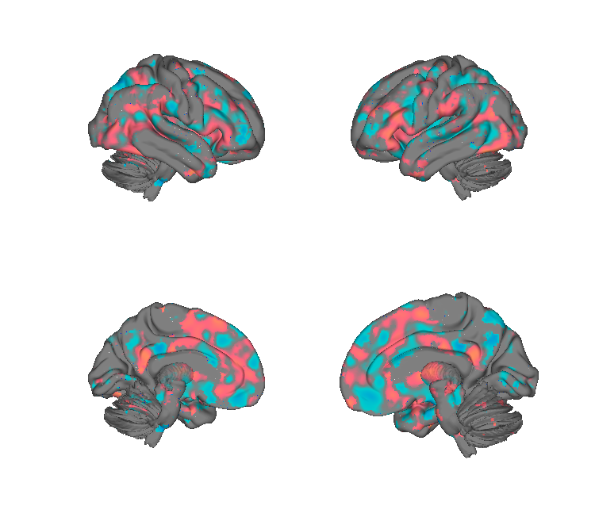
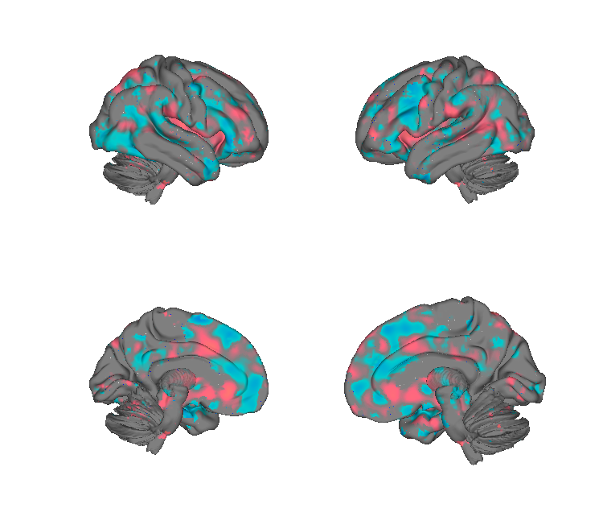
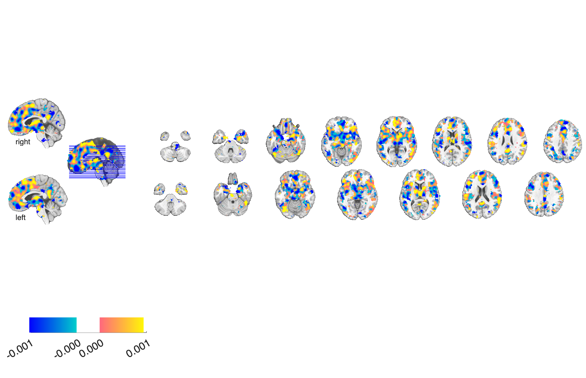
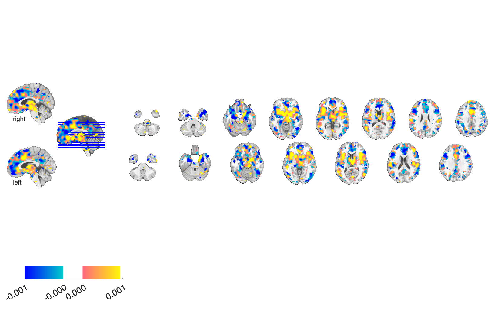

# dpSP / Romantic-Rejection signature (Woo et al. 2014)

## Overview

A **distributed pain-vs-other** brain pattern (`dpSP`) that discriminates
**social rejection imagery** (recalling a recent romantic breakup) from
control conditions. Trained with cross-validated multivariate prediction
on N=59 participants who had recently experienced an unwanted romantic
break-up. The folder also contains an analogous "hot" pain pattern from
the same study and a 6 mm searchlight pattern in dACC.

**Primary reference (open access).** Woo, C.-W., Koban, L., Kross, E.,
Lindquist, M. A., Banich, M. T., Ruzic, L., Andrews-Hanna, J. R., &
Wager, T. D. (2014). *Separate neural representations for physical pain
and social rejection.* **Nature Communications, 5**, 5380.
[doi:10.1038/ncomms6380](https://doi.org/10.1038/ncomms6380)
· [local PDF](./Woo_2014_NatComms_dpSP_romantic_rejection.pdf)

> The folder is named `2015_…` but the paper was published in Nov 2014.

## Key images

| Rejection signature (dpSP) | Heat companion |
| --- | --- |
|  |  |
|  |  |

The whole-brain SVM weights for rejection-vs-others (left) and the
companion heat-pain pattern from the same paper (right). The
6 mm searchlight dACC patterns for both conditions are also in
`png_images/`. Rendered by [`visualize_contents.m`](./visualize_contents.m).

## How to load

Registered as the `'rejection'` keyword in
[`load_image_set.m`](https://github.com/canlab/CanlabCore/blob/master/CanlabCore/Data_extraction/load_image_set.m):

```matlab
[obj, networknames, imagenames] = load_image_set('rejection');
% Or with other negative-affect signatures:
[obj, networknames, imagenames] = load_image_set('npsplus');
```

Or load directly:

```matlab
rej = fmri_data(which('dpsp_rejection_vs_others_weights_final.nii'));
```

## File inventory

| File | Type | What it is |
| --- | --- | --- |
| `dpsp_rejection_vs_others_weights_final.nii` (+ `.nii.gz`) | NIfTI | **Rejection signature** — distributed pattern discriminating rejection vs other conditions. Loaded by `load_image_set('rejection')`. |
| `dpsp_hot_vs_others_weights_final.nii.gz` | NIfTI | Companion pattern for noxious heat vs other conditions, from the same study. |
| `dACC_hw_pattern_sl6mm.nii.gz` | NIfTI | 6 mm-searchlight pattern in dACC, hot-water condition. |
| `dACC_rf_pattern_sl6mm.nii.gz` | NIfTI | 6 mm-searchlight pattern in dACC, rejection condition. |
| `Woo_2014_NatComms_dpSP_romantic_rejection.pdf` | PDF | Primary reference (OA). |
| `visualize_contents.m` | MATLAB | Generates `png_images/`. |

## Citations

- Woo CW, Koban L, Kross E, Lindquist MA, Banich MT, Ruzic L,
  Andrews-Hanna JR, Wager TD (2014). Separate neural representations for
  physical pain and social rejection. *Nat Commun* 5:5380.
  [doi:10.1038/ncomms6380](https://doi.org/10.1038/ncomms6380)
