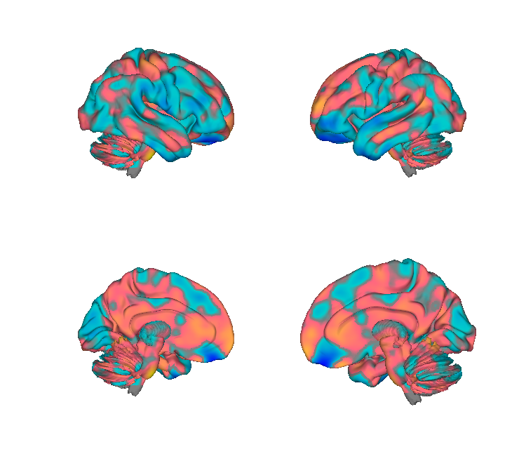
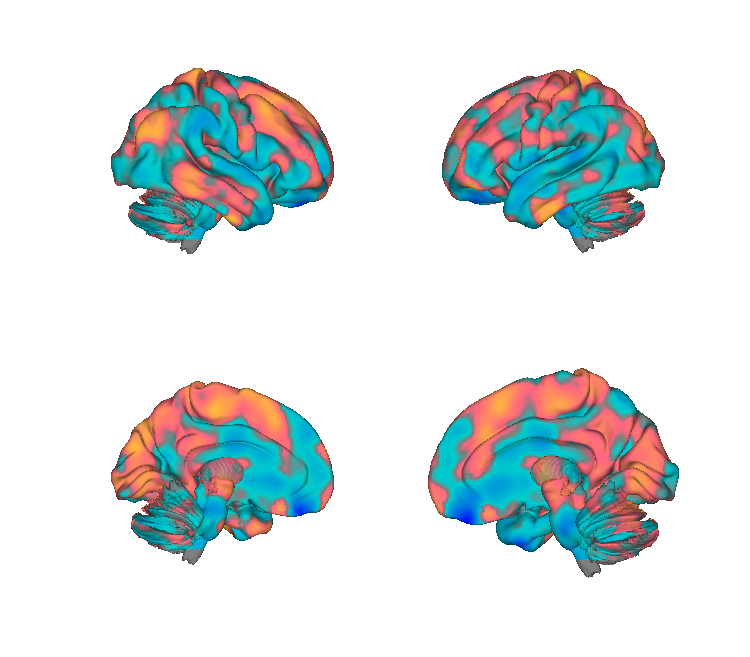
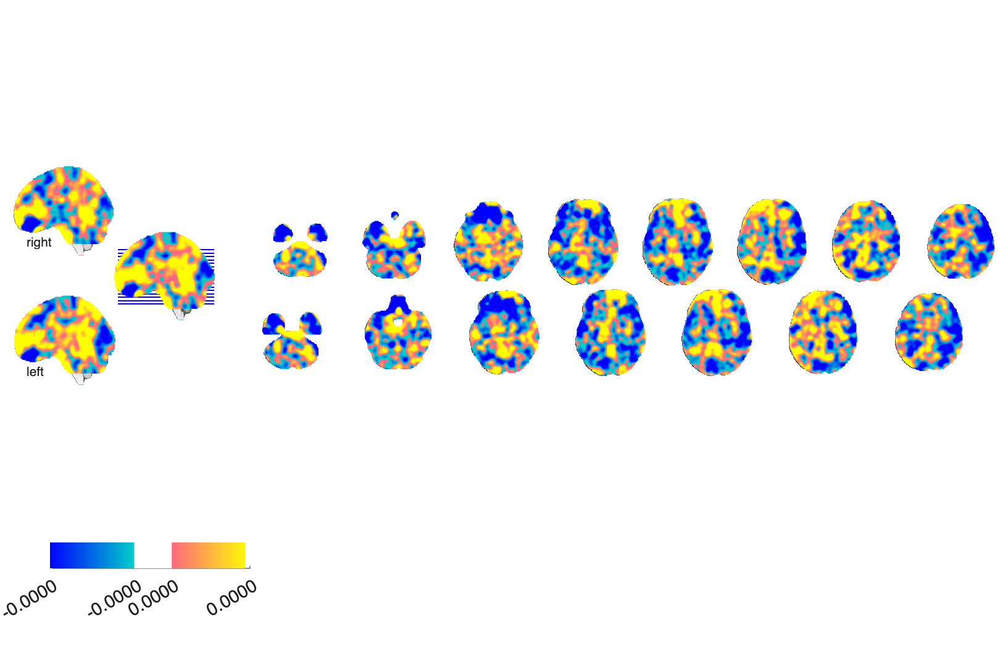
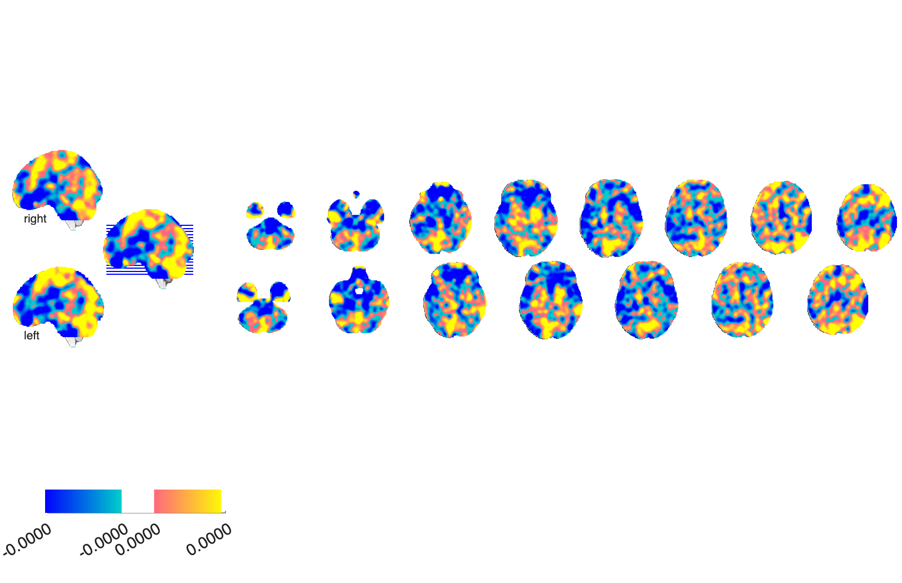

# Autonomic-response brain patterns — GSR & HR (Eisenbarth et al. 2016)

## Overview

Two multivariate fMRI brain patterns trained to predict **trial-by-trial
autonomic responses to thermal pain**:

- `GSR` — galvanic skin response (skin-conductance level)
- `HR`  — heart-rate change

Both are derived from cross-validated multivariate regression on N=33
participants undergoing thermal pain stimulation. The patterns dissociate
the brain bases of sympathetic and cardiac responses to pain.

**Primary reference.** Eisenbarth, H., Chang, L. J., & Wager, T. D. (2016).
*Multivariate brain prediction of heart rate and skin conductance responses
to social threat.* **The Journal of Neuroscience, 36**(47), 11987–11998.
[doi:10.1523/JNEUROSCI.3672-15.2016](https://doi.org/10.1523/JNEUROSCI.3672-15.2016)
· [local PDF](./Eisenbarth_2016_JN_Multivariate_heart_SCL.pdf)

## Key images

| GSR (skin-conductance) | HR (heart-rate) |
| --- | --- |
|  |  |
|  |  |

The two unthresholded autonomic-response patterns. The
*p* < 0.005 thresholded display variants are also in `png_images/`
(`*_p005thr_*.png`). Rendered by
[`visualize_contents.m`](./visualize_contents.m).

## How to load

Registered as `'gsr'` and `'hr'` keywords in
[`load_image_set.m`](https://github.com/canlab/CanlabCore/blob/master/CanlabCore/Data_extraction/load_image_set.m):

```matlab
[gsr_obj, ~, ~] = load_image_set('gsr');
[hr_obj,  ~, ~] = load_image_set('hr');

% Or bundled with NPS / SIIPS / PINES / Rejection / VPS:
[obj, networknames, imagenames] = load_image_set('npsplus');
```

Or load directly:

```matlab
gsr = fmri_data(which('ANS_Eisenbarth_JN_2016_GSR_pattern.img'));
hr  = fmri_data(which('ANS_Eisenbarth_JN_2016_HR_pattern.img'));
```

## File inventory

| File | Type | What it is |
| --- | --- | --- |
| `ANS_Eisenbarth_JN_2016_GSR_pattern.img` (+ `.img.gz`, `.hdr`) | Analyze | **GSR pattern** — unthresholded. Loaded by `load_image_set('gsr')`. |
| `ANS_Eisenbarth_JN_2016_GSR_pattern_p005thr.img.gz` (+ `.hdr`) | Analyze | GSR pattern, p<0.005 thresholded display version. |
| `ANS_Eisenbarth_JN_2016_HR_pattern.img` (+ `.img.gz`, `.hdr`) | Analyze | **HR pattern** — unthresholded. Loaded by `load_image_set('hr')`. |
| `ANS_Eisenbarth_JN_2016_HR_pattern_p005thr.img.gz` (+ `.hdr`) | Analyze | HR pattern, p<0.005 thresholded display version. |
| `Eisenbarth_2016_JN_Multivariate_heart_SCL.pdf` | PDF | Primary reference. |
| `visualize_contents.m` | MATLAB | Generates `png_images/`. |

## Citations

- Eisenbarth H, Chang LJ, Wager TD (2016). Multivariate brain prediction
  of heart rate and skin conductance responses to social threat. *J
  Neurosci* 36:11987–11998.
  [doi:10.1523/JNEUROSCI.3672-15.2016](https://doi.org/10.1523/JNEUROSCI.3672-15.2016)
