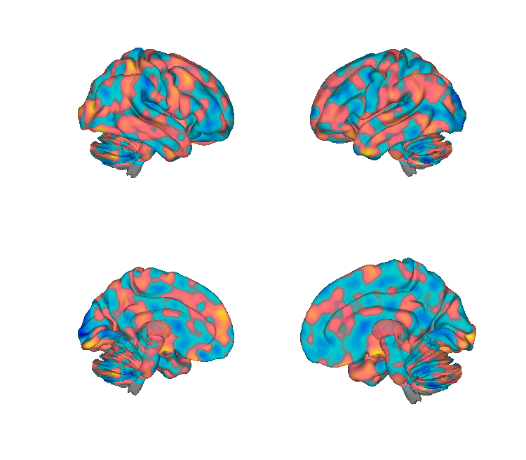
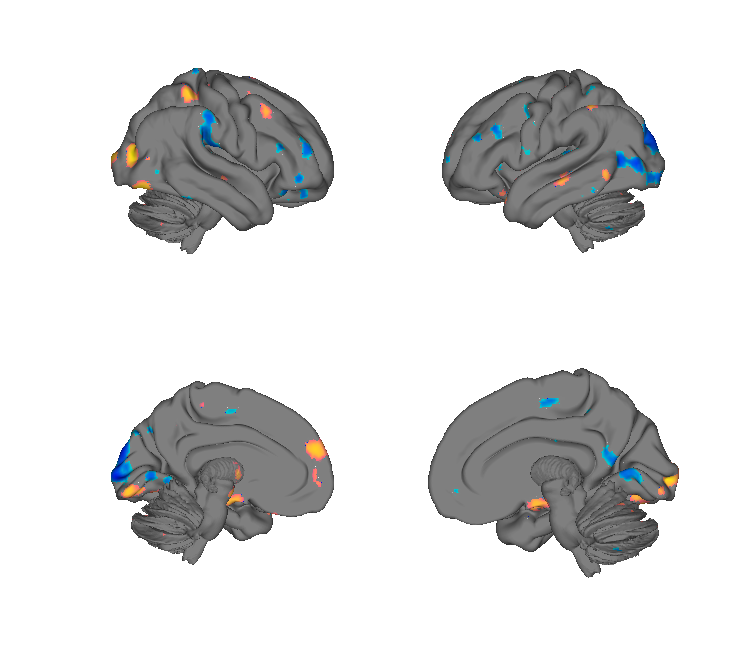
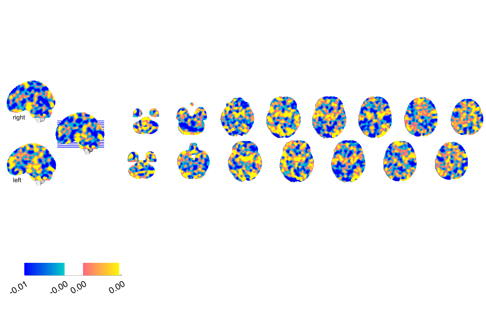
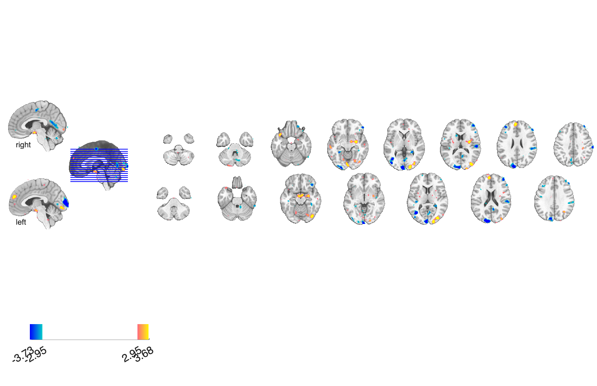

# VPS — Vicarious-Pain Signature (Krishnan et al. 2016)

## Overview

The **Vicarious-Pain Signature (VPS)** is a multivariate fMRI brain pattern
that predicts **observed (vicarious) pain intensity** when participants
view others in pain. Trained on N=28 in BMRK4 and validated across
multiple datasets. The VPS is **distinct from somatic-pain signatures** —
it shares some regions with the NPS/SIIPS but the predictive geometry
is different, supporting the view that vicarious and felt pain rely on
partly separable brain systems. An *occipital-removed* variant is also
provided to control for early-visual confounds when observing pain
imagery.

**Primary reference (open access).** Krishnan, A., Woo, C.-W., Chang,
L. J., Ruzic, L., Gu, X., López-Solà, M., Jackson, P. L., Pujol, J.,
Fan, J., & Wager, T. D. (2016). *Somatic and vicarious pain are
represented by dissociable multivariate brain patterns.* **eLife, 5**,
e15166.
[doi:10.7554/eLife.15166](https://doi.org/10.7554/eLife.15166)
· [local PDF](./Krishnan_2016_eLife_VPS_vicarious_pain.pdf)

## Key images

| VPS (unthresholded) | VPS (FDR *q* < 0.05) |
| --- | --- |
|  |  |
|  |  |

The full vicarious-pain pattern (left) and the FDR-thresholded display
version (right). The occipital-masked variant
(`VPS_nooccipital_*.png`) is also in `png_images/`. Rendered by
[`visualize_contents.m`](./visualize_contents.m).

## How to load

Registered as the `'vps'` keyword in
[`load_image_set.m`](https://github.com/canlab/CanlabCore/blob/master/CanlabCore/Data_extraction/load_image_set.m):

```matlab
[vps_obj, networknames, imagenames] = load_image_set('vps');
% Bundled set including VPS_nooccip:
[obj, networknames, imagenames] = load_image_set('npsplus');
```

Or load directly:

```matlab
vps          = fmri_data(which('bmrk4_VPS_unthresholded.nii'));
vps_nooccip  = fmri_data(which('Krishnan_2016_VPS_bmrk4_Without_Occipital_Lobe.nii'));
```

`readme_apply_signature.m` in this folder is a worked example.

## File inventory

| File | Type | What it is |
| --- | --- | --- |
| `bmrk4_VPS_unthresholded.nii` (+ `.nii.gz`) | NIfTI | **VPS pattern (unthresholded)** — full predictive weights. `load_image_set('vps')`. |
| `bmrk4_VPS_fdr05.img.gz` (+ `.hdr`) | Analyze | FDR q<0.05 thresholded display. |
| `Krishnan_2016_VPS_bmrk4_Without_Occipital_Lobe.nii` (+ `.nii.gz`) | NIfTI | **VPS_nooccip** — occipital lobe masked out (controls for image-viewing). |
| `readme_apply_signature.m` | MATLAB | Worked example applying the signature. |
| `Krishnan_2016_eLife_VPS_vicarious_pain.pdf` | PDF | Primary reference (eLife, OA). |
| `visualize_contents.m` | MATLAB | Generates `png_images/`. |

## Citations

- Krishnan A, Woo CW, Chang LJ, Ruzic L, Gu X, López-Solà M, Jackson PL,
  Pujol J, Fan J, Wager TD (2016). Somatic and vicarious pain are
  represented by dissociable multivariate brain patterns. *eLife* 5:e15166.
  [doi:10.7554/eLife.15166](https://doi.org/10.7554/eLife.15166)
