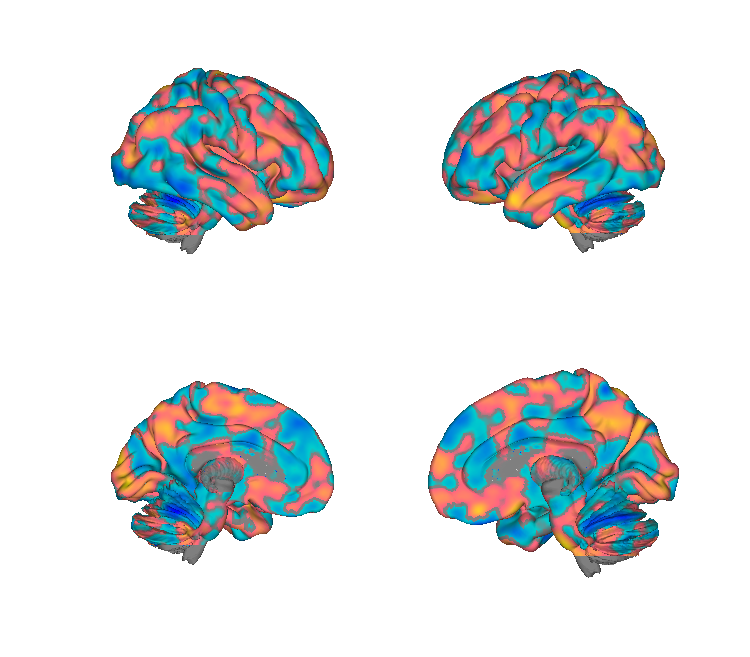
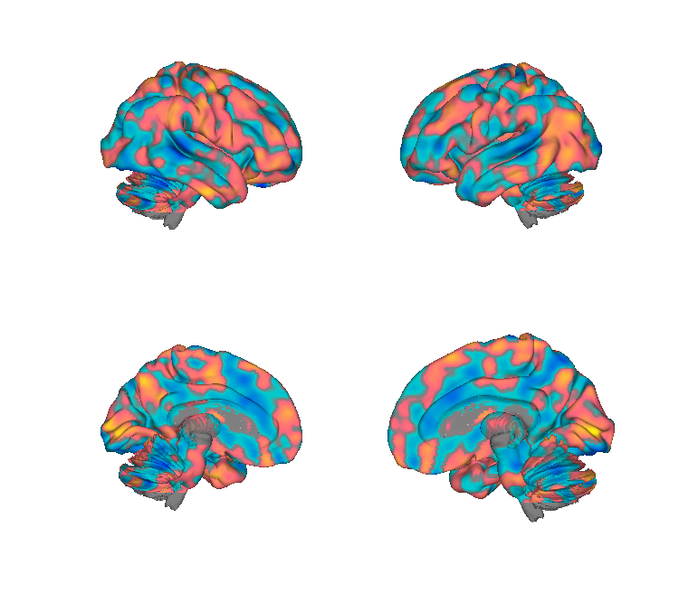
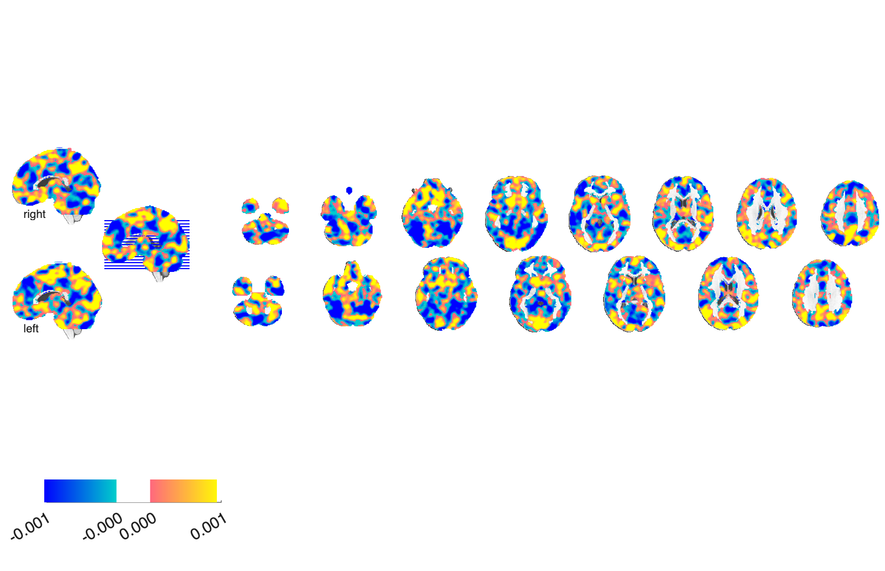
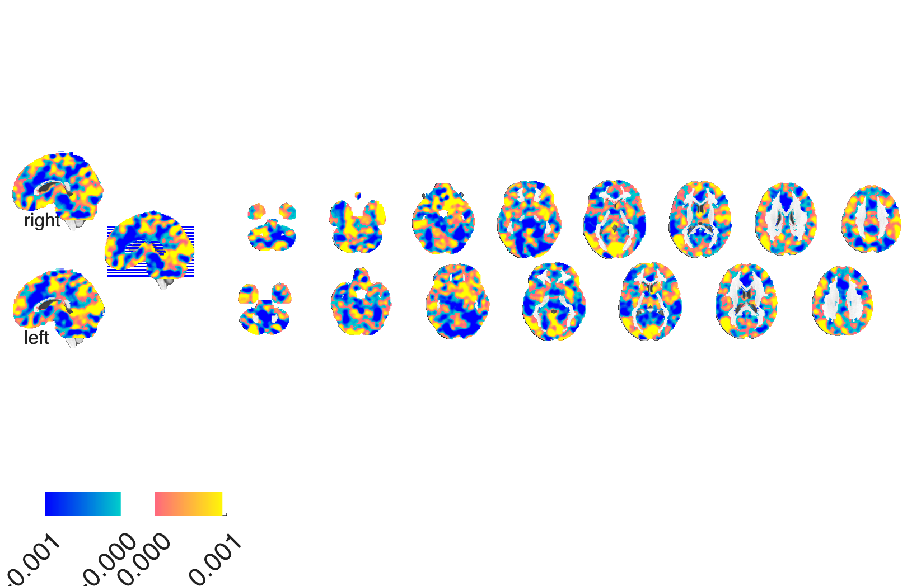

# Empathic Care & Distress signatures (Ashar et al. 2017)

## Overview

Two multivariate fMRI brain patterns that dissociate **empathic care**
(tender concern, motivation to help) from **empathic distress** (personal
aversive arousal) elicited by stories of others' suffering. Trained on
N=66 participants. The two signatures predict different prosocial
behaviours and have largely non-overlapping neuroanatomy, supporting
the view that care and distress are distinct components of empathy.

**Primary reference.** Ashar, Y. K., Andrews-Hanna, J. R., Dimidjian, S.,
& Wager, T. D. (2017). *Empathic care and distress: predictive brain
markers and dissociable brain systems.* **Neuron, 94**(6), 1263–1273.e4.
[doi:10.1016/j.neuron.2017.05.014](https://doi.org/10.1016/j.neuron.2017.05.014)
· [local PDF](./Ashar_2017_Neuron_empathic_care_distress.pdf)

## Key images

| Empathic Care | Empathic Distress |
| --- | --- |
|  |  |
|  |  |

The two unthresholded signatures, showing the largely non-overlapping
neural geometries of empathic *care* (tender concern, motivation to
help) and empathic *distress* (personal aversive arousal). FDR-
thresholded display variants (`*_fdr05_*.png`) are also in
`png_images/`. Rendered by [`visualize_contents.m`](./visualize_contents.m).

## How to load

These patterns are not yet registered as a `load_image_set` keyword.
Load directly:

```matlab
care_obj     = fmri_data(which('Ashar_2017_empathic_care_marker.nii'));
distress_obj = fmri_data(which('Ashar_2017_empathic_distress_marker.nii'));

% Apply to new data:
new_data = fmri_data('my_contrast.nii');
care_resp     = apply_mask(new_data, care_obj,     'pattern_expression', 'ignore_missing');
distress_resp = apply_mask(new_data, distress_obj, 'pattern_expression', 'ignore_missing');
```

## File inventory

| File | Type | What it is |
| --- | --- | --- |
| `Ashar_2017_empathic_care_marker.nii` (+ `.nii.gz`) | NIfTI | **Empathic-care signature** — unthresholded weights. |
| `Ashar_2017_empathic_care_markerFDR_05.nii.gz` | NIfTI | Care signature, FDR q<0.05 thresholded display. |
| `Ashar_2017_empathic_distress_marker.nii` (+ `.nii.gz`) | NIfTI | **Empathic-distress signature** — unthresholded weights. |
| `Ashar_2017_empathic_distress_markerFDR_05.nii.gz` | NIfTI | Distress signature, FDR q<0.05 thresholded display. |
| `Ashar_2017_Neuron_empathic_care_distress.pdf` | PDF | Primary reference. |
| `visualize_contents.m` | MATLAB | Generates `png_images/`. |

## Citations

- Ashar YK, Andrews-Hanna JR, Dimidjian S, Wager TD (2017). Empathic care
  and distress: predictive brain markers and dissociable brain systems.
  *Neuron* 94:1263–1273.
  [doi:10.1016/j.neuron.2017.05.014](https://doi.org/10.1016/j.neuron.2017.05.014)
