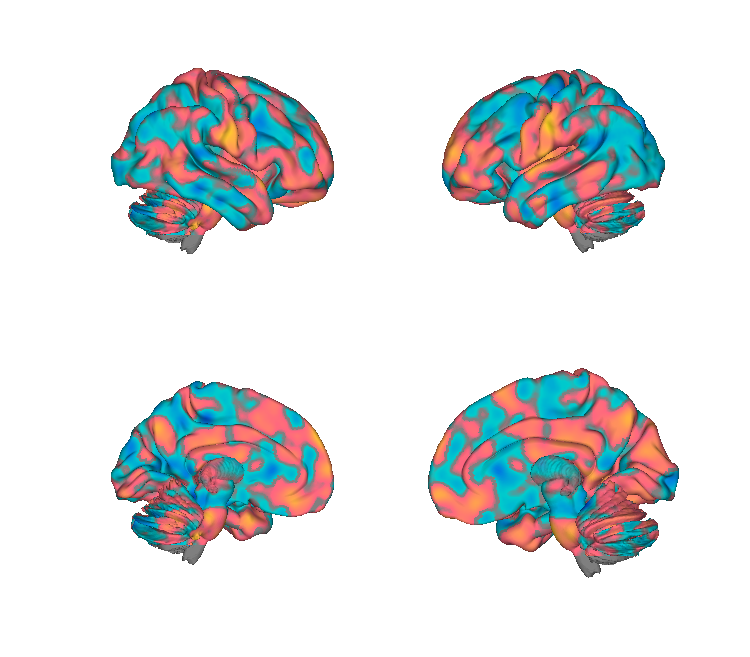
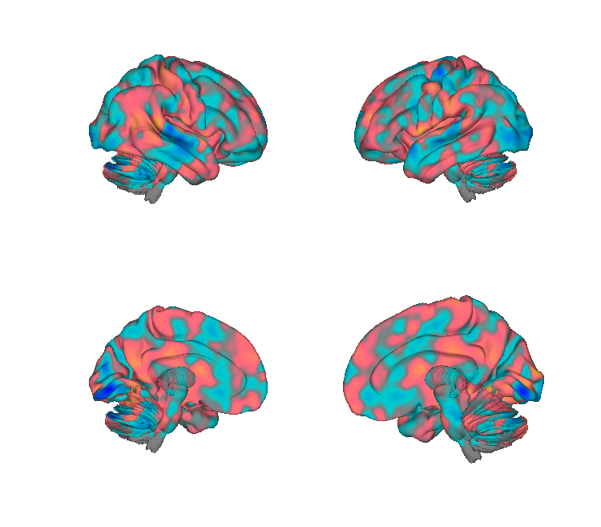
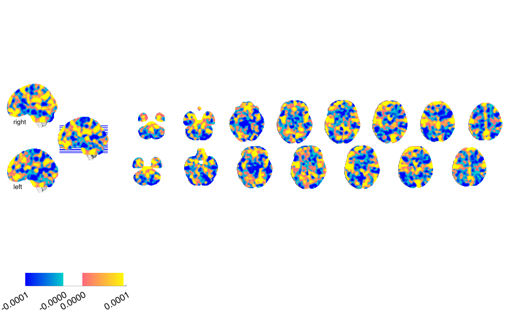
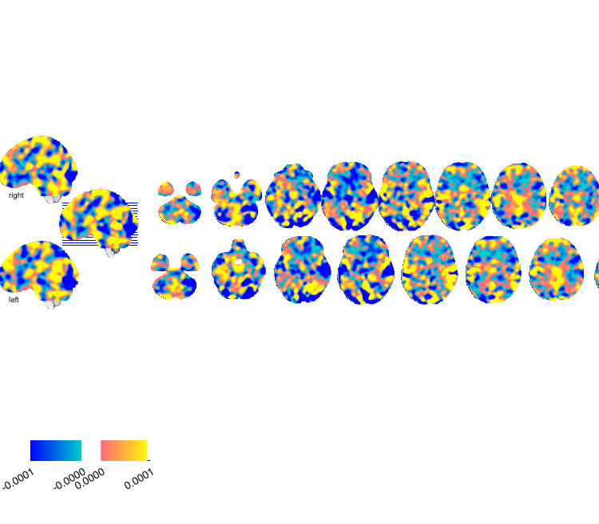

# Fibromyalgia signatures (López-Solà et al. 2017)

## Overview

This folder contains the two multivariate fMRI brain signatures for
**fibromyalgia (FM)** from López-Solà et al. (2017), plus the
NPS-derived region masks used in that study.

- **FM-pain** — a whole-brain pattern trained to track the brain
  response to **evoked (painful) pressure** that differs in FM patients.
- **FM-multisensory (FM-MS)** — a whole-brain pattern trained on the
  response to **non-painful multisensory stimulation** (auditory, visual,
  tactile/motor). Together the two patterns classify FM patients vs.
  healthy controls with high accuracy and capture distinct aspects of
  central sensitization.

The folder also includes region masks built from the **Neurologic Pain
Signature (NPS)** of Wager et al. (2013): the positive (**NPSp**) and
negative (**NPSn**) FDR-corrected peak regions. As the local
[`readme.rtf`](./readme.rtf) explains, these were created by Marina
López-Solà and Tor Wager and differ from the Krishnan et al. (2016)
NPS sub-regions: NPSp are positive FDR peaks falling in pain-activated
regions; NPSn are negative peaks (deactivations) excluding visual
cortex, forming a set of "self-referential" regions.

**Primary reference.** López-Solà, M., Woo, C. W., Pujol, J., Deus, J.,
Harrison, B. J., Monfort, J., & Wager, T. D. (2017). *Towards a
neurophysiological signature for fibromyalgia.* **Pain, 158**(1), 34–47.
[doi:10.1097/j.pain.0000000000000707](https://doi.org/10.1097/j.pain.0000000000000707).
No redistributable PDF is included; see the DOI for the canonical
citation. Please cite this paper if you use the masks.

## Key images

| FM-pain signature | FM-multisensory signature |
| --- | --- |
|  |  |
|  |  |

The whole-brain FM-pain predictor (left) and FM-multisensory predictor
(right). Both are dense (unthresholded) weight maps. Renderings of the
NPSp / NPSn region masks and the smoothed NPS positive-peak map are also
in `png_images/` (`LopezSola2017_NPSp_*`, `LopezSola2017_NPSn_*`,
`LopezSola2017_rNPS_fdr_pospeaks_*`). Rendered by
[`visualize_contents.m`](./visualize_contents.m).

## How to load

Not registered as a `load_image_set` keyword. Load directly with
`fmri_data`:

```matlab
fm_pain = fmri_data(which('FM_pain_wholebrain.nii.gz'));
fm_ms   = fmri_data(which('FM_Multisensory_wholebrain.nii.gz'));

% NPS-derived region masks (Analyze .hdr/.img.gz pairs)
npsp = fmri_data(which('NPSp_Lopez-Sola_2017_PAIN.img.gz'));
npsn = fmri_data(which('NPSn_Lopez-Sola_2017_PAIN.img.gz'));
```

To apply a signature to new contrast images, use CanlabCore's
`apply_mask` with `'pattern_expression'`, or the
[`apply_all_signatures.m`](../apply_all_signatures.m) wrapper at the root
of `Multivariate_signature_patterns/`.

## File inventory

| File | Type | What it is |
| --- | --- | --- |
| `FM_pain_wholebrain.nii.gz` | NIfTI | **FM-pain signature** — whole-brain weights for evoked-pain response. |
| `FM_Multisensory_wholebrain.nii.gz` | NIfTI | **FM-multisensory (FM-MS) signature** — whole-brain weights for non-painful multisensory response. |
| `NPSp_Lopez-Sola_2017_PAIN.hdr` / `.img.gz` | Analyze | NPS **positive** FDR-peak regions (pain-activated). |
| `NPSn_Lopez-Sola_2017_PAIN.hdr` / `.img.gz` | Analyze | NPS **negative** FDR-peak regions (deactivations, "self-referential"; visual cortex excluded). |
| `rNPS_fdr_pospeaks_smoothed.hdr` / `.img.gz` | Analyze | Resampled, smoothed NPS positive FDR-peak map. |
| `readme.rtf` | RTF | Author notes (provenance of FM patterns and NPSp/NPSn masks). |
| `visualize_contents.m` | MATLAB | Generates `png_images/`. |

## Citations

- **Primary:** López-Solà, M., Woo, C. W., Pujol, J., Deus, J.,
  Harrison, B. J., Monfort, J., & Wager, T. D. (2017). Towards a
  neurophysiological signature for fibromyalgia. *Pain, 158*(1), 34–47.
  [doi:10.1097/j.pain.0000000000000707](https://doi.org/10.1097/j.pain.0000000000000707).
- **NPS (source of the region masks):** Wager, T. D., Atlas, L. Y.,
  Lindquist, M. A., Roy, M., Woo, C. W., & Kross, E. (2013). An
  fMRI-based neurologic signature of physical pain. *New England Journal
  of Medicine, 368*(15), 1388–1397.
  [doi:10.1056/NEJMoa1204471](https://doi.org/10.1056/NEJMoa1204471).
