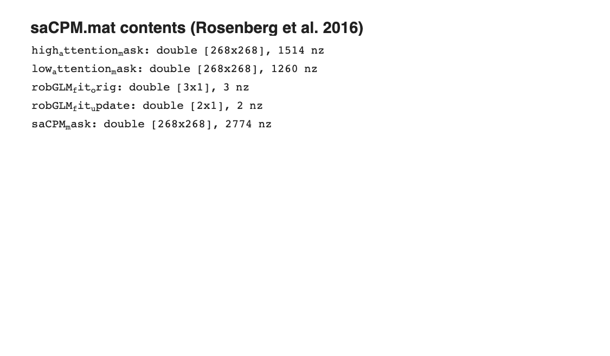

# saCPM — Sustained-Attention Connectome-based Predictive Model (Rosenberg et al. 2016)

## Overview

The **sustained-attention CPM (saCPM)** is a **connectome-based predictive
model** (not a voxelwise signature) of individual differences in sustained
attention. It comprises two whole-brain functional-connectivity edge sets
("high-attention" and "low-attention" networks). The model generalises
across in-scanner attention tasks and resting-state, predicts ADHD
symptoms, and is provided as a `.mat` file with the selected edges.

**Primary reference.** Rosenberg, M. D., Finn, E. S., Scheinost, D.,
Papademetris, X., Shen, X., Constable, R. T., & Chun, M. M. (2016).
*A neuromarker of sustained attention from whole-brain functional
connectivity.* **Nature Neuroscience, 19**(1), 165–171.
[doi:10.1038/nn.4179](https://doi.org/10.1038/nn.4179)
· [local PDF](./Rosenberg_et_al._2016_-_A_neuromarker_of_sustained_attention_from_whole-brain_functional_connectivity.pdf)

## Key images



The saCPM is a **connectivity-edge model**, not a voxelwise pattern,
so the standard surface / montage / isosurface trio does not apply.
[`visualize_contents.m`](./visualize_contents.m) inspects the `.mat`
file and renders this edge-count summary into `png_images/`.

## How to load

Not registered in `load_image_set`. Load the `.mat` directly:

```matlab
S = load(which('saCPM.mat'));
% S typically contains the selected edges / regression coefficients used
% to predict sustained attention from a connectivity matrix.
```

`test_saCPM.m` in this folder is a worked example applying the model to
a new connectivity matrix.

## File inventory

| File | Type | What it is |
| --- | --- | --- |
| `saCPM.mat` | MAT | **saCPM model** — selected high/low-attention edges and intercepts. |
| `test_saCPM.m` | MATLAB | Apply the saCPM to a new connectivity matrix. |
| `Rosenberg_description.rtf` | RTF | Author-provided usage notes. |
| `Rosenberg_et_al._2016_-_A_neuromarker_of_sustained_attention_from_whole-brain_functional_connectivity.pdf` | PDF | Primary reference. |
| `visualize_contents.m` | MATLAB | Generates a summary plot in `png_images/`. |

## Citations

- Rosenberg MD, Finn ES, Scheinost D, Papademetris X, Shen X, Constable RT,
  Chun MM (2016). A neuromarker of sustained attention from whole-brain
  functional connectivity. *Nat Neurosci* 19:165–171.
  [doi:10.1038/nn.4179](https://doi.org/10.1038/nn.4179)
