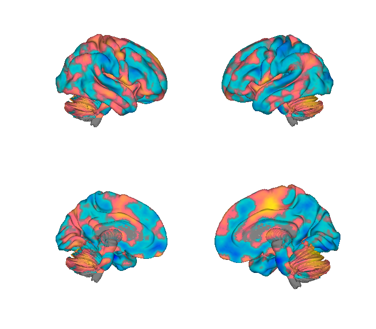
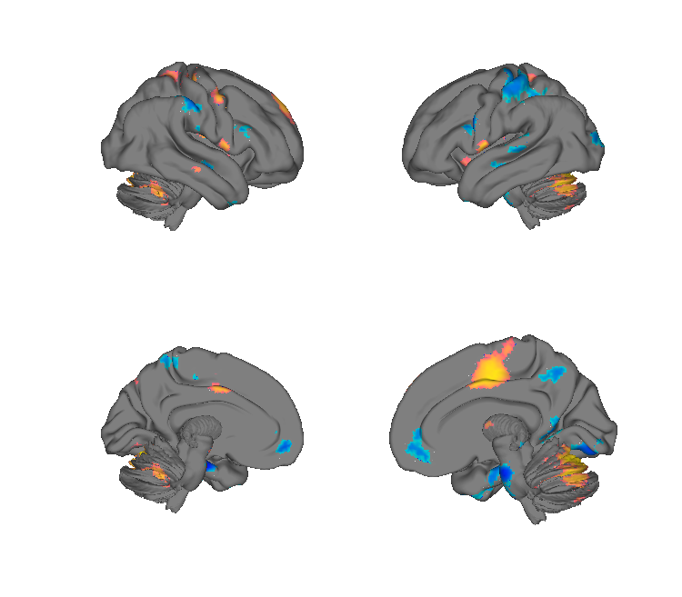
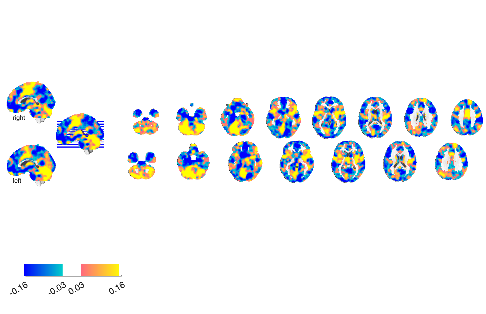
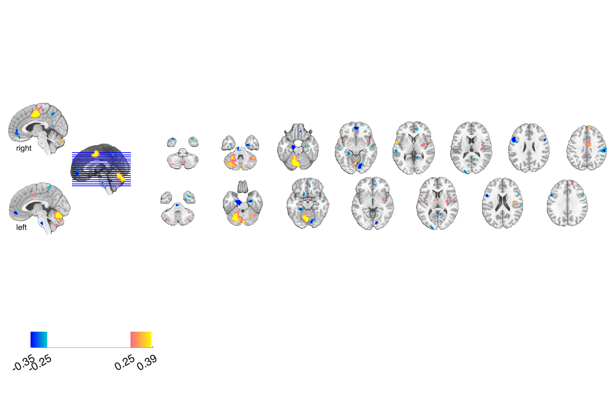

# SIIPS1 — Stimulus Intensity Independent Pain Signature-1 (Woo et al. 2017)

## Overview

The **Stimulus Intensity Independent Pain Signature-1 (SIIPS1)** is a multivariate
fMRI brain-pattern signature that predicts trial-by-trial pain ratings **above
and beyond** the variance explained by noxious stimulus intensity and by the
nociceptive Neurologic Pain Signature (NPS). It captures cerebral contributions
to pain — including patterns in the nucleus accumbens, lateral prefrontal cortex,
parahippocampal cortex, and other regions — and was developed from 4 training
fMRI studies (*N* = 137) and validated in 2 independent test studies (*N* = 46).
SIIPS1 mediates the pain-modulating effects of expectancy and perceived control,
giving an extensible characterisation of higher-order brain contributions to pain
and a set of brain targets for interventions.

**Primary reference (open access).** Woo, C.-W., Schmidt, L., Krishnan, A.,
Jepma, M., Roy, M., Lindquist, M. A., Atlas, L. Y., & Wager, T. D. (2017).
*Quantifying cerebral contributions to pain beyond nociception.* **Nature
Communications, 8, 14211.**
[doi:10.1038/ncomms14211](https://doi.org/10.1038/ncomms14211) ·
[publisher PDF](https://www.nature.com/articles/ncomms14211)

A copy of the paper is included in this folder as
[`Woo_2017_SIIPS1_stimulus_intensity_independent_pain.pdf`](./Woo_2017_SIIPS1_stimulus_intensity_independent_pain.pdf).

## Key images

Generated by [`visualize_contents.m`](./visualize_contents.m); written to
`png_images/`:

| Mean-weight pattern | FDR-thresholded subclusters |
| --- | --- |
|  |  |
|  |  |
| Cortical surface + axial montage of the full SIIPS1 weighted-mean pattern (`nonnoc_v11_4_137subjmap_weighted_mean.nii`). | Surface + montage of the FDR *q* < 0.05 subcluster pattern (`..._fdr05_pattern_wttest.nii`) — the 44 named subregions used by `load_siips_subregions`. |

## Applying the signature

The most convenient way to apply SIIPS1 to new data is the dedicated
helper [`apply_siips.m`](../apply_siips.m) (in the parent
`Multivariate_signature_patterns/` folder). It accepts wildcards,
filename lists, or `fmri_data` objects and returns:

- `siips_values` — one SIIPS response per input image,
- `siipspos_exp_by_region` / `siipsneg_exp_by_region` — local-pattern
  expressions in each positive / negative FDR subregion.

```matlab
% Apply to every contrast in a folder via wildcard:
[siips_values, image_names] = apply_siips('sub-*_con-*.nii');

% Apply to an existing fmri_data object:
[siips_values, ~, ~, siipspos_by_region, siipsneg_by_region] = ...
    apply_siips(my_fmri_data_obj);
```

For multi-signature batch application (NPS, SIIPS, PINES, …) see
[`apply_all_signatures.m`](../apply_all_signatures.m) in the parent
folder.

## How to load

### Whole signature (recommended)

The full weighted-mean SIIPS1 pattern is registered in
[`CanlabCore/Data_extraction/load_image_set.m`](https://github.com/canlab/CanlabCore/blob/master/CanlabCore/Data_extraction/load_image_set.m)
under the `'siips'` keyword:

```matlab
[siips_obj, networknames, imagenames] = load_image_set('siips');
```

It is also included in the multi-signature keyword set:

```matlab
[obj, networknames, imagenames] = load_image_set('npsplus');   % NPS + SIIPS + PINES + Rejection + VPS + GSR + ...
[obj, networknames, imagenames] = load_image_set('painsig');   % NPS + SIIPS only
```

Apply the pattern to new data with a dot product (canonical "signature response"):

```matlab
new_data        = fmri_data('my_contrast.nii');
siips_response  = apply_mask(new_data, siips_obj, 'pattern_expression', 'ignore_missing');
```

### Subregions (positive- and negative-weight clusters)

For region-level analysis, use the helper in this folder
([`load_siips_subregions.m`](./load_siips_subregions.m)):

```matlab
addpath(fileparts(which('load_siips_subregions.m')));
[siips_pos_obj, siips_neg_obj, siips_pos_regions, siips_neg_regions, ...
 names_pos, names_neg, r] = load_siips_subregions();
```

`siips_pos_regions(k).all_data` and `siips_neg_regions(k).all_data` hold the
local pattern weights for each FDR-thresholded subcluster, with names in
`shorttitle`.

### Raw NIfTI

Alternatively, point `fmri_data` directly at the NIfTI:

```matlab
siips_obj = fmri_data(which('nonnoc_v11_4_137subjmap_weighted_mean.nii'));
```

## File inventory

| File | Type | What it is |
| --- | --- | --- |
| `nonnoc_v11_4_137subjmap_weighted_mean.nii` (+ `.nii.gz`) | NIfTI | **The SIIPS1 pattern itself** — voxelwise weighted mean of the trained pattern across the 4 training studies (*N* = 137). This is what `load_image_set('siips')` returns. |
| `nonnoc_v11_4_137subjmap_weighted_pvalue.nii.gz` | NIfTI | Voxelwise p-value map of the trained weights, used to threshold the pattern. |
| `nonnoc_v11_4_subcluster_maps_fdr05_pattern_wttest.nii` (+ `.nii.gz`) | NIfTI | Pattern weights restricted to FDR q < 0.05 subclusters (positive *and* negative). Loaded by `load_siips_subregions.m`. |
| `nonnoc_v11_4_subcluster_maps_fdr05_unique_wttest.nii.gz` | NIfTI | Same FDR q < 0.05 subclusters labelled with unique integer indices (parcel image). |
| `nonnoc_v11_4_subcluster_maps_fdr05_44_cluster_names.mat` | MAT | Names (`cl44names`) and signs (`clsign`) for the 44 FDR subclusters; consumed by `load_siips_subregions.m`. |
| `load_siips_subregions.m` | MATLAB | Helper that builds `fmri_data` and `region` objects for the positive/negative subregions of SIIPS1. |
| `visualize_contents.m` | MATLAB | Regenerates the cortical-surface and montage PNGs in `png_images/`. |
| `Woo_2017_SIIPS1_stimulus_intensity_independent_pain.pdf` | PDF | Primary reference (Nature Communications 2017, OA). |

`apply_all_signatures.m` and `apply_siips.m` (one level up, in
[`Multivariate_signature_patterns/`](..)) demonstrate batch application to a set
of test images.

## Citations

**Primary**

- Woo, C.-W., Schmidt, L., Krishnan, A., Jepma, M., Roy, M., Lindquist, M. A.,
  Atlas, L. Y., & Wager, T. D. (2017). Quantifying cerebral contributions to
  pain beyond nociception. *Nature Communications*, 8, 14211.
  [doi:10.1038/ncomms14211](https://doi.org/10.1038/ncomms14211).

**Closely related (NPS / SIIPS comparisons in the same paper)**

- Wager, T. D., Atlas, L. Y., Lindquist, M. A., Roy, M., Woo, C.-W., & Kross, E.
  (2013). An fMRI-based neurologic signature of physical pain. *New England
  Journal of Medicine*, 368, 1388–1397.
  [doi:10.1056/NEJMoa1204471](https://doi.org/10.1056/NEJMoa1204471).
