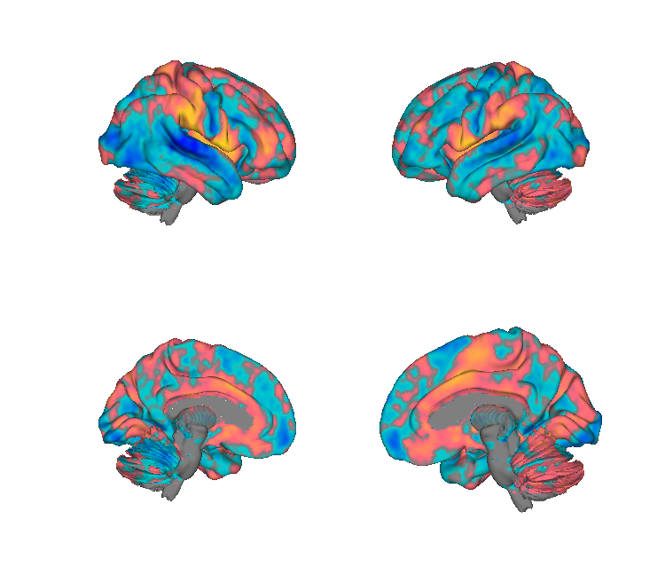
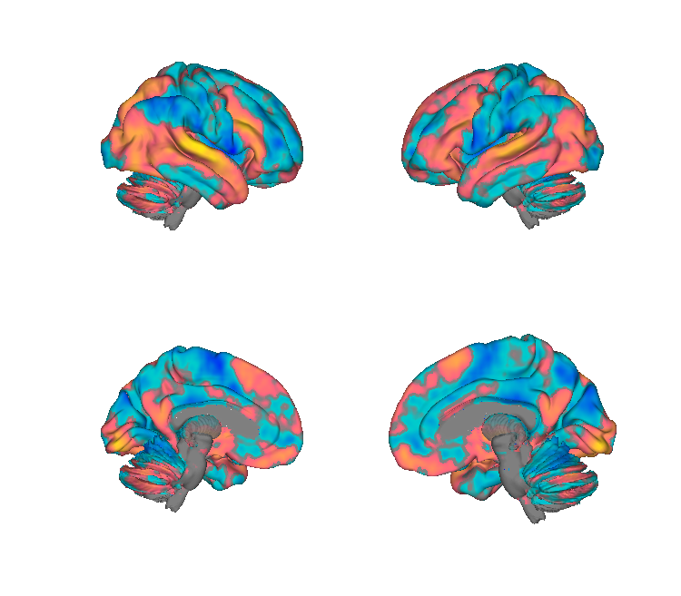
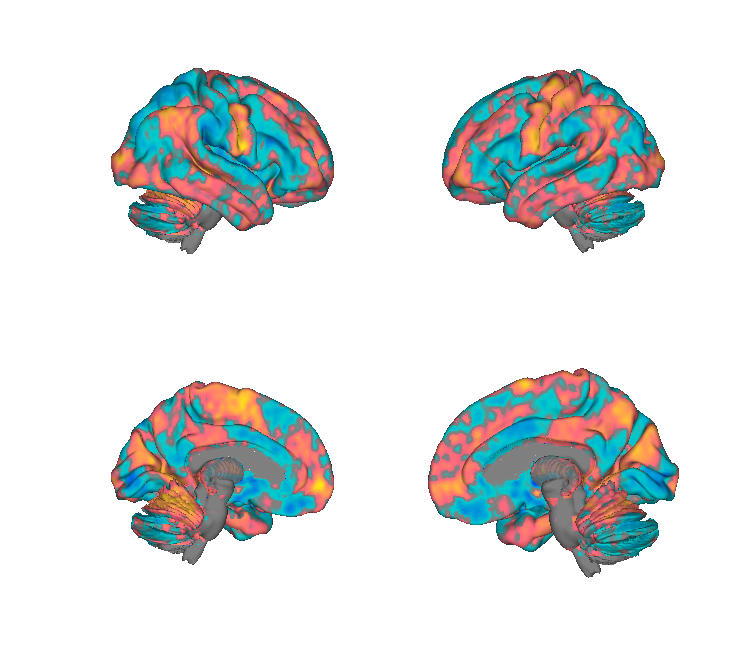
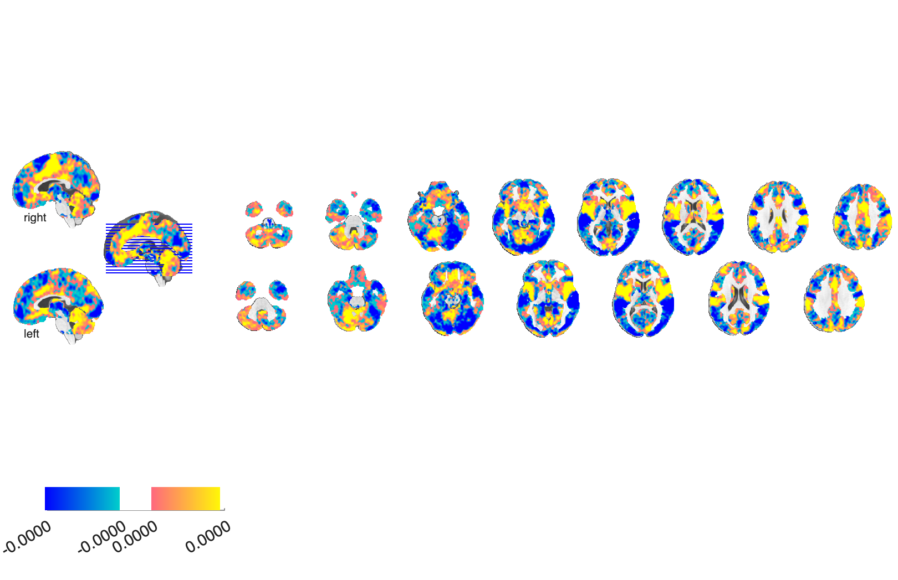
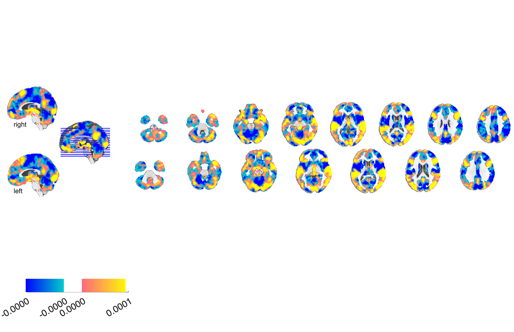
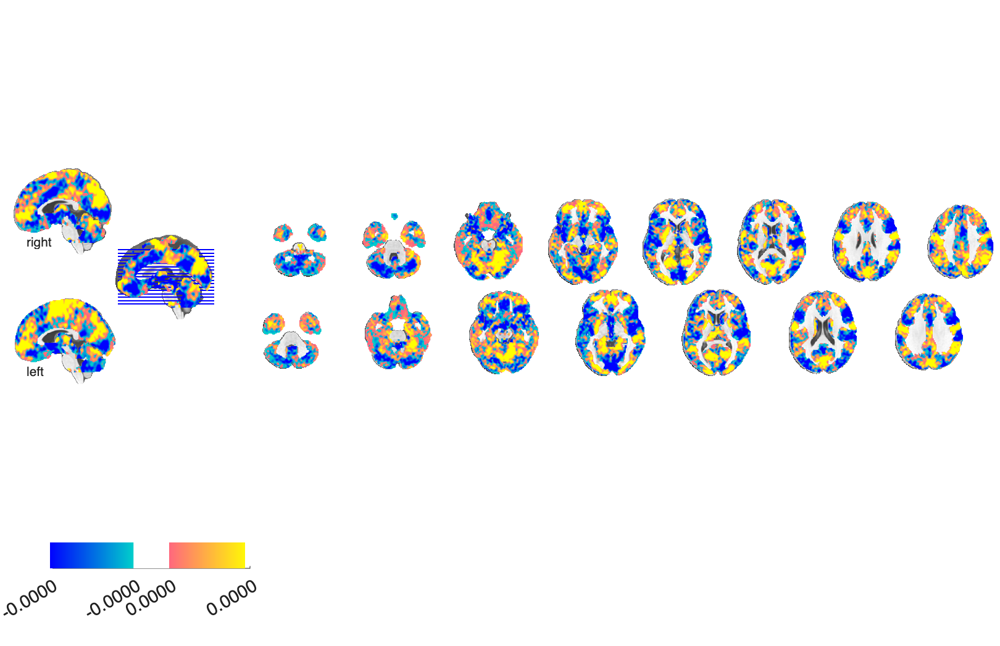

# MFC generalizability patterns — Pain × Negative Emotion × Cognitive Control (Kragel et al. 2018)

## Overview

Twenty-one **bootstrapped PLS regression (bPLS) brain patterns** trained on
multi-study meta-analytic data to discriminate **pain, negative emotion,
and cognitive control** within seven medial-frontal-cortex (MFC)
subregions and at the whole-brain level. The patterns demonstrate
that even within the cingulate, neighbouring subregions carry
**topographically distinct, generalisable** signatures for the three
processes.

Subregions: `aMCC`, `dMFC`, `MFC`, `pACC`, `pMCC`, `sgACC`, `vmPFC`, plus
`Wholebrain`. Each comes in three condition-specific versions:
`Pain`, `Negative_Emotion`, `Cognitive_Control` → 8 × 3 = 24 maps (the
folder has 21 because Wholebrain has only the three condition maps in
`.nii` form; the seven subregions × 3 conditions = 21 `.nii.gz` files).

**Primary reference.** Kragel, P. A., Kano, M., Van Oudenhove, L., Ly,
H. G., Dupont, P., Rubio, A., Delon-Martin, C., Bonaz, B. L., Manuck,
S. B., Gianaros, P. J., Čeko, M., Reynolds Losin, E. A., Woo, C.-W.,
Nichols, T. E., & Wager, T. D. (2018). *Generalizable representations
of pain, cognitive control, and negative emotion in medial frontal
cortex.* **Nature Neuroscience, 21**(2), 283–289.
[doi:10.1038/s41593-017-0051-7](https://doi.org/10.1038/s41593-017-0051-7)
· [local PDF](./Kragel_2018_NatNeurosci_MFC_generalizability.pdf)
· [supplementary PDF](./Kragel_2018_Generalizable_Pain_Emo_Cog_Supp_Info.pdf)

## Key images

Whole-brain bPLS patterns, one column per condition (illustrative
subset — all 24 condition × region combinations are in `png_images/`):

| Pain (Wholebrain) | Negative emotion (Wholebrain) | Cognitive control (Wholebrain) |
| --- | --- | --- |
|  |  |  |
|  |  |  |

Region-specific bPLS patterns (aMCC, dMFC, MFC, pACC, pMCC, sgACC, vmPFC)
× each condition are rendered alongside. Rendered by
[`visualize_contents.m`](./visualize_contents.m).

## How to load

Registered as the `'kragel18'` (alias `'pain_cog_emo'`) keyword in
[`load_image_set.m`](https://github.com/canlab/CanlabCore/blob/master/CanlabCore/Data_extraction/load_image_set.m):

```matlab
[obj, networknames, imagenames] = load_image_set('kragel18');
% 21 named patterns: 'Pain pMCC', 'Pain aMCC', ..., 'Cogcontrol Wholebrain'.
```

Or load directly:

```matlab
pain_wb = fmri_data(which('bPLS_Wholebrain_Pain.nii'));
```

## File inventory

| Region | Pain | Negative emotion | Cognitive control |
| --- | --- | --- | --- |
| Wholebrain | `bPLS_Wholebrain_Pain.nii(.gz)` | `bPLS_Wholebrain_Negative_Emotion.nii(.gz)` | `bPLS_Wholebrain_Cognitive_Control.nii(.gz)` |
| MFC | `bPLS_MFC_Pain.nii.gz` | `bPLS_MFC_Negative_Emotion.nii.gz` | `bPLS_MFC_Cognitive_Control.nii.gz` |
| dMFC | `bPLS_dMFC_*.nii.gz` | … | … |
| aMCC | `bPLS_aMCC_*.nii.gz` | … | … |
| pMCC | `bPLS_pMCC_*.nii.gz` | … | … |
| pACC | `bPLS_pACC_*.nii.gz` | … | … |
| sgACC | `bPLS_sgACC_*.nii.gz` | … | … |
| vmPFC | `bPLS_vmPFC_*.nii.gz` | … | … |

Plus:

| File | What it is |
| --- | --- |
| `Kragel_2018_NatNeurosci_MFC_generalizability.pdf` | Primary reference. |
| `Kragel_2018_Generalizable_Pain_Emo_Cog_Supp_Info.pdf` | Supplementary information. |
| `note.txt` | Notes from the authors. |
| `visualize_contents.m` | Generates `png_images/`. |

## Citations

- Kragel PA, Kano M, Van Oudenhove L, et al. (2018). Generalizable
  representations of pain, cognitive control, and negative emotion in
  medial frontal cortex. *Nat Neurosci* 21:283–289.
  [doi:10.1038/s41593-017-0051-7](https://doi.org/10.1038/s41593-017-0051-7)
