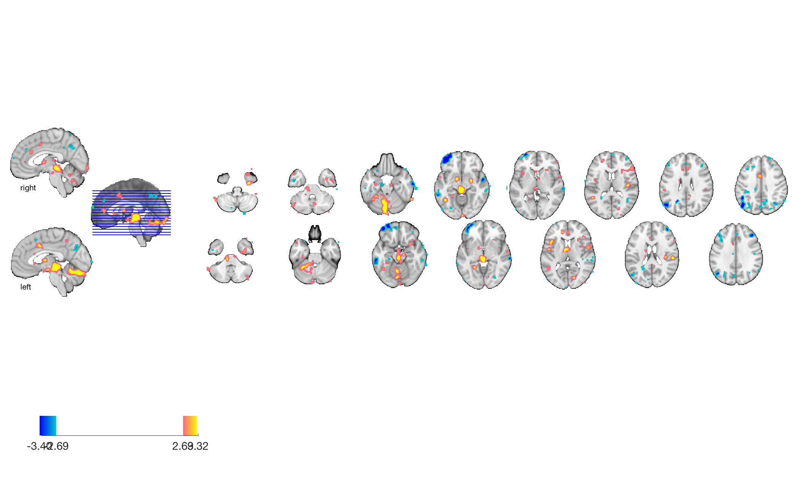
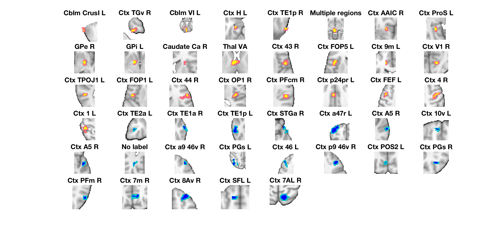
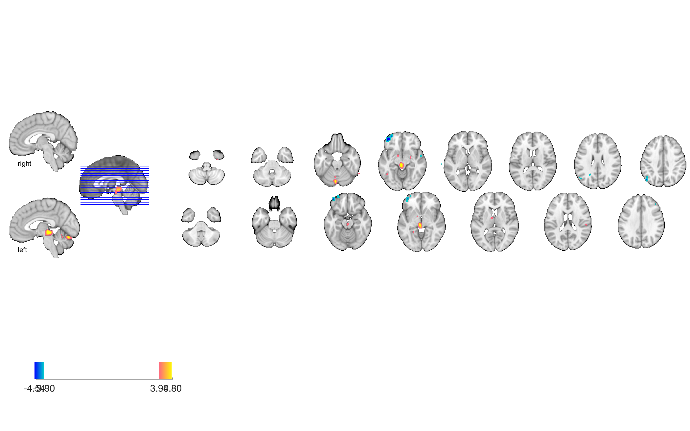
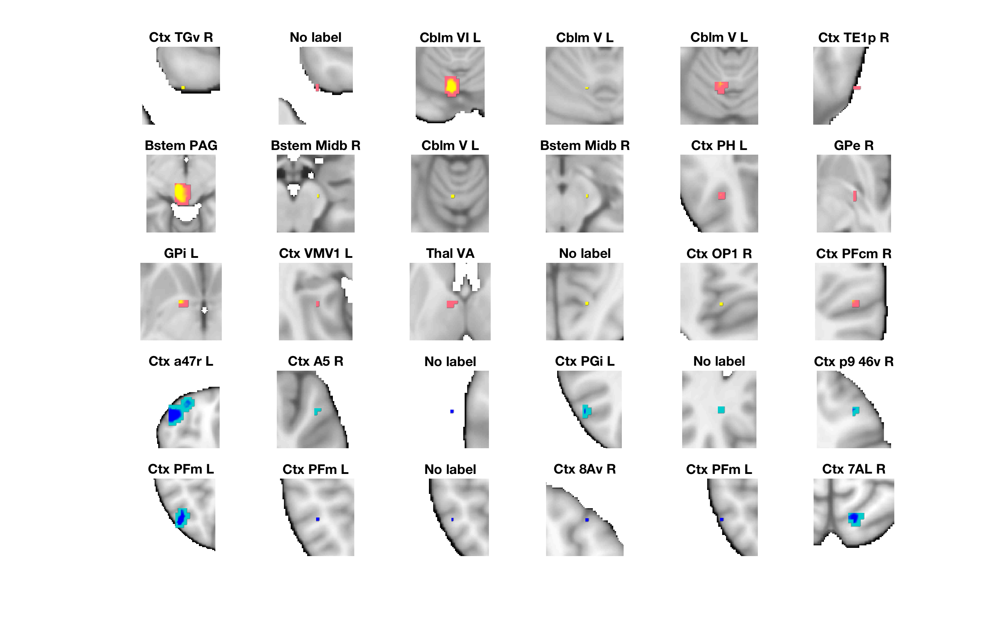

# CS+ vs CS− threat-conditioning signature (Reddan et al. 2018)

## Overview

A multivariate fMRI **support-vector-machine pattern** that discriminates
**conditioned-threat (CS+) trials** from safety (CS−) trials during
acquisition in a Pavlovian threat-conditioning paradigm — the
**"ImEx" (Imagined Extinction) study**.

The paper's central finding is that **imagining the conditioned
stimulus has the same effect as actually re-exposing the participant
to it**: imagined extinction is as effective as real extinction at
reducing both neural threat-pattern responses and skin-conductance
responses, and engages a largely overlapping brain network anchored on
**ventromedial prefrontal cortex** (vmPFC), amygdala, and primary
auditory / perceptual cortices. Activity in the **nucleus accumbens**
uniquely predicts how successful imagined extinction will be for a
given participant. This supports imagination as a clinically tractable
extinction tool for threat-related disorders (PTSD, phobias, anxiety).

**Primary reference.** Reddan, M. C., Wager, T. D., & Schiller, D. (2018).
*Attenuating neural threat expression with imagination.* **Neuron,
100**(4), 994–1005.e4. (Published 21 November 2018.)
[doi:10.1016/j.neuron.2018.10.046](https://doi.org/10.1016/j.neuron.2018.10.046)
· [local PDF](./Reddan_2018_IMEX_threat_imagination.pdf)

## Key images

Author-curated montages at two thresholds (from
[`images_and_regions/`](./images_and_regions)):

| Whole-brain SVM weights | Region montage |
| --- | --- |
|  |  |
| Threshold *p* < 0.01 uncorrected. | Region montage at the same threshold. |
|  |  |
| Threshold FDR *q* < 0.05. | Region montage at FDR *q* < 0.05. |

[`visualize_contents.m`](./visualize_contents.m) regenerates additional
surface / montage / isosurface PNGs from the underlying NIfTI into
`png_images/`.

## How to load

Registered as the `'csplus'` keyword in
[`load_image_set.m`](https://github.com/canlab/CanlabCore/blob/master/CanlabCore/Data_extraction/load_image_set.m):

```matlab
[obj, networknames, imagenames] = load_image_set('csplus');
% networknames = {'Reddan18CSplus_vs_CSminus'}
```

Or load directly:

```matlab
csplus = fmri_data(which('IE_ImEx_Acq_Threat_SVM_nothresh.nii.gz'));
```

The corresponding intercept is in `IE_ImEx_Acq_Threat_SVM_intercept`.

## File inventory

| File | Type | What it is |
| --- | --- | --- |
| `IE_ImEx_Acq_Threat_SVM_nothresh.nii` (+ `.nii.gz`) | NIfTI | **CS+ vs CS− SVM weights** — unthresholded. `load_image_set('csplus')`. |
| `IE_ImEx_Acq_Threat_SVM_01thresh.nii.gz` | NIfTI | p<0.01 uncorrected thresholded display. |
| `IE_ImEx_Acq_Threat_SVM_05FDR.nii.gz` | NIfTI | FDR q<0.05 thresholded display. |
| `IE_ImEx_Acq_Threat_SVM_intercept` | text | SVM intercept value. |
| `images_and_regions/` | dir | Pre-rendered PNGs, `.mat` region objects, region tables. |
| `marianne_tmp_script_tor_save_threat_pattern_results.m` | MATLAB | Provenance: script that wrote the pattern files. |
| `visualize_contents.m` | MATLAB | Generates `png_images/`. |

## Citations

- Reddan MC, Wager TD, Schiller D (2018). Attenuating neural threat
  expression with imagination. *Neuron* 100:994–1005.
  [doi:10.1016/j.neuron.2018.10.046](https://doi.org/10.1016/j.neuron.2018.10.046)
