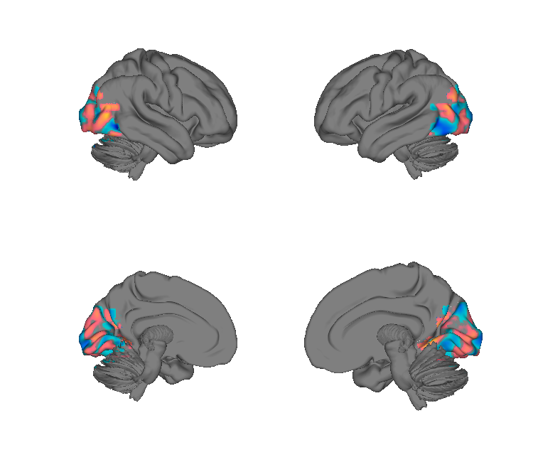
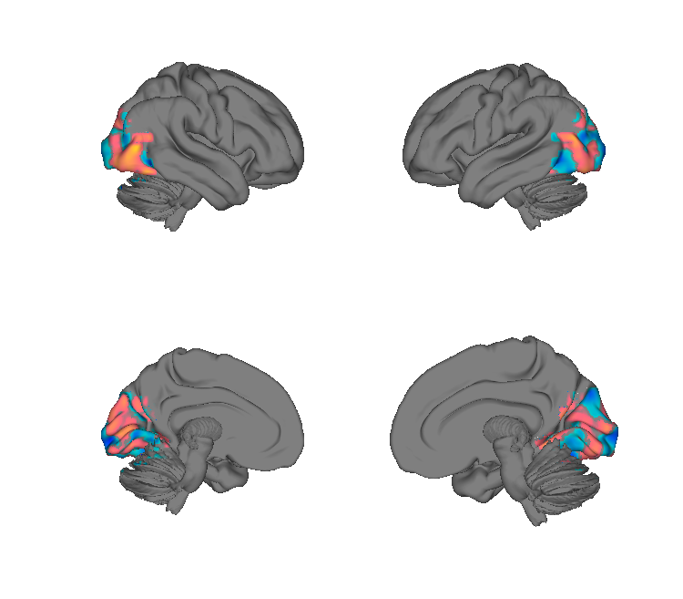
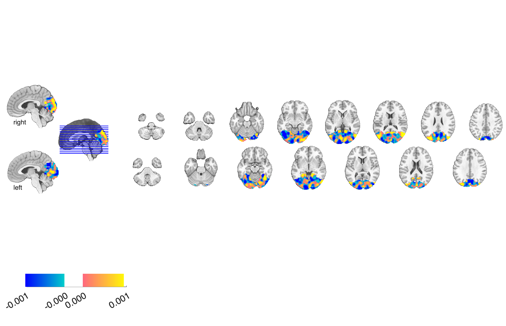
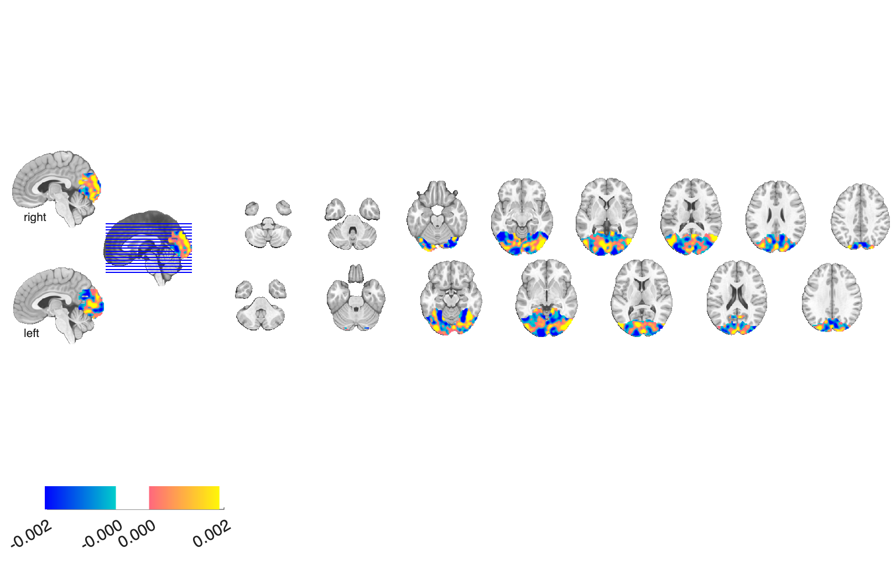

# Emotion-schema PLS patterns (Kragel et al. 2019)

## Overview

Twenty whole-brain **PLS regression patterns** — one per emotion category —
trained to predict subjective emotional experience from fMRI during a
naturalistic emotion-elicitation paradigm. Categories span a broad
appetitive/aversive range:
*Adoration, Aesthetic Appreciation, Amusement, Anxiety, Awe, Boredom,
Confusion, Craving, Disgust, Empathic Pain, Entrancement, Excitement,
Fear, Horror, Interest, Joy, Romance, Sadness, Sexual Desire, Surprise*.

The patterns operationalise the **emotion-schema** view that distinct
emotional experiences map onto **distinct multivariate brain patterns**,
not just gradient positions along valence/arousal.

**Primary reference.** Kragel, P. A., Reddan, M. C., LaBar, K. S., &
Wager, T. D. (2019). *Emotion schemas are embedded in the human visual
system.* **Science Advances, 5**(7), eaaw4358.
[doi:10.1126/sciadv.aaw4358](https://doi.org/10.1126/sciadv.aaw4358)
· [local PDF](./Kragel_2019_SciAdv_emotion_schemas.pdf)

## Key images

Two representative emotion-schema patterns (all 20 categories are
rendered into `png_images/`):

| Fear | Joy |
| --- | --- |
|  |  |
|  |  |

The remaining 18 schemas — Adoration, Aesthetic Appreciation,
Amusement, Anxiety, Awe, Boredom, Confusion, Craving, Disgust,
Empathic Pain, Entrancement, Excitement, Horror, Interest, Romance,
Sadness, Sexual Desire, Surprise — are rendered with the same
surface / montage / isosurface trio. Rendered by
[`visualize_contents.m`](./visualize_contents.m).

## How to load

Registered as the `'kragelschemas'` keyword in
[`load_image_set.m`](https://github.com/canlab/CanlabCore/blob/master/CanlabCore/Data_extraction/load_image_set.m):

```matlab
[obj, networknames, imagenames] = load_image_set('kragelschemas');
% networknames lists all 20 emotion categories.
```

Or load a single emotion:

```matlab
fear = fmri_data(which('PLS_betas_Fear.nii.gz'));
```

## File inventory

20 NIfTI files of the form `PLS_betas_<Emotion>.nii.gz`, one per category.
Plus:

| File | What it is |
| --- | --- |
| `Kragel_2019_SciAdv_emotion_schemas.pdf` | Primary reference (OA). |
| `visualize_contents.m` | Generates `png_images/`. |

## Citations

- Kragel PA, Reddan MC, LaBar KS, Wager TD (2019). Emotion schemas are
  embedded in the human visual system. *Sci Adv* 5:eaaw4358.
  [doi:10.1126/sciadv.aaw4358](https://doi.org/10.1126/sciadv.aaw4358)
