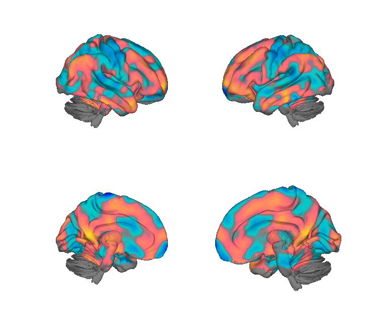
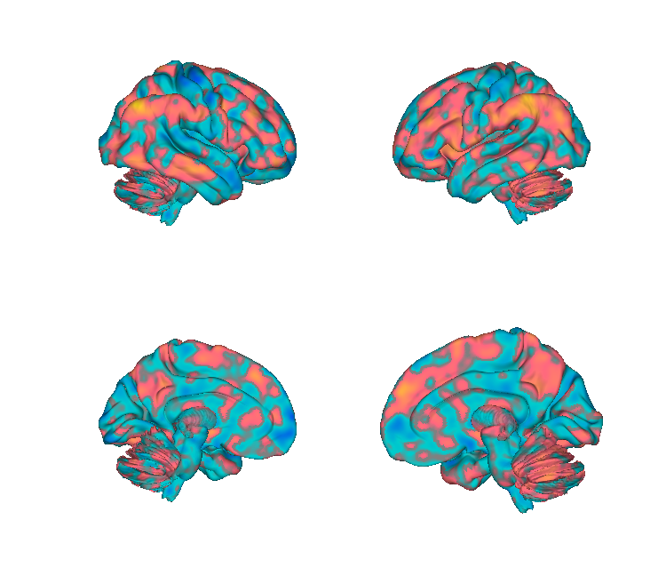
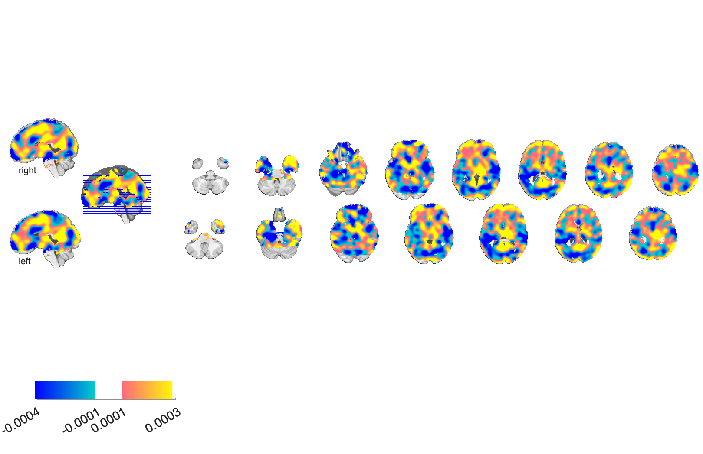
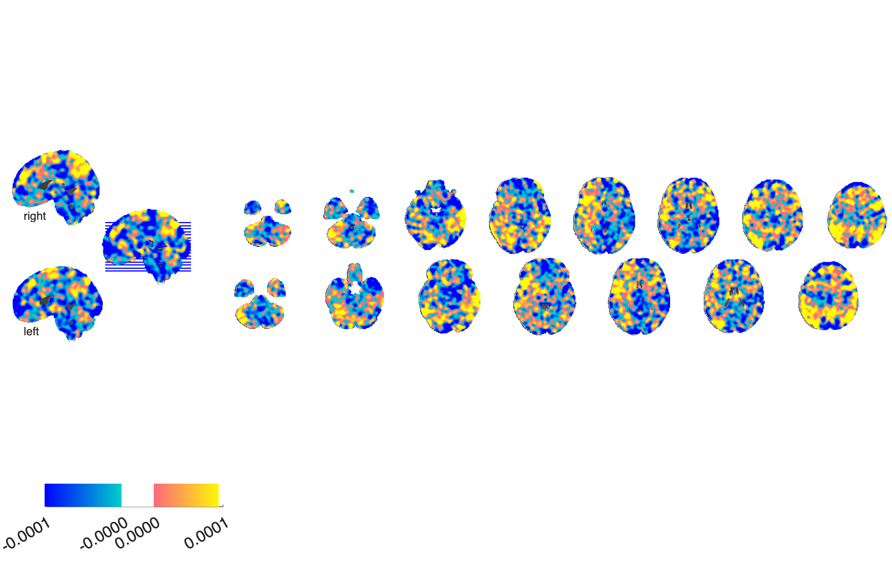

# Chronic back-pain prediction markers (Lee et al. 2019)

## Overview

Multivariate brain markers that **predict clinical pain intensity in
chronic back-pain patients**, derived from three distinct neural modalities:

- **S1** — somatosensory cortex functional-connectivity edges (SVM on connectivity)
- **PCASL** — perfusion (arterial spin labelling) voxelwise weights
- **HFHRV** — high-frequency heart-rate-variability spectral features

Each modality is provided as a separate predictor (volume / connectivity
features + intercept). They reflect distinct, complementary aspects of
chronic pain.

**Primary reference.** Lee, J., Mawla, I., Kim, J., Loggia, M. L.,
Ortiz, A., Jung, C., Chan, S.-T., Gerber, J., Schmithorst, V. J.,
Edwards, R. R., Wasan, A. D., Berna, C., Kong, J., Kaptchuk, T. J.,
Gollub, R. L., Rosen, B. R., & Napadow, V. (2019). *Machine learning-based
prediction of clinical pain using multimodal neuroimaging and
autonomic metrics.* **PAIN, 160**(3), 550–560.
[doi:10.1097/j.pain.0000000000001417](https://doi.org/10.1097/j.pain.0000000000001417)
· [local PDF](./machine_learning_based_prediction_of_clinical_pain.3.pdf)
· [supplementary materials](./Lee%20et%20al%20Supp%20Materials.pdf)

> The folder name says JPain but the paper appeared in *PAIN*.

## Key images

| PCASL (perfusion) | S1 (somatosensory connectivity) |
| --- | --- |
|  |  |
|  |  |

The two imaging-based clinical-pain predictors. The HFHRV model is
non-imaging (spectral heart-rate-variability features + intercept) and
is not rendered. The S1 seed coordinates are visualised in
`png_images/Lee2019_S1back_ROIs_*.png`. Rendered by
[`visualize_contents.m`](./visualize_contents.m).

## How to load

Not registered in `load_image_set`. Load each modality separately:

```matlab
pcasl = fmri_data(which('nilearn_pairedSVM_W_PCASL53.nii.gz'));
s1    = fmri_data(which('nilearn_pairedSVM_W_S1conn53.nii'));
hfhrv_weights   = readmatrix(fullfile('HFHRV', 'weight.txt'));
hfhrv_intercept = readmatrix(fullfile('HFHRV', 'intercept.txt'));
```

`apply_LeeCBP_S1_marker.m` is a worked example for the S1 connectivity
marker.

## File inventory

| Subfolder / File | Type | What it is |
| --- | --- | --- |
| `S1/nilearn_pairedSVM_W_S1conn53.nii` | NIfTI | S1 connectivity-based pain predictor (paired SVM weights). |
| `S1/intercept.txt` | text | Intercept for the S1 SVM. |
| `S1/S1back_Lee_2018coords.nii` | NIfTI | S1 seed-region coordinates used for connectivity extraction. |
| `S1/make_S1back_ROIs_Lee2018.m` | MATLAB | Builds the S1 seed ROIs. |
| `PCASL/nilearn_pairedSVM_W_PCASL53.nii.gz` | NIfTI | PCASL (perfusion) SVM weights. |
| `PCASL/intercept.txt` | text | PCASL SVM intercept. |
| `HFHRV/weight.txt` | text | High-frequency heart-rate-variability feature weights. |
| `HFHRV/intercept.txt` | text | HFHRV model intercept. |
| `apply_LeeCBP_S1_marker.m` | MATLAB | Worked example applying the S1 marker. |
| `README.md` | text | Author notes. |
| `machine_learning_based_prediction_of_clinical_pain.3.pdf` | PDF | Primary reference. |
| `Lee et al Supp Materials.pdf` | PDF | Supplementary materials. |
| `visualize_contents.m` | MATLAB | Generates `png_images/`. |

## Citations

- Lee J, Mawla I, Kim J, et al. (2019). Machine learning-based prediction
  of clinical pain using multimodal neuroimaging and autonomic metrics.
  *PAIN* 160:550–560.
  [doi:10.1097/j.pain.0000000000001417](https://doi.org/10.1097/j.pain.0000000000001417)
