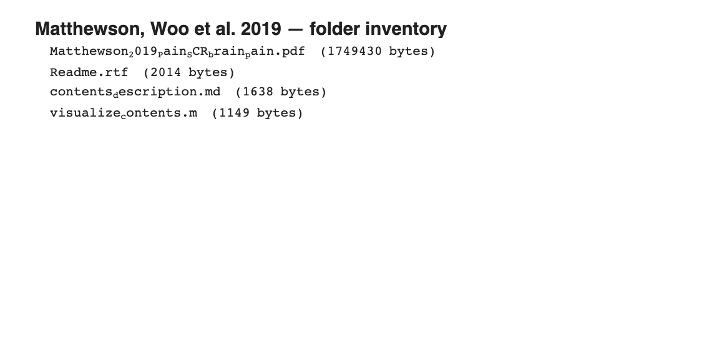

# SCR-pain study (Matthewson, Woo et al. 2019)

## Overview

Companion folder for **Matthewson, Woo et al. 2019** — a study linking
**skin-conductance responses (SCR)** to brain markers of pain perception.
The folder currently contains only a `Readme.rtf` describing the
materials; the pattern files themselves are stored elsewhere (see the
README for download instructions).

**Primary reference.** Matthewson, G. M., Woo, C.-W., Reddan, M. C., &
Wager, T. D. (2019). *Cognitive self-regulation influences pain-related
physiology.* **PAIN, 160**(10), 2338–2349.
[doi:10.1097/j.pain.0000000000001621](https://doi.org/10.1097/j.pain.0000000000001621)
· [local PDF](./Matthewson_2019_Pain_SCR_brain_pain.pdf)

## Key images

No NIfTI files are present locally, so
[`visualize_contents.m`](./visualize_contents.m) renders only this
inventory panel into `png_images/`. See the linked PDF for the
study's figures, and the SIIPS1 / NPS-plus bundle in CanlabCore for
the actual pattern weights.

## How to load

Pattern files for this study are distributed with the SIIPS1 / NPS-plus
bundle in CanlabCore. If you need the specific SCR-pain pattern files,
see `Readme.rtf` for download instructions.

## File inventory

| File | Type | What it is |
| --- | --- | --- |
| `Readme.rtf` | RTF | Author notes (download instructions for pattern files). |
| `Matthewson_2019_Pain_SCR_brain_pain.pdf` | PDF | Primary reference. |
| `visualize_contents.m` | MATLAB | Inventory panel only (no NIfTIs locally). |

## Citations

- Matthewson GM, Woo CW, Reddan MC, Wager TD (2019). Cognitive
  self-regulation influences pain-related physiology. *PAIN* 160:2338–2349.
  [doi:10.1097/j.pain.0000000000001621](https://doi.org/10.1097/j.pain.0000000000001621)
