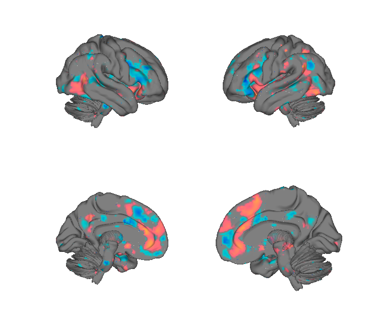
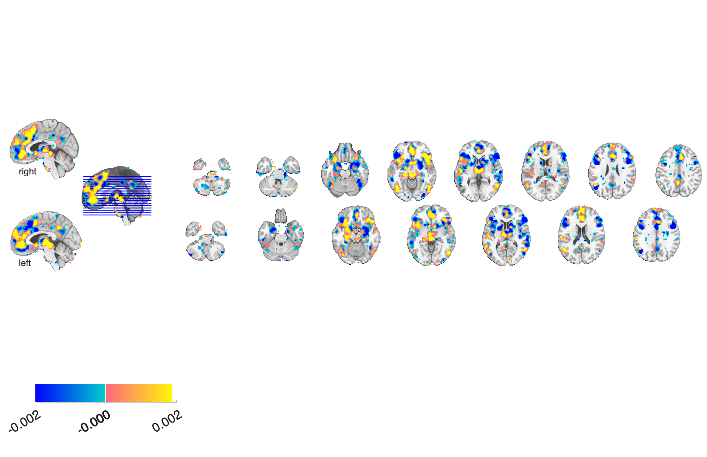

# Interpersonal-Guilt signature (Yu, Koban et al. 2020)

## Overview

A multivariate fMRI **support-vector-machine pattern** that discriminates
**self-responsible guilt** (pain caused to a partner is one's own fault,
"sxpo") from **shared-responsibility** trials ("sxpx") where blame is
distributed. The classifier was **trained within a Neurosynth meta-analytic
emotion mask** (forward-inference) to ensure the signal reflects
emotion-related activity rather than task confounds, then tested for
generalisation across independent samples.

**Primary reference.** Yu, H., Koban, L., Chang, L. J., Wagner, U.,
Krishnan, A., Vuilleumier, P., Zhou, X., & Wager, T. D. (2020).
*A generalizable multivariate brain pattern for interpersonal guilt.*
**Cerebral Cortex, 30**(6), 3558–3572.
[doi:10.1093/cercor/bhz326](https://doi.org/10.1093/cercor/bhz326)
· [local PDF](./Yu_2020_CerebralCortex_guilt.pdf)

> The folder name says 2019 but the paper was published in 2020.

## Key images

| Guilt-SVM — cortical surface | Guilt-SVM — axial montage |
| --- | --- |
|  |  |

The unthresholded guilt SVM weights within the Neurosynth emotion
forward-inference mask. The matching isosurface is at
`png_images/Yu2020_Guilt_SVM_isosurface.png`. Pre-rendered tables and
additional figures are in [`tables_and_figures/`](./tables_and_figures).
Rendered by [`visualize_contents.m`](./visualize_contents.m).

## How to load

Registered as `'guilt'` (alias `'guilt_behavior'`) in
[`load_image_set.m`](https://github.com/canlab/CanlabCore/blob/master/CanlabCore/Data_extraction/load_image_set.m):

```matlab
[obj, ~, ~] = load_image_set('guilt');
```

Or load directly:

```matlab
guilt = fmri_data(which('Yu_guilt_SVM_sxpo_sxpx_EmotionForwardmask.nii'));
```

See `apply_guilt_signature_example.m` for a worked application.

## File inventory

| File | Type | What it is |
| --- | --- | --- |
| `Yu_guilt_SVM_sxpo_sxpx_EmotionForwardmask.nii` (+ `.nii.gz`) | NIfTI | **Guilt signature** — SVM weights within the Neurosynth emotion mask. |
| `apply_guilt_signature_example.m` | MATLAB | Worked example applying the signature. |
| `tables_and_figures/` | dir | Pre-rendered tables and figures. |
| `readme.rtf` | RTF | Author notes. |
| `Yu_2020_CerebralCortex_guilt.pdf` | PDF | Primary reference. |
| `visualize_contents.m` | MATLAB | Generates `png_images/`. |

## Citations

- Yu H, Koban L, Chang LJ, Wagner U, Krishnan A, Vuilleumier P, Zhou X,
  Wager TD (2020). A generalizable multivariate brain pattern for
  interpersonal guilt. *Cereb Cortex* 30:3558–3572.
  [doi:10.1093/cercor/bhz326](https://doi.org/10.1093/cercor/bhz326)
