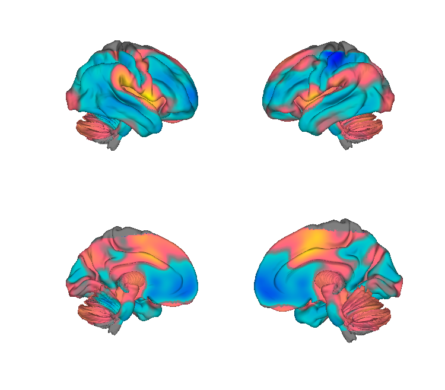
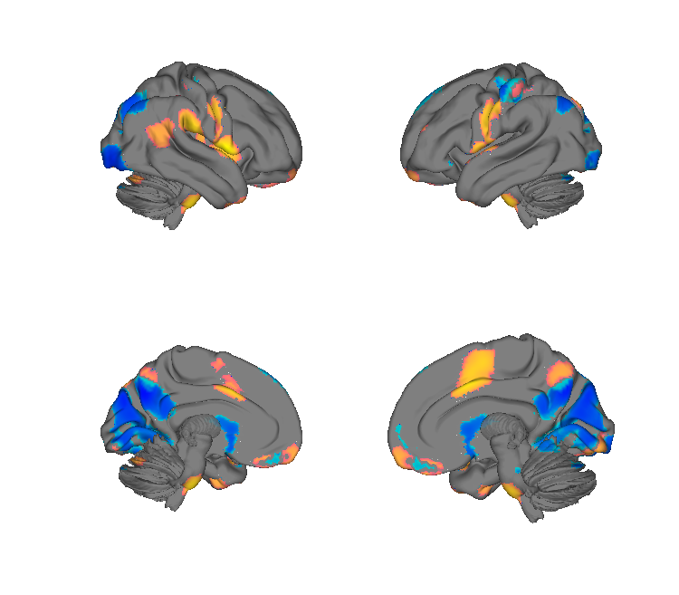
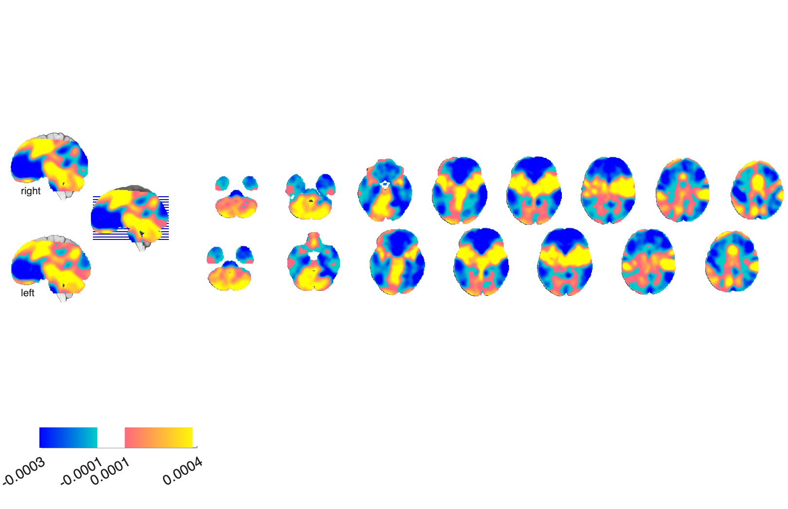

# cPDM — combined Principal Directions of Mediation (Geuter et al. 2020)

## Overview

The **combined Principal-Directions-of-Mediation (cPDM)** is a
multivariate brain pattern whose voxelwise weights identify the
direction in which brain activity **mediates the stimulus→pain
relationship**. Unlike signatures trained to predict pain ratings, the
cPDM is optimised to capture the causal pathway. The folder also
contains the 10 individual orthogonal PDMs and a combined `atlas`-style
`.mat` object.

**Primary reference (open access via CANlab Dartmouth mirror).** Geuter,
S., Reynolds Losin, E. A., Roy, M., Atlas, L. Y., Schmidt, L., Krishnan,
A., Koban, L., Wager, T. D., & Lindquist, M. A. (2020). *Multiple brain
networks mediating stimulus–pain relationships in humans.* **Cerebral
Cortex, 30**(7), 4204–4219.
[doi:10.1093/cercor/bhaa048](https://doi.org/10.1093/cercor/bhaa048)
· [local PDF](./Geuter_2020_NatHumBehav_pain_PDM.pdf)

> Despite the local filename, the PDF is the *Cerebral Cortex* paper.

## Key images

| Combined cPDM map | 10-PDM stack (FDR *q* < 0.05) |
| --- | --- |
|  |  |
|  |  |

The canonical combined-cPDM mediation map (left) — a single
voxel-wise direction that mediates the stimulus → pain relationship —
and the FDR-thresholded stack of the 10 individual orthogonal PDMs
(right). The unthresholded 10-PDM stack is also in `png_images/`.
Rendered by [`visualize_contents.m`](./visualize_contents.m).

## How to load

Registered as `'pdm'` (alias `'pain_pdm'`) in
[`load_image_set.m`](https://github.com/canlab/CanlabCore/blob/master/CanlabCore/Data_extraction/load_image_set.m):

```matlab
[obj, networknames, imagenames] = load_image_set('pdm');
% networknames = {'GeuterPaincPDM','PDM1','PDM2',...,'PDM10'}
```

Or load directly:

```matlab
cpdm    = fmri_data(which('Geuter_2020_cPDM_combined_pain_map.nii'));
pdm10   = fmri_data(which('All_PDM10_unthresholded.nii.gz'));
```

The `CombinedPDM.mat` file provides the matched named-object form.

## File inventory

| File | Type | What it is |
| --- | --- | --- |
| `Geuter_2020_cPDM_combined_pain_map.nii` (+ `.nii.gz`) | NIfTI | **cPDM combined map** — the canonical mediation pattern. |
| `All_PDM10_unthresholded.nii.gz` | NIfTI | Stack of 10 individual PDMs, unthresholded. |
| `All_PDM10_FDR_thresholded.nii.gz` | NIfTI | Same stack, FDR-thresholded for display. |
| `CombinedPDM.mat` | MAT | Named-object form (used by CanlabCore loaders). |
| `Geuter_2020_NatHumBehav_pain_PDM.pdf` | PDF | Primary reference. |
| `visualize_contents.m` | MATLAB | Generates `png_images/`. |

## Citations

- Geuter S, Reynolds Losin EA, Roy M, Atlas LY, Schmidt L, Krishnan A,
  Koban L, Wager TD, Lindquist MA (2020). Multiple brain networks
  mediating stimulus–pain relationships in humans. *Cereb Cortex*
  30:4204–4219.
  [doi:10.1093/cercor/bhaa048](https://doi.org/10.1093/cercor/bhaa048)
