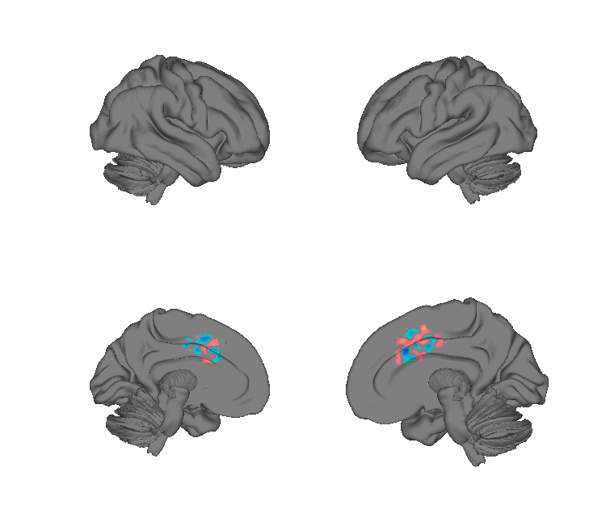
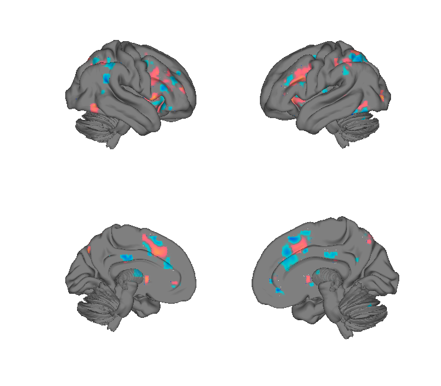
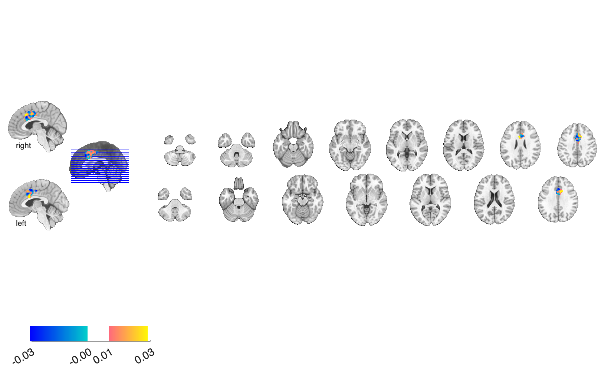
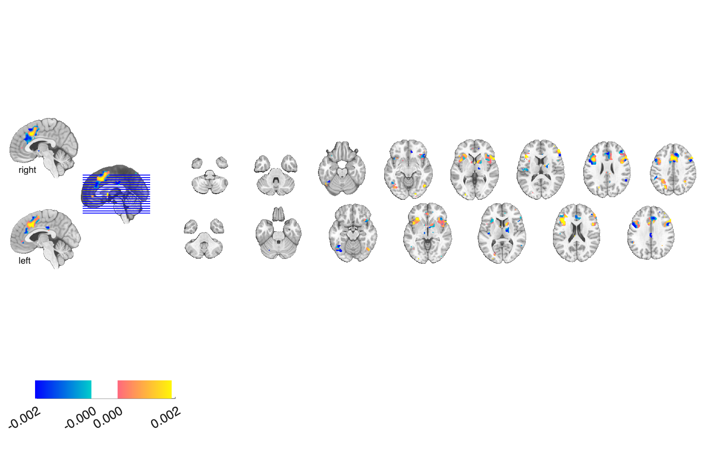

# dACC pain × cognitive-control interaction patterns (Silvestrini & Rainville 2020)

## Overview

Three multivariate dorsal-anterior-cingulate (dACC / aMCC) patterns from
a study of **how cognitive control and pain interact** in the dACC:

- A **pain pattern** trained on noxious heat vs warm trials,
- A **task / cognitive-control pattern** trained on Stroop trials,
- A **Stroop interference pattern** at the whole-brain level.

Together they support the claim that even within dACC, pain and
cognitive-control engage **dissociable multivariate patterns** despite
overlapping univariate activation.

**Primary reference.** Silvestrini, N., Piché, M., Wager, T. D., &
Rainville, P. (2020). *Differential brain activity for pain and
cognitive control in the cingulate cortex.* **NeuroImage, 217**, 116897.
[doi:10.1016/j.neuroimage.2020.116897](https://doi.org/10.1016/j.neuroimage.2020.116897)
· [local PDF](./Silvestrini_2020_Neuroimage_aMCC_pain_cogcontrol.pdf)

## Key images

| dACC pain pattern | Stroop interference (whole-brain) |
| --- | --- |
|  |  |
|  |  |

The dACC pain pattern (`dACC_pain_pattern_wani_121416.nii`) on the left
versus the whole-brain Stroop interference pattern
(`stroop_pattern_wani_121416.nii`) on the right — together they
dissociate pain from cognitive control within the cingulate. The dACC
task (Stroop within-dACC) pattern is also in `png_images/`. See
`Silvestrini_Readme.html` for the author-authored description with
embedded figures. Rendered by [`visualize_contents.m`](./visualize_contents.m).

## How to load

The Stroop interference pattern is registered as `'stroop'` in
[`load_image_set.m`](https://github.com/canlab/CanlabCore/blob/master/CanlabCore/Data_extraction/load_image_set.m):

```matlab
[obj, networknames, imagenames] = load_image_set('stroop');
% networknames = {'Stroop'}
```

For the dACC pain and task patterns, load directly:

```matlab
dacc_pain = fmri_data(which('dACC_pain_pattern_wani_121416.nii'));
dacc_task = fmri_data(which('dACC_task_pattern_wani_121416.nii'));
```

## File inventory

| File | Type | What it is |
| --- | --- | --- |
| `dACC_pain_pattern_wani_121416.nii` | NIfTI | dACC pattern from the pain task. |
| `dACC_task_pattern_wani_121416.nii` | NIfTI | dACC pattern from the Stroop task. |
| `stroop_pattern_wani_121416.nii` | NIfTI | **Whole-brain Stroop interference pattern.** `load_image_set('stroop')`. |
| `Silvestrini_Readme.html` (+ `.mlx`) | HTML / LiveScript | Author-authored description with figures. |
| `Silvestrini_2020_Neuroimage_aMCC_pain_cogcontrol.pdf` | PDF | Primary reference. |
| `visualize_contents.m` | MATLAB | Generates `png_images/`. |

## Citations

- Silvestrini N, Piché M, Wager TD, Rainville P (2020). Differential
  brain activity for pain and cognitive control in the cingulate cortex.
  *NeuroImage* 217:116897.
  [doi:10.1016/j.neuroimage.2020.116897](https://doi.org/10.1016/j.neuroimage.2020.116897)
