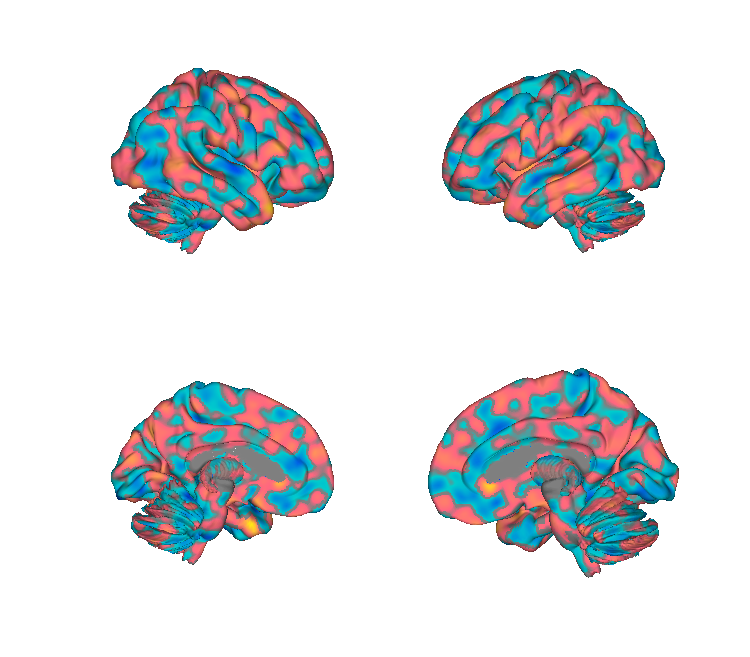
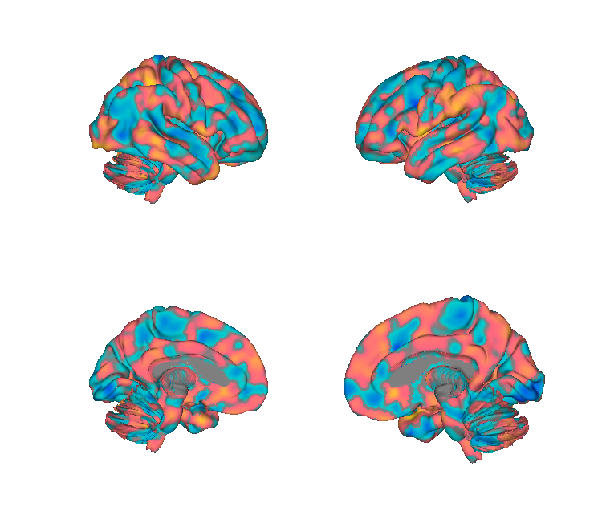
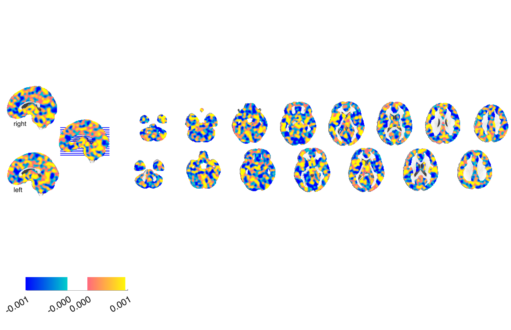
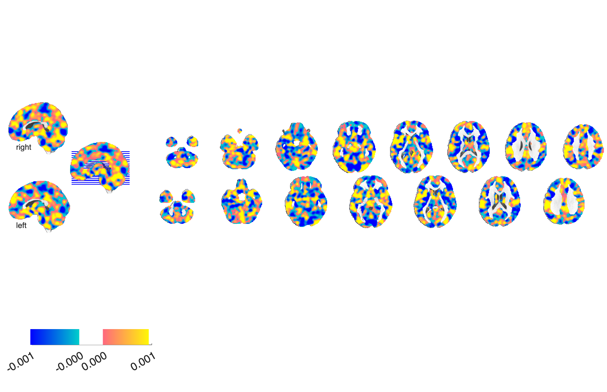

# Vicarious-pain signatures — General / NS / FE (Zhou et al. 2020)

## Overview

Three multivariate fMRI brain patterns predicting **vicarious-pain
ratings** from different stimulus modalities:

- **General** — pooled across noxious-stimulation (NS) and facial-expression (FE) cues
- **NS** — vicarious pain from observed noxious stimulation
- **FE** — vicarious pain from observed facial expressions of pain

Each is provided in unthresholded and FDR q<0.05 thresholded forms.
Together they support both **modality-general** and **modality-specific**
brain representations of vicarious pain.

**Primary reference (open access).** Zhou, F., Li, J., Zhao, W., Xu, L.,
Zheng, X., Fu, M., Yao, S., Kendrick, K. M., Wager, T. D., & Becker, B.
(2020). *Empathic pain evoked by sensory and emotional-communicative
cues share common and process-specific neural representations.*
**eLife, 9**, e56929.
[doi:10.7554/eLife.56929](https://doi.org/10.7554/eLife.56929)
· [local PDF](./Zhou_2020_Vicarious_Pain_elife-56929-v1.pdf)

## Key images

| General vicarious pain (unthresh) | Noxious-stimuli (NS, unthresh) |
| --- | --- |
|  |  |
|  |  |

Two of the three vicarious-pain signatures: the General pattern and
the noxious-stimuli (NS) pattern. The Facial-Expression (FE)
pattern, FDR-thresholded display variants (`*_FDR05_*`) and matching
isosurfaces are also in `png_images/`; rendered by
[`visualize_contents.m`](./visualize_contents.m). The folder also
includes `zhou_VPS_brain_surfaces.pptx` with author-curated figures.

## How to load

A helper `load_zhouvps` is registered inside
[`load_image_set.m`](https://github.com/canlab/CanlabCore/blob/master/CanlabCore/Data_extraction/load_image_set.m)
returning the General unthresholded pattern. Otherwise load directly:

```matlab
gen   = fmri_data(which('General_vicarious_pain_pattern_unthresholded.nii'));
ns    = fmri_data(which('NS_vicarious_pain_pattern_unthresholded.nii'));
fe    = fmri_data(which('FE_vicarious_pain_pattern_unthresholded.nii'));
```

## File inventory

| File | Type | What it is |
| --- | --- | --- |
| `General_vicarious_pain_pattern_unthresholded.nii` | NIfTI | **General pattern** — pooled across NS and FE. |
| `General_vicarious_pain_pattern_FDR05_Boot10000.nii` | NIfTI | General pattern, FDR q<0.05 bootstrap thresholded. |
| `NS_vicarious_pain_pattern_unthresholded.nii` | NIfTI | NS modality-specific pattern. |
| `NS_vicarious_pain_pattern_FDR05.nii` | NIfTI | NS pattern, FDR q<0.05. |
| `FE_vicarious_pain_pattern_unthresholded.nii` | NIfTI | FE modality-specific pattern. |
| `FE_vicarious_pain_pattern_FDR05.nii` | NIfTI | FE pattern, FDR q<0.05. |
| `mask.nii` | NIfTI | Analysis mask used during training. |
| `link-to-subj-beta-images.txt` | text | Pointer to training-subject beta images. |
| `Zhou_2020_Vicarious_Pain_elife-56929-v1.pdf` | PDF | Primary reference (eLife, OA). |
| `zhou_VPS_brain_surfaces.pptx` | PPTX | Author-curated figures. |
| `readme` | text | Author notes. |
| `visualize_contents.m` | MATLAB | Generates `png_images/`. |

## Citations

- Zhou F, Li J, Zhao W, Xu L, Zheng X, Fu M, Yao S, Kendrick KM, Wager TD,
  Becker B (2020). Empathic pain evoked by sensory and emotional-
  communicative cues share common and process-specific neural
  representations. *eLife* 9:e56929.
  [doi:10.7554/eLife.56929](https://doi.org/10.7554/eLife.56929)
