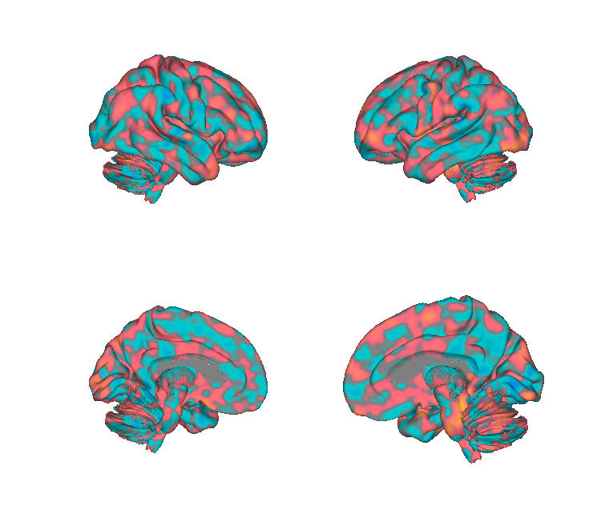
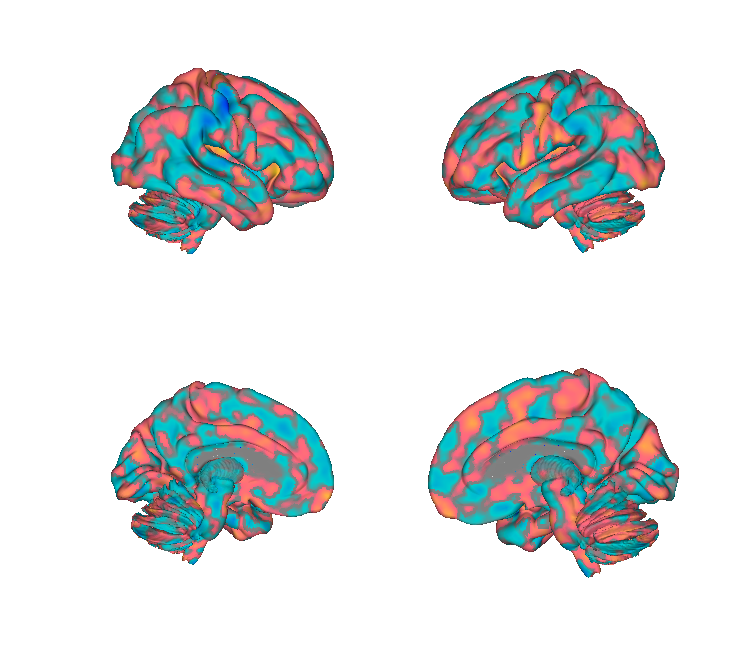
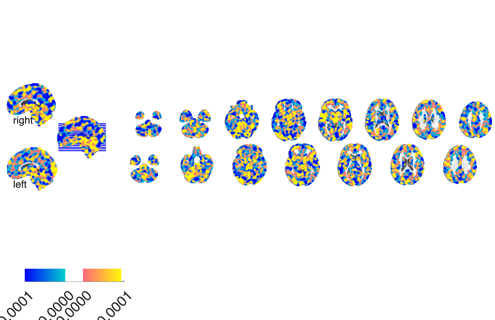
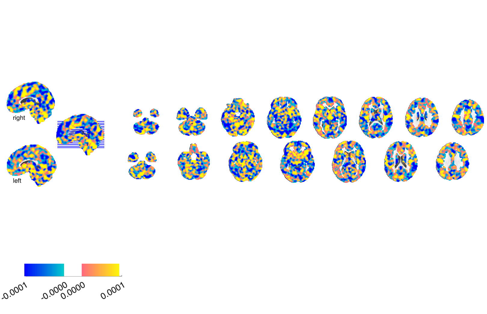

# MPA2 — Multi-Aversive Patterns (Čeko et al. 2022)

## Overview

The **Multi-Aversive Patterns 2 (MPA2)** set captures **common and
stimulus-type-specific** representations of aversive experience across
four modalities — **mechanical pain, thermal pain, aversive sounds, and
aversive visual images** — plus a pooled **general** aversive pattern.
Trained with bootstrapped PLS regression on N=55 participants and
validated in independent samples. The MPA2 generalises across studies,
predicts subjective negative affect, and dissociates aversive
experience from general salience/arousal.

**Primary reference (open access).** Čeko, M., Kragel, P. A., Woo, C.-W.,
López-Solà, M., & Wager, T. D. (2022). *Common and stimulus-type-specific
brain representations of negative affect.* **Nature Neuroscience, 25**(6),
760–770.
[doi:10.1038/s41593-022-01082-w](https://doi.org/10.1038/s41593-022-01082-w)
· [local PDF](./Ceko_2022_NatNeurosci_MPA2_negative_affect.pdf)

> The folder is named `2021_…` but the paper was published in 2022.

## Key images

| General aversive | Thermal pain |
| --- | --- |
|  |  |
|  |  |

The shared-across-modalities general aversive pattern (left) versus
the thermal-pain stimulus-type-specific pattern (right). The
mechanical, sound, and visual modality-specific patterns are also in
`png_images/`. Rendered by [`visualize_contents.m`](./visualize_contents.m).

## How to load

Registered as `'multiaversive'` (alias `'mpa2'`) in
[`load_image_set.m`](https://github.com/canlab/CanlabCore/blob/master/CanlabCore/Data_extraction/load_image_set.m):

```matlab
[obj, networknames, imagenames] = load_image_set('mpa2');
% networknames = {'General aversive' 'Mech pain' 'Thermal pain' ...
%                 'Aversive Sound' 'Aversive Visual'}
```

Apply (multi-pattern similarity):

```matlab
new_data = fmri_data('my_contrast.nii');
[~, sim] = image_similarity_plot(new_data, 'mapset', obj, 'noplot');
```

Worked examples: `apply_multiaversive_mpa2_patterns.m`,
`apply_mpa2_to_kragel270.m`.

## File inventory

| File | Type | What it is |
| --- | --- | --- |
| `General_bplsF_unthr.nii` | NIfTI | **General aversive pattern**. |
| `Mechanical_bplsF_unthr.nii` | NIfTI | Mechanical-pain pattern. |
| `Thermal_bplsF_unthr.nii` | NIfTI | Thermal-pain pattern. |
| `Sound_bplsF_unthr.nii` | NIfTI | Aversive-sound pattern. |
| `Visual_bplsF_unthr.nii` | NIfTI | Aversive-visual pattern. |
| `apply_multiaversive_mpa2_patterns.m` | MATLAB | Apply all 5 patterns to new data. |
| `apply_mpa2_to_kragel270.m` | MATLAB | Apply MPA2 to the Kragel270 test dataset. |
| `Ceko_2022_NatNeurosci_MPA2_negative_affect.pdf` | PDF | Primary reference (OA). |
| `visualize_contents.m` | MATLAB | Generates `png_images/`. |

## Citations

- Čeko M, Kragel PA, Woo CW, López-Solà M, Wager TD (2022). Common and
  stimulus-type-specific brain representations of negative affect.
  *Nat Neurosci* 25:760–770.
  [doi:10.1038/s41593-022-01082-w](https://doi.org/10.1038/s41593-022-01082-w)
