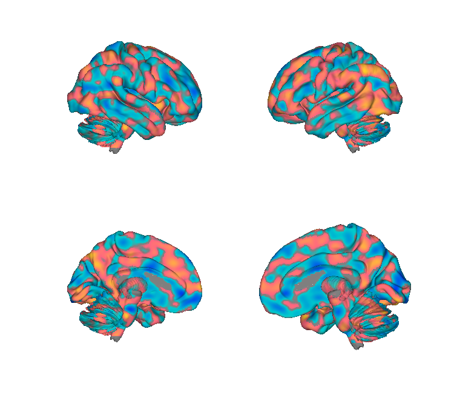
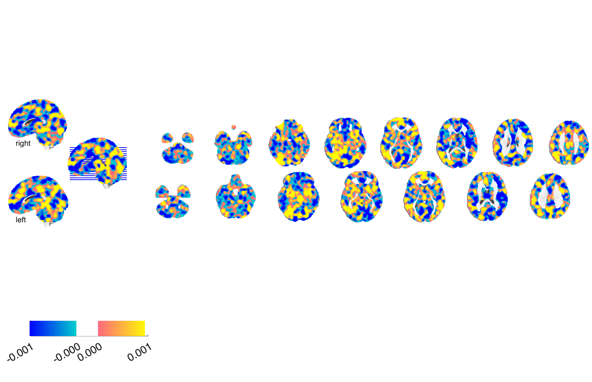

# VIFS — Visually-Induced Fear Signature (Zhou et al. 2021)

## Overview

The **Visually-Induced Fear Signature (VIFS)** is a multivariate fMRI
brain pattern that **predicts subjective fear ratings** in response to
naturalistic fearful videos. Trained with cross-validated multivariate
regression on healthy participants and validated across independent
samples. VIFS provides a fear-specific brain marker that is distinct
from general negative affect or arousal.

**Primary reference (open access).** Zhou, F., Zhao, W., Qi, Z., Geng, Y.,
Yao, S., Kendrick, K. M., Wager, T. D., & Becker, B. (2021). *A
distributed fMRI-based signature for the subjective experience of fear.*
**Nature Communications, 12**, 6643.
[doi:10.1038/s41467-021-26977-3](https://doi.org/10.1038/s41467-021-26977-3)
· [local PDF](./Zhou_2021_NatComms_VIFS_subjective_fear.pdf)

> For additional usage notes from the original authors, see the
> in-folder [`readme.md`](./readme.md).

## Key images

| VIFS — cortical surface | VIFS — axial montage |
| --- | --- |
|  |  |

The unthresholded VIFS pattern (`VIFS.nii`). Positive (warm) voxels
contribute to higher predicted subjective fear; negative (cool) to
lower. Distributed cortical (PFC, midcingulate, insula) and
subcortical (thalamus, PAG, basal forebrain, amygdala) contributions
are visible. The matching isosurface is at
`png_images/Zhou2021_VIFS_isosurface.png`. Rendered by
[`visualize_contents.m`](./visualize_contents.m).

## How to load

A helper `load_vifs` exists in
[`load_image_set.m`](https://github.com/canlab/CanlabCore/blob/master/CanlabCore/Data_extraction/load_image_set.m).
The straightforward direct load is:

```matlab
vifs = fmri_data(which('VIFS.nii'));
```

Pattern application:

```matlab
new_data = fmri_data('my_contrast.nii');
vifs_resp = apply_mask(new_data, vifs, 'pattern_expression', 'ignore_missing');
```

## File inventory

| File | Type | What it is |
| --- | --- | --- |
| `VIFS.nii` | NIfTI | **VIFS pattern** — unthresholded weights. |
| `thresholded_maps.zip` | ZIP | FDR-thresholded variants of the pattern. |
| `readme.md` | Markdown | Author notes. |
| `Citation` | text | Citation information. |
| `visualize_contents.m` | MATLAB | Generates `png_images/`. |

## Citations

- Zhou F, Zhao W, Qi Z, Geng Y, Yao S, Kendrick KM, Wager TD, Becker B
  (2021). A distributed fMRI-based signature for the subjective
  experience of fear. *Nat Commun* 12:6643.
  [doi:10.1038/s41467-021-26977-3](https://doi.org/10.1038/s41467-021-26977-3)
