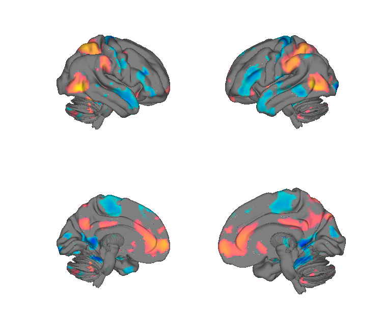
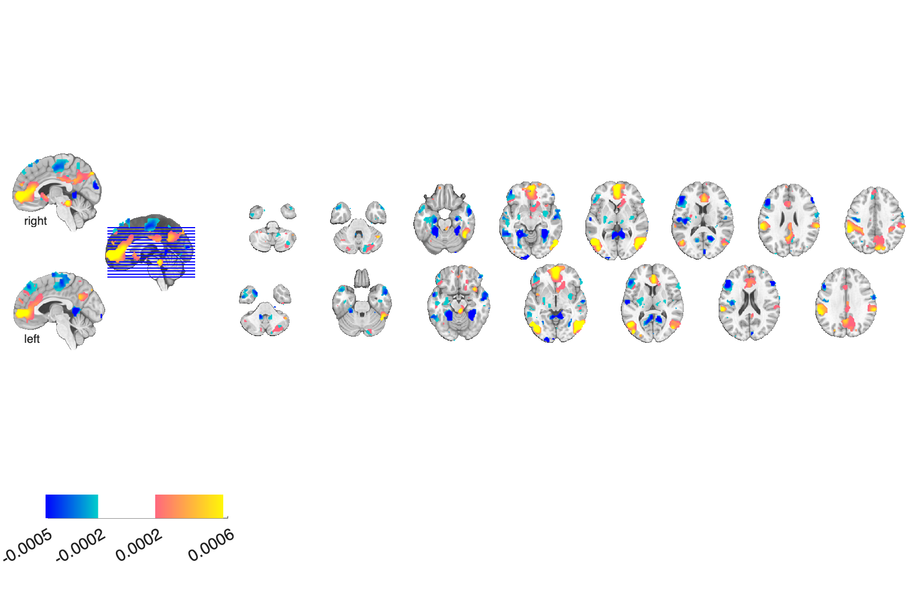

# BASIC — Brain Activity-based Sexual-Image Classifier (van 't Hof et al. 2021)

## Overview

The **Brain Activity-based Sexual-Image Classifier (BASIC)** is a
multivariate fMRI **support-vector pattern** that distinguishes brain
responses to **sexual images** from responses to **neutral or aversive
images**. Trained on N=49 healthy participants with cross-validated
SVM-RFE. Useful as a control / specificity test for affect signatures.

**Primary reference.** van 't Hof, S. R., Cifre, I., Boekel, W., Mengelers,
R., Kohn, N., & Smeets, P. A. M. (2021). *Brain activity-based pattern
classification of sexual images.* **Cerebral Cortex, 31**(8), 3702–3712.
[doi:10.1093/cercor/bhab038](https://doi.org/10.1093/cercor/bhab038)
· [local PDF](./vantHoff_2021_CerebCortex_BASIC_sexual_image.pdf)

## Key images

| BASIC — cortical surface | BASIC — axial montage |
| --- | --- |
|  |  |

The whole-brain BASIC classifier weights. Positive (warm) voxels are
those that increase the probability of classifying a contrast as
sexual; negative (cool) decrease it. The matching isosurface is in
`png_images/vantHoff2021_BASIC_isosurface.png`. Author-curated
renderings and animations are in [`images/`](./images) and
[`movies/`](./movies).

## How to load

Not registered in `load_image_set`. Load directly:

```matlab
basic = fmri_data(which('BASIC_Sexual_image_classifier.nii'));
new_data = fmri_data('my_contrast.nii');
basic_resp = apply_mask(new_data, basic, 'pattern_expression', 'ignore_missing');
```

## File inventory

| File | Type | What it is |
| --- | --- | --- |
| `BASIC_Sexual_image_classifier.nii` | NIfTI | **BASIC pattern** — SVM weights. |
| `images/` | dir | Author-curated rendering output. |
| `movies/` | dir | Author-curated animations. |
| `region_table` | text | Region table for the thresholded pattern. |
| `vantHoff_2021_CerebCortex_BASIC_sexual_image.pdf` | PDF | Primary reference. |
| `visualize_contents.m` | MATLAB | Generates `png_images/`. |

## Citations

- van 't Hof SR, Cifre I, Boekel W, Mengelers R, Kohn N, Smeets PAM
  (2021). Brain activity-based pattern classification of sexual images.
  *Cereb Cortex* 31:3702–3712.
  [doi:10.1093/cercor/bhab038](https://doi.org/10.1093/cercor/bhab038)
