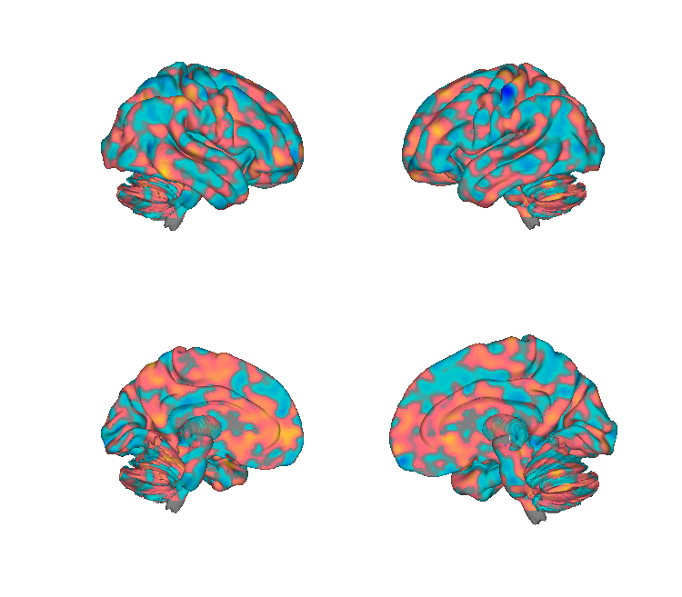
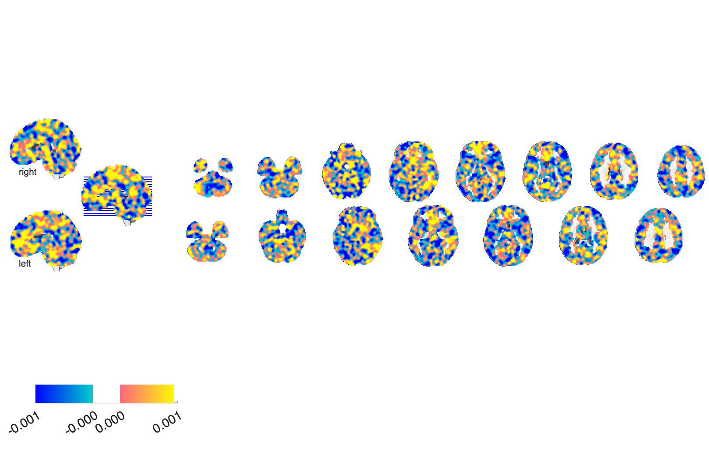

# NCS — Neurobiological Craving Signature (Koban et al. 2023)

## Overview

The **Neurobiological Craving Signature (NCS)** is a multivariate fMRI
**brain pattern** trained to predict **subjective craving** across
**drugs and food**. Trained on N=99 participants spanning multiple
substance-use and food-cue paradigms, and validated in independent
samples. The NCS provides a transdiagnostic brain marker of craving
and dissociates craving from general reward and emotion.

**Primary reference.** Koban, L., Wager, T. D., & Kober, H. (2023).
*A neuromarker for drug and food craving distinguishes drug users from
non-users.* **Nature Neuroscience, 26**(2), 316–325.
[doi:10.1038/s41593-022-01228-w](https://doi.org/10.1038/s41593-022-01228-w)
· [local PDF](./Koban_2023_NatNeurosci_NCS_craving.pdf)

## Key images

| NCS — cortical surface | NCS — axial montage |
| --- | --- |
|  |  |

The general NCS weight map (`craving_wmapN99_boot10K_02-May-2022.img`)
— a 10K-bootstrap weighted mean across the *N* = 99 training set.
The matching isosurface is at `png_images/Koban2023_NCS_general_isosurface.png`.
Rendered by [`visualize_contents.m`](./visualize_contents.m).

The supplementary materials and code are in `Data_code_public/`. The
`NCS_weightmaps/`, `fMRI_data_objects/`, `PatternExpressionData/`, and
`BehavioralData/` subfolders contain the data backing the paper.

## How to load

Registered as the `'ncs'` keyword in
[`load_image_set.m`](https://github.com/canlab/CanlabCore/blob/master/CanlabCore/Data_extraction/load_image_set.m):

```matlab
[obj, networknames, imagenames] = load_image_set('ncs');
% networknames = {'NCS' 'NCSdrugs' 'NCSfood'}
```

Or load directly:

```matlab
ncs = fmri_data(which('craving_wmapN99_boot10K_02-May-2022.img'));
```

## File inventory

| File / dir | Type | What it is |
| --- | --- | --- |
| `craving_wmapN99_boot10K_02-May-2022.img` (+ `.hdr`) | Analyze | **NCS weight map** — 10K-bootstrap weighted mean across N=99. `load_image_set('ncs')`. |
| `NCS_weightmaps/` | dir | Drug/food-specific weight variants. |
| `fMRI_data_objects/` | dir | Subject-level data objects used for training/testing. |
| `PatternExpressionData/` | dir | NCS responses in held-out samples. |
| `BehavioralData/` | dir | Behavioural ratings paired to the fMRI. |
| `Metadata_Craving_20220913.xlsx` | XLSX | Study/subject metadata. |
| `scripts/` | dir | Analysis scripts (Koban lab). |
| `Data_code_public/` | dir | Public code/data drop accompanying the paper. |
| `visualize_contents.m` | MATLAB | Generates `png_images/`. |

## Citations

- Koban L, Wager TD, Kober H (2023). A neuromarker for drug and food
  craving distinguishes drug users from non-users. *Nat Neurosci*
  26:316–325.
  [doi:10.1038/s41593-022-01228-w](https://doi.org/10.1038/s41593-022-01228-w)
