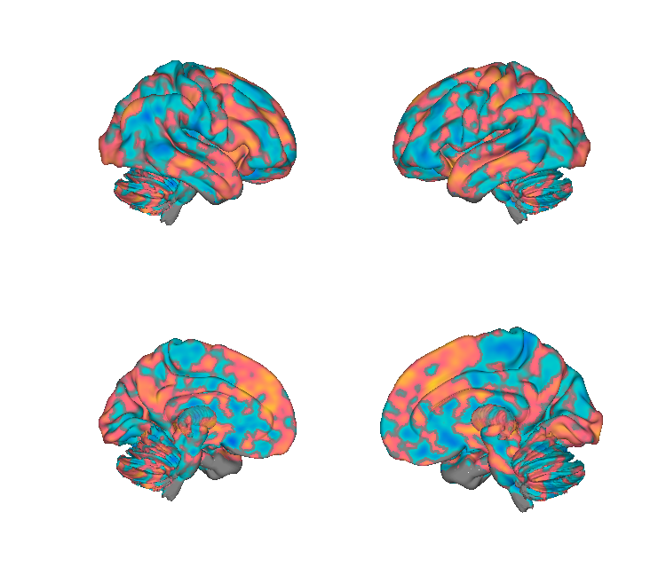
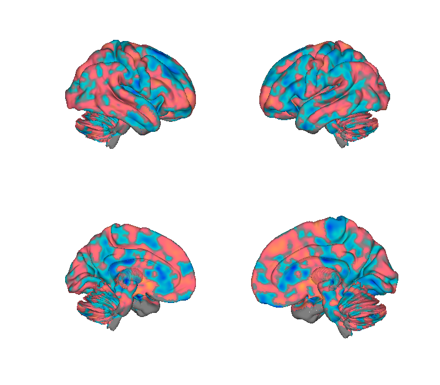
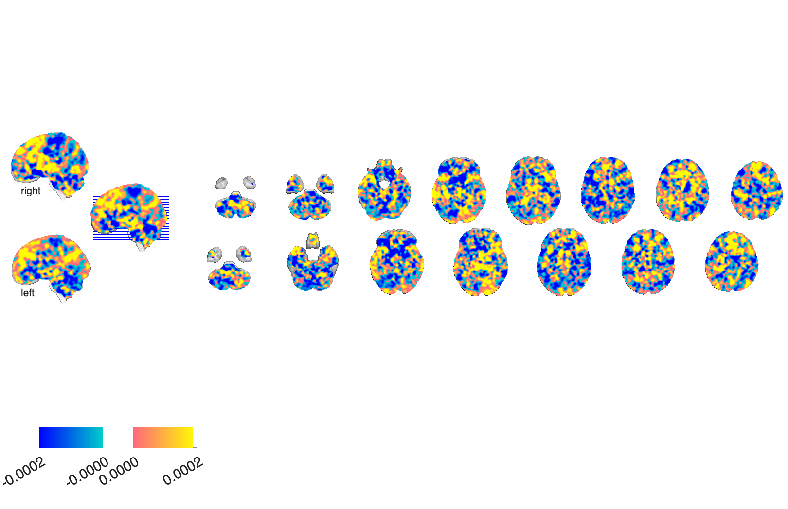
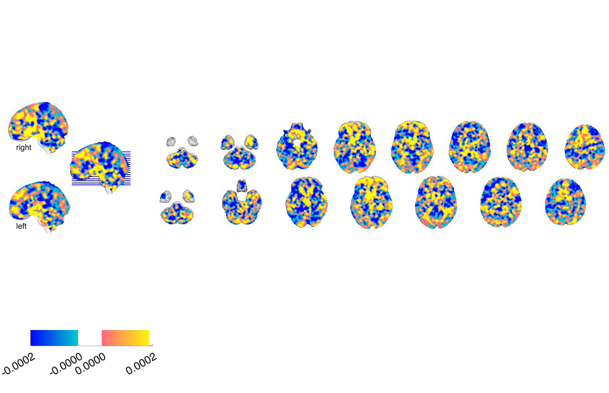

# Decision-value of future pain — Coll et al. 2022

## Overview

Three multivariate fMRI patterns derived from an **economic-choice task
in which participants accepted or rejected offers combining various
amounts of pain and money** (*N* = 57). Each pattern decodes a
different dimension of the offer:

- **`painvalue`** — distributed pattern predicting the **intensity of
  the *future* pain** participants are about to choose for or against.
  Loads negatively on areas tied to reward valuation (ventral striatum,
  orbitofrontal cortex) and positively on saliency / negative-affect /
  executive-control / goal-directed-action regions.
- **`moneyvalue`** — pattern predicting the **subjective value of the
  monetary offer**.
- **`shockintensity`** — pattern tracking the **physical intensity of
  the noxious shock** delivered at outcome.

The paper's central finding is that the brain representation of *future*
pain value **overlaps with that of aversive pictures but is distinct
from experienced pain** — i.e., future pain is encoded as a signed
value combined with saliency / control signals, not as a stored
representation of past noxious experience.

Each pattern is provided as unthresholded weights, bootstrap z-maps,
and an FDR *q* < 0.05 thresholded display.

**Primary reference (open access).** Coll, M.-P., Slimani, H., Woo,
C.-W., Wager, T. D., Rainville, P., Vachon-Presseau, É., & Roy, M.
(2022). *The neural signature of the decision value of future pain.*
**PNAS, 119**(23), e2119931119.
[doi:10.1073/pnas.2119931119](https://doi.org/10.1073/pnas.2119931119)
· [local PDF](<./Coll et al. 2022 - The neural signature of the decision value of future pain.pdf>)

## Key images

| Pain-value (unthresholded) | Money-value (unthresholded) |
| --- | --- |
|  |  |
|  |  |

The two valuation patterns side-by-side — note the largely opposite-sign
loadings in striatal / orbitofrontal regions, consistent with the
paper's signed-value account. The shock-intensity pattern (which
tracks physical stimulus strength rather than decision value) plus
bootstrap-z and FDR-thresholded variants of all three patterns are
also in `png_images/`. Rendered by
[`visualize_contents.m`](./visualize_contents.m).

## How to load

Not registered in `load_image_set`. Load directly:

```matlab
painv  = fmri_data(which('painvalue_weights.nii.gz'));
moneyv = fmri_data(which('moneyvalue_weights.nii.gz'));
shock  = fmri_data(which('shockintensity_weights.nii.gz'));
```

Each `*_weights` map is the unthresholded predictor. `*_bootz` is the
bootstrap z-map and `*_weights_fdr05` is the FDR q<0.05 thresholded
display.

## File inventory

| File | Type | What it is |
| --- | --- | --- |
| `painvalue_weights.nii.gz` | NIfTI | Pain-value SVM/regression weights, unthresholded. |
| `painvalue_bootz.nii.gz` | NIfTI | Pain-value bootstrap z-map. |
| `painvalue_weights_fdr05.nii.gz` | NIfTI | Pain-value FDR q<0.05 thresholded display. |
| `moneyvalue_weights.nii.gz` | NIfTI | Money-value weights, unthresholded. |
| `moneyvalue_bootz.nii.gz` | NIfTI | Money-value bootstrap z-map. |
| `moneyvalue_weights_fdr05.nii.gz` | NIfTI | Money-value FDR q<0.05. |
| `shockintensity_weights.nii.gz` | NIfTI | Shock-intensity weights, unthresholded. |
| `shockintensity_bootz.nii.gz` | NIfTI | Shock-intensity bootstrap z-map. |
| `shockintensity_weights_fdr05.nii.gz` | NIfTI | Shock-intensity FDR q<0.05. |
| `readme.rtf` | RTF | Author notes. |
| `Coll et al. 2022 - The neural signature of the decision value of future pain.pdf` | PDF | Primary reference (PNAS, OA). |
| `visualize_contents.m` | MATLAB | Generates `png_images/`. |

## Citations

- Coll M-P, Slimani H, Woo C-W, Wager TD, Rainville P,
  Vachon-Presseau É, Roy M (2022). The neural signature of the
  decision value of future pain. *PNAS* 119(23):e2119931119.
  [doi:10.1073/pnas.2119931119](https://doi.org/10.1073/pnas.2119931119)
