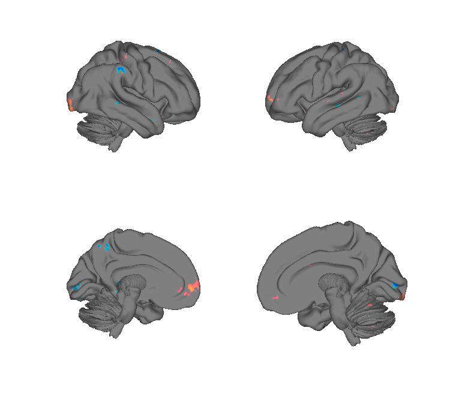
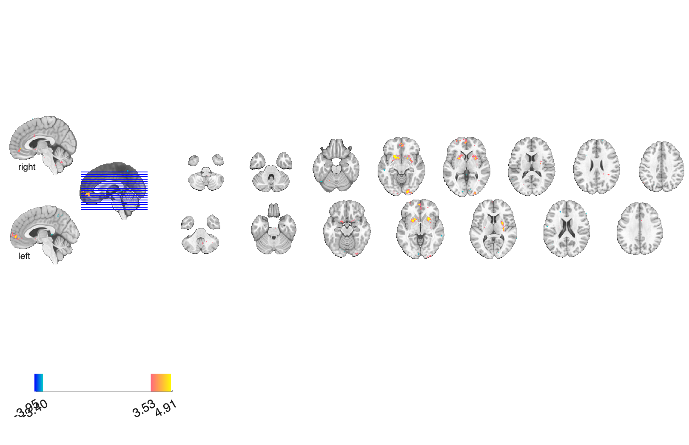

# BRS — Brain Reward Signature (Speer et al. 2023)

## Overview

The **Brain Reward Signature (BRS)** is a multivariate fMRI brain
pattern that predicts the **signed magnitude of monetary rewards vs.
losses** from whole-brain activity. It was trained on the **Monetary
Incentive Delay (MID)** task (*N* = 39) with cross-validated machine
learning, achieving **92% decoding accuracy** between reward and loss
trials in cross-validation. Generalisation tests:

- Independent MID sample (*N* = 12) — **92%** decoding accuracy.
- Out-of-task gambling sample (*N* = 1 084) — **73%** decoding accuracy.

Specificity probes show that BRS responses discriminate rewarding from
negative feedback (**92%**) but do *not* differ for disgust conditions
in a novel Disgust-Delay task (*N* = 39), arguing for a reward-specific
rather than generic salience-related signature. Passively viewing
positively- and negatively-valenced facial expressions also loads
positively on BRS, hinting at a link to information-seeking and morbid
curiosity. The pattern is intended as a domain-general reward
biomarker, complementary to the pain-domain signatures elsewhere in
this repository.

**Primary reference.** Speer, S. P. H., Keysers, C., Campdepadrós
Barrios, J., Teurlings, C. J. S., Smidts, A., Boksem, M. A. S.,
Wager, T. D., & Gazzola, V. (2023). *A multivariate brain signature
for reward.* **NeuroImage, 271**, 119990.
[doi:10.1016/j.neuroimage.2023.119990](https://doi.org/10.1016/j.neuroimage.2023.119990)
(open access, CC BY-NC-ND 4.0)
· [local PDF](./Speer_2023_BRS_reward_signature.pdf)

The folder also includes `explore_speer_BRS.html`/`.mlx` — an
author-authored MATLAB live-script demo that visualises and applies the
pattern.

## Key images

| Cortical surface | Axial montage |
| --- | --- |
|  |  |

The BRS pattern (`Reward_Signature_bootstrapped_0.5.nii.gz`) — positive
weights (warm) encode reward, negative (cool) encode loss. Rendered by
[`visualize_contents.m`](./visualize_contents.m); the matching
isosurface is in `png_images/Speer2023_BRS_isosurface.png`.

## How to load

Not yet registered as a `load_image_set` keyword. Load directly:

```matlab
brs = fmri_data(which('Reward_Signature_bootstrapped_0.5.nii.gz'));
new_data = fmri_data('my_contrast.nii');
brs_resp = apply_mask(new_data, brs, 'pattern_expression', 'ignore_missing');
```

## File inventory

| File | Type | What it is |
| --- | --- | --- |
| `Reward_Signature_bootstrapped_0.5.nii.gz` | NIfTI | **BRS pattern** — bootstrap-thresholded (0.5) weights. |
| `explore_speer_BRS.html` (+ `.mlx`) | HTML / LiveScript | Author-authored worked example. |
| `Readme Speer et al.rtf` | RTF | Author notes (primary reference). |
| `visualize_contents.m` | MATLAB | Generates `png_images/`. |

## Citations

- Speer SPH, Keysers C, Campdepadrós Barrios J, Teurlings CJS,
  Smidts A, Boksem MAS, Wager TD, Gazzola V (2023). A multivariate
  brain signature for reward. *NeuroImage* 271:119990.
  [doi:10.1016/j.neuroimage.2023.119990](https://doi.org/10.1016/j.neuroimage.2023.119990)
