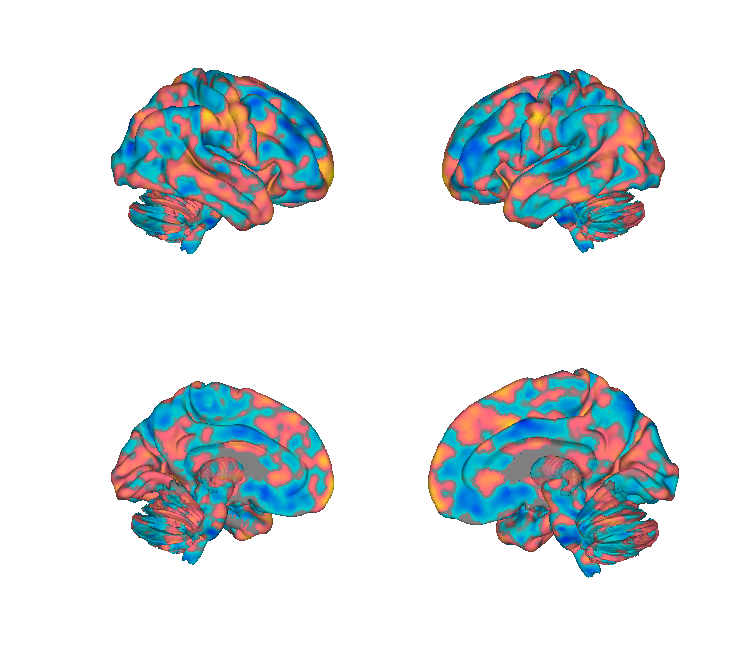
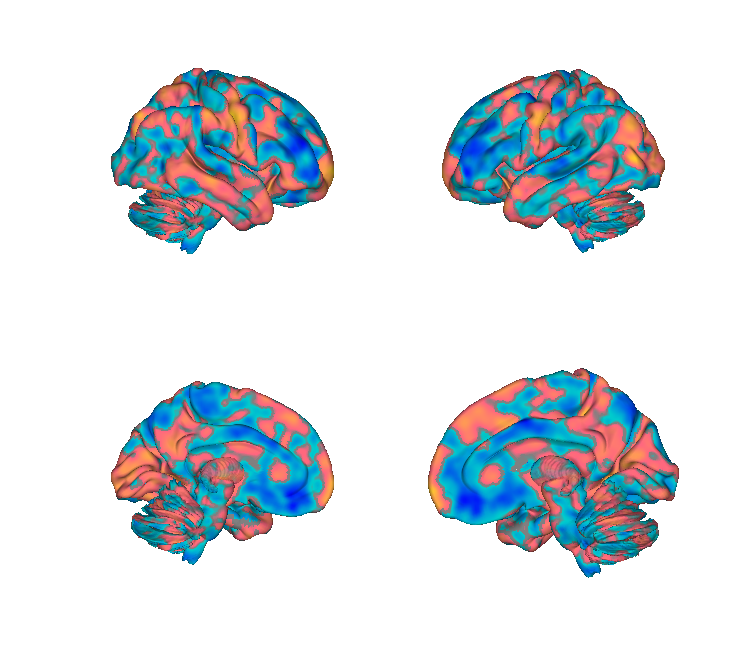
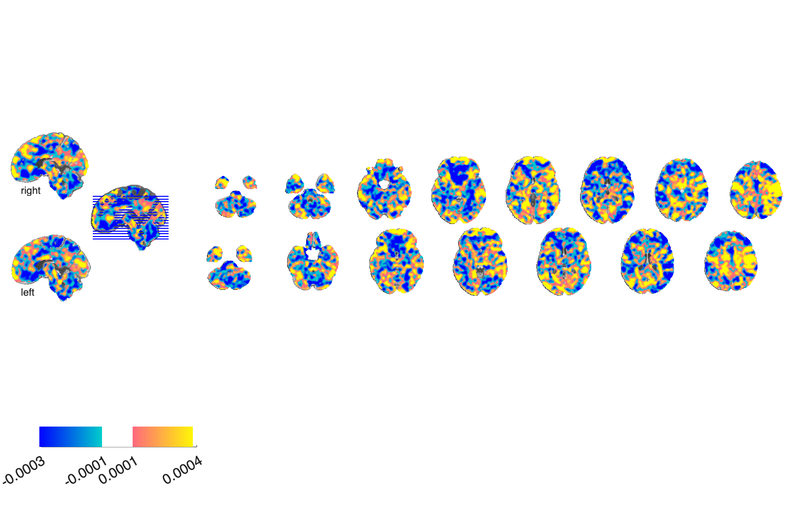
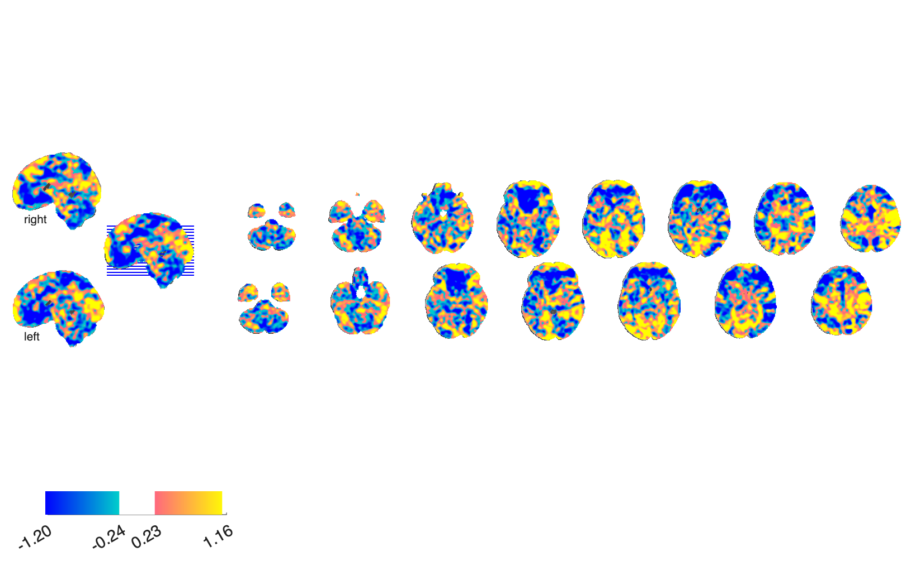

# FEPS — Facial-Expressions-of-Pain Signature

## Overview

The **Facial-Expressions-of-Pain Signature (FEPS)** is a multivariate
fMRI brain pattern that predicts **facial-expression-based pain ratings**.
Provided as the mean cross-validated weight map and a z-scored
unthresholded variant. Distinct from pain-rating signatures (NPS/SIIPS)
in that it targets the *facial-display* dimension of pain, which is
partly dissociable from self-reported intensity.

**Primary reference.** See *eLife* 87962 v1 — the local PDF is
[`elife-87962-v1.pdf`](./elife-87962-v1.pdf). Refer to that paper for
the canonical citation; the author list and exact title are on the PDF
cover page.

## Key images

| FEPS — mean xval weights | FEPS — z-unthresholded |
| --- | --- |
|  |  |
|  |  |

The cross-validated mean weight pattern (left) and the z-scored
unthresholded variant (right). Matching isosurfaces are also in
`png_images/`. Rendered by [`visualize_contents.m`](./visualize_contents.m).

## How to load

Not yet registered as a `load_image_set` keyword. Load directly:

```matlab
feps_mean = fmri_data(which('feps_mean_xval_weights.nii.gz'));
feps_z    = fmri_data(which('feps_z_unthresholded.nii.gz'));
```

## File inventory

| File | Type | What it is |
| --- | --- | --- |
| `feps_mean_xval_weights.nii.gz` | NIfTI | **FEPS pattern** — mean cross-validated weights. |
| `feps_z_unthresholded.nii.gz` | NIfTI | Z-scored unthresholded variant. |
| `feps mean xval weights.zip` | ZIP | Archive of the mean-weights NIfTI. |
| `feps z unthresholded.zip` | ZIP | Archive of the z-unthresholded NIfTI. |
| `FEPS_readme.rtf` | RTF | Author notes. |
| `elife-87962-v1.pdf` | PDF | Primary reference (eLife, OA). |
| `visualize_contents.m` | MATLAB | Generates `png_images/`. |

## Citations

- See [`elife-87962-v1.pdf`](./elife-87962-v1.pdf) for the full citation
  (eLife article 87962, OA).
