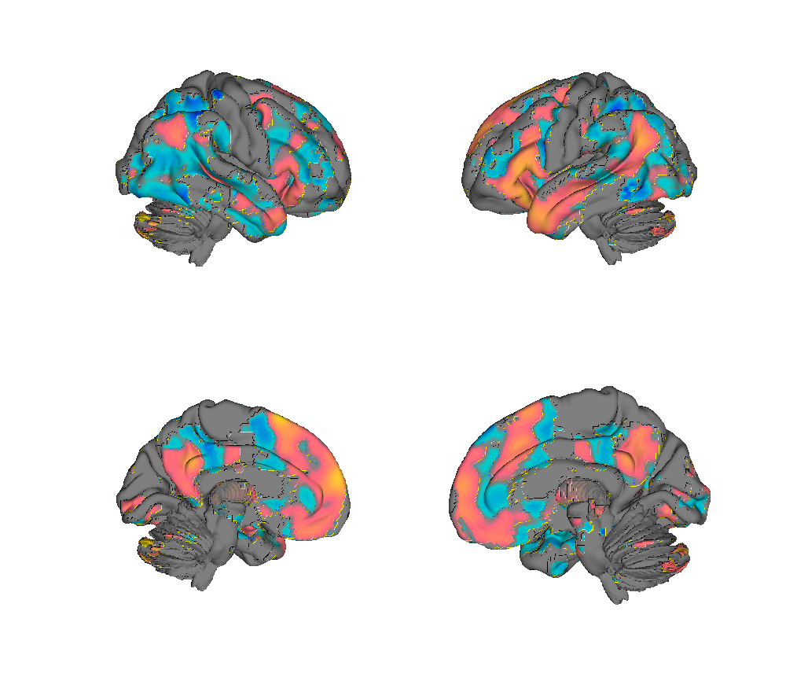
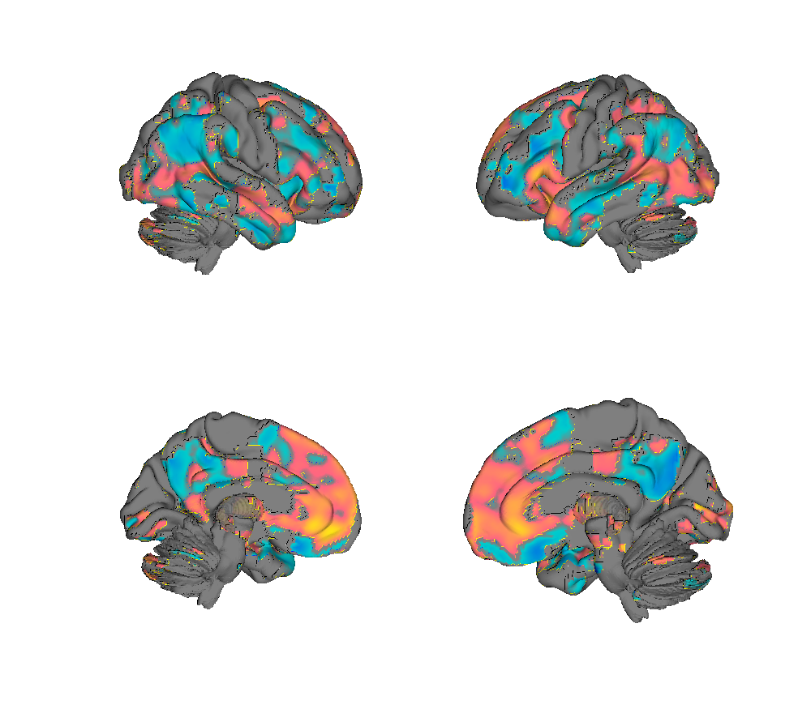
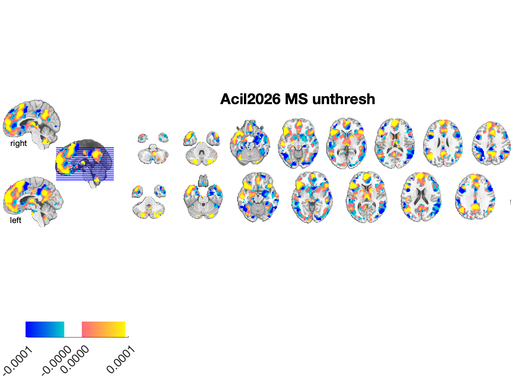
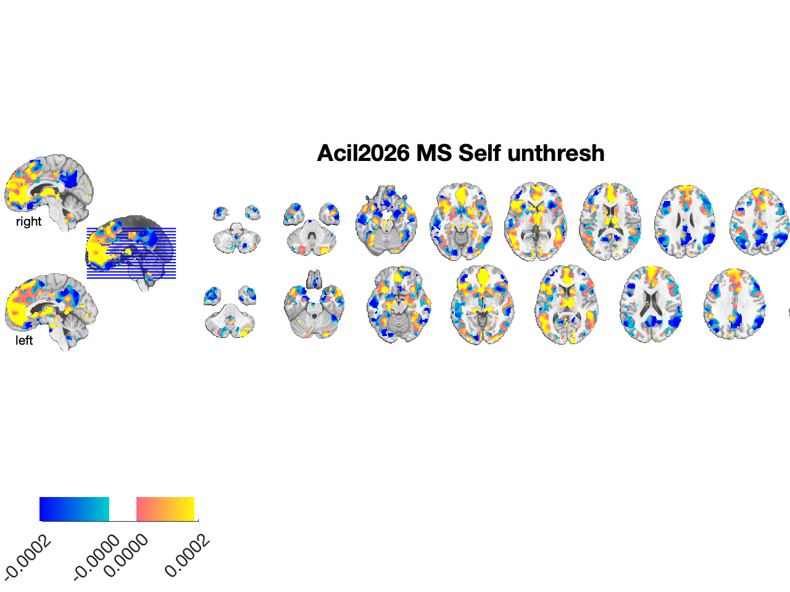
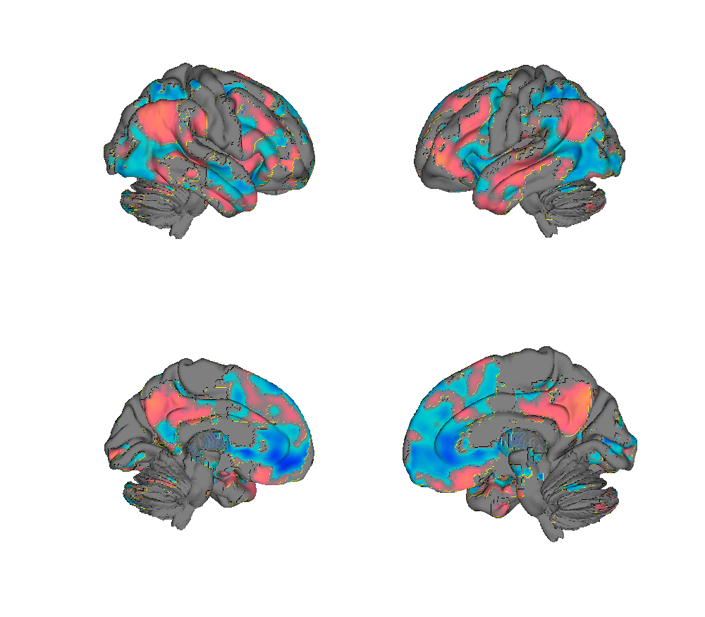
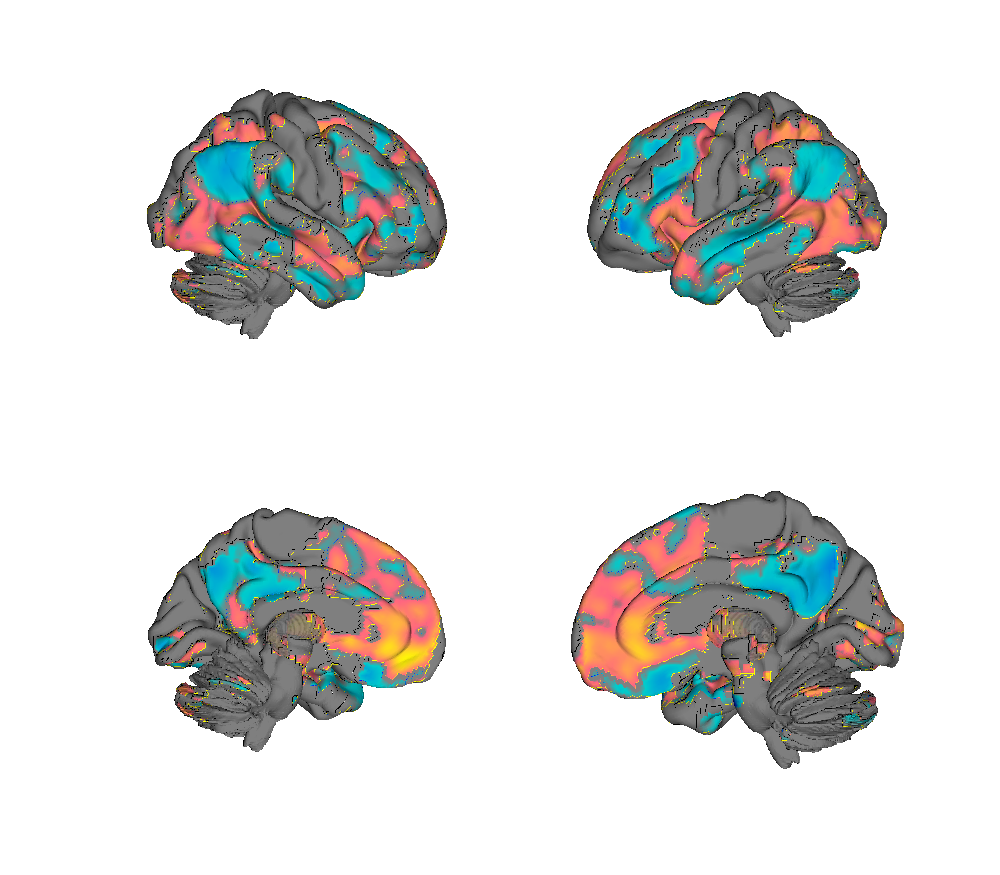
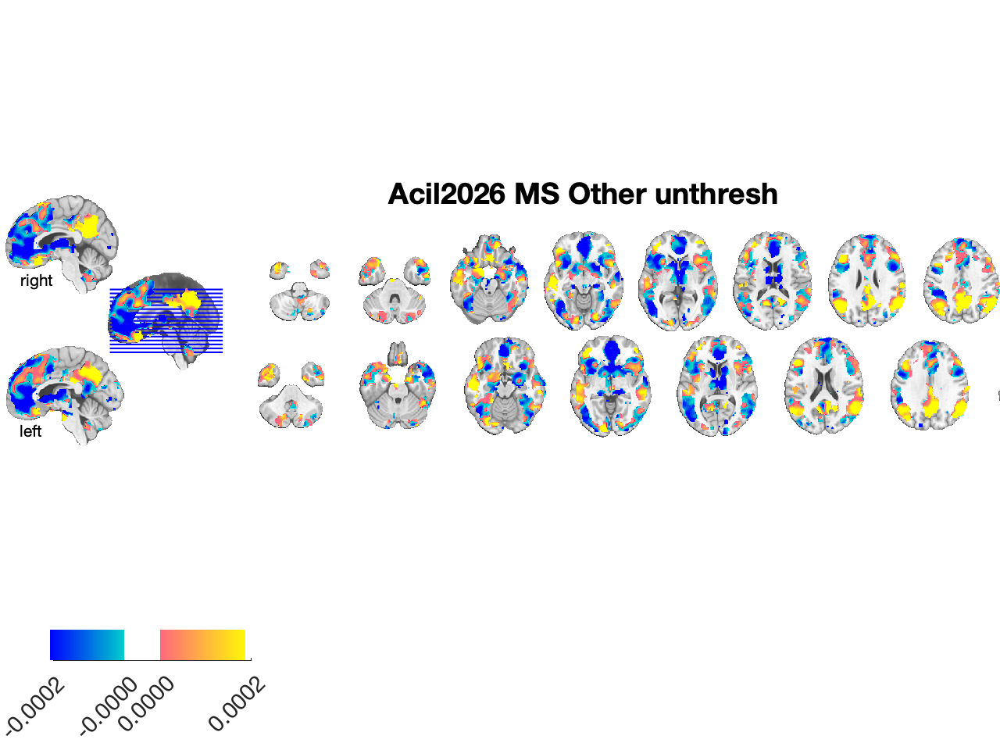
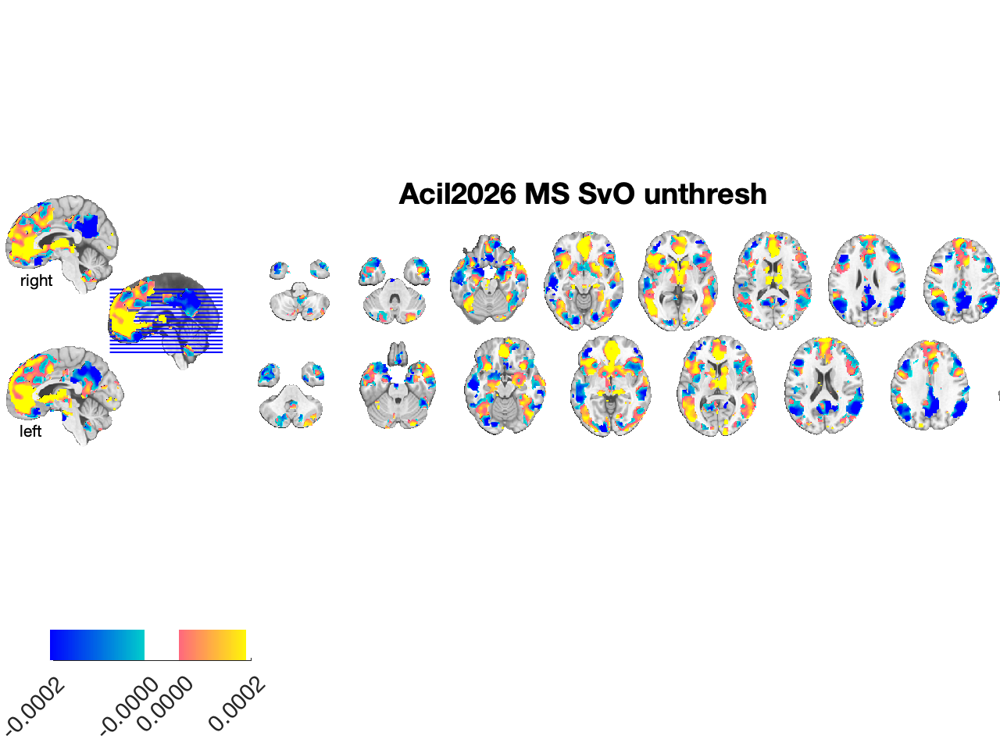

# Mentalizing Signatures — Self, Other, and Self-vs-Other (Açıl et al. 2026)

## Overview

Four multivariate fMRI **support-vector-machine** patterns that predict
**mentalizing about self and others** from single-subject contrast maps.
They were trained on an adult trait-evaluation task (Study 1a, *n* = 21;
Self / Other / non-mentalizing Control conditions) within an inclusive
**social-cognition mask** (union of Neurosynth term-based maps for
*mentalizing*, *self-referential*, and *social*) to discourage the
classifier from leveraging task-confounded sensory features, then
validated in **eight independent cohorts** (*N* = 281 total) spanning
healthy adults, adolescents (ages 11–18), schizophrenia and bipolar
patients, and an implicit social-feedback task in romantic couples.

The folder ships four signatures, each saved as an **unthresholded,
bootstrap-stabilised SVM weight map**:

| Signature | Trained to discriminate | Topography of positive weights |
| --- | --- | --- |
| **MS — Mentalizing Signature** | Self + Other vs. Control | mPFC (dorsal & medial), bilateral vlPFC, dACC, frontal operculum, bilateral SMA, MTG, temporal poles, left STS, MCC, PCC/precuneus, angular gyrus/TPJ, right caudate, left anterior insula, bilateral thalamus |
| **MS-Self** | Self vs. (Other + Control) | Anterior / midline: vmPFC, dmPFC, frontal eye fields, ventral ACC, frontal operculum, anterior insula, thalamus, caudate |
| **MS-Other** | Other vs. (Self + Control) | Posterior / lateral: left vlPFC, left STS, bilateral TPJ, precuneus/PCC |
| **MS-SvO** | Self vs. Other (within mentalizing) | Self/Other contrast pattern used for direct discrimination between targets |

Cross-validated 2AFC accuracy in the training sample was 100 % for all
three primary signatures (averaged Cohen's *d*: MS = 4.92, MS-Self =
3.18, MS-Other = 2.45). Pooled across 14 independent validation tests,
forced-choice accuracy was **97.9 % for MS, 81.5 % for MS-Self, and
77.3 % for MS-Other**. Self-vs-other discrimination by MS-Self and
MS-Other was significantly **reduced in schizophrenia** versus matched
healthy controls, and **increased with age** in adolescents — consistent
with mentalizing maturation across development and altered self/other
differentiation in psychosis. In a held-out social-feedback task, MS and
MS-Self tracked self-relevant feedback even though mentalizing was never
explicitly instructed.

**Primary reference.** Açıl, D., Andrews-Hanna, J., Lopez-Sola, M.,
van Buuren, M., Krabbendam, L., Zhang, L., van der Meer, L.,
Fuentes-Claramonte, P., Pomarol-Clotet, E., Salvador, R., McKenna, P.J.,
Debbané, M., Vrtička, P., Vuilleumier, P., Sbarra, D., Coppola, A.M.,
White, L.O., Wager, T.D., & Koban, L. (2026). *Brain neuromarkers
predict self- and other-related mentalizing across adult, clinical, and
developmental samples.* **Nature Communications.**

## Key images

| Mentalizing Signature (MS) | Self-mentalizing (MS-Self) |
| --- | --- |
|  |  |
|  |  |

| Other-mentalizing (MS-Other) | Self vs. Other (MS-SvO) |
| --- | --- |
|  |  |
|  |  |

All four unthresholded, bootstrap-stabilised SVM weight maps rendered on
the HCP foursurfaces (top) and axial montages (bottom). Matching
isosurfaces are in `png_images/Acil2026_*_isosurface.png`. Rendered by
[`visualize_contents.m`](./visualize_contents.m).

## How to load

Registered as the `'selfother'` keyword in
[`load_image_set.m`](https://github.com/canlab/CanlabCore/blob/master/CanlabCore/Data_extraction/load_image_set.m),
which returns all four maps as a single `fmri_data` object:

```matlab
[obj, networknames, imagenames] = load_image_set('selfother');
% networknames = {'MS','MS_Self','MS_Other','MS_SvO'}
```

Or load the NIfTIs directly. The helper
[`apply_mental2.m`](./apply_mental2.m) (Koban, 2024) wraps the standard
call:

```matlab
% Load the four signatures individually
ms     = fmri_data(which('Mentalization_Boot_Unthr_11-Jun-2024.nii'));
ms_slf = fmri_data(which('Self_Boot_Unthr_11-Jun-2024.nii'));
ms_oth = fmri_data(which('Other_Boot_Unthr_11-Jun-2024.nii'));
ms_svo = fmri_data(which('SvO_Boot_Unthr_11-Jun-2024.nii'));

% Apply to single-subject contrast maps (one map per condition).
% IMPORTANT: rescale subject contrasts using L2-norm before applying,
% as in training.
DAT_rs   = rescale(DAT, 'l2norm_images');
pexp_ms  = apply_mask(DAT_rs, ms,     'pattern_expression');
pexp_slf = apply_mask(DAT_rs, ms_slf, 'pattern_expression');
pexp_oth = apply_mask(DAT_rs, ms_oth, 'pattern_expression');
pexp_svo = apply_mask(DAT_rs, ms_svo, 'pattern_expression');
```

L2-norm rescaling of the input contrasts is required because the
training contrasts were standardised the same way to make beta weights
comparable across studies, scanners, and participants.

## File inventory

| File | Type | What it is |
| --- | --- | --- |
| `Mentalization_Boot_Unthr_11-Jun-2024.nii` | NIfTI | **MS** — overall Mentalizing Signature (Self + Other vs. Control), bootstrap-stabilised SVM weights, unthresholded. |
| `Self_Boot_Unthr_11-Jun-2024.nii` | NIfTI | **MS-Self** — Self-referential signature (Self vs. Other + Control). |
| `Other_Boot_Unthr_11-Jun-2024.nii` | NIfTI | **MS-Other** — Other-referential signature (Other vs. Self + Control). |
| `SvO_Boot_Unthr_11-Jun-2024.nii` | NIfTI | **MS-SvO** — Self-vs-Other discriminator (trained within mentalizing trials). |
| `apply_mental2.m` | MATLAB | Convenience wrapper (Koban, 2024) returning all four pattern-expression values for an `fmri_data` object after L2-norm rescaling. |
| `ReadMe_MentalizingSignatures.txt` | Text | Brief note from the original distribution mapping file names to signatures. |
| `visualize_contents.m` | MATLAB | Generates `png_images/`. |

## Notes on training and validation

- **Training task (Study 1a, Geneva).** Trait-evaluation block design
  (Kelley-style): rate trait adjectives as describing **self**, a
  same-sex **confederate** met earlier, or **count syllables**
  (non-mentalizing control). Three SVMs trained with 10-fold CV (ridge
  = 0.5, weighted classes, otherwise default parameters).
- **Voxel selection.** Bootstrap (5000 samples) plus FDR *q* < 0.05 and
  ≥ 10-voxel clusters identifies the most reliable contributors;
  however, the **unthresholded** maps in this folder are what should be
  applied to new data.
- **Validation cohorts.** Studies 2 (Debbané et al. 2017, adolescents),
  3 (van Buuren et al. 2020, adolescents), 4 (Fuentes-Claramonte et al.
  2019/2020, schizophrenia + controls), 5 (Zhang et al. 2015,
  schizophrenia + bipolar + controls), and 6 (Andrews-Hanna, romantic
  couples, social-feedback task).
- **Caveats from the authors.** Out-of-sample accuracy is lower than
  cross-validated accuracy, in part because the training Other was an
  unfamiliar confederate. In samples where Other is a close partner
  (e.g., Study 6), MS-Other may show weaker self/other separation
  because partners are processed in part as extensions of the self.
  The signatures index *cognitive, explicit* mentalizing and should not
  be assumed to capture affective or implicit dimensions without
  further validation.

## Citation

- Açıl, D., Andrews-Hanna, J., Lopez-Sola, M., van Buuren, M.,
  Krabbendam, L., Zhang, L., van der Meer, L., Fuentes-Claramonte, P.,
  Pomarol-Clotet, E., Salvador, R., McKenna, P.J., Debbané, M.,
  Vrtička, P., Vuilleumier, P., Sbarra, D., Coppola, A.M., White, L.O.,
  Wager, T.D., & Koban, L. (2026). Brain neuromarkers predict self- and
  other-related mentalizing across adult, clinical, and developmental
  samples. *Nature Communications*.

Please cite the paper in any work that uses these signatures or the
included MATLAB code.
