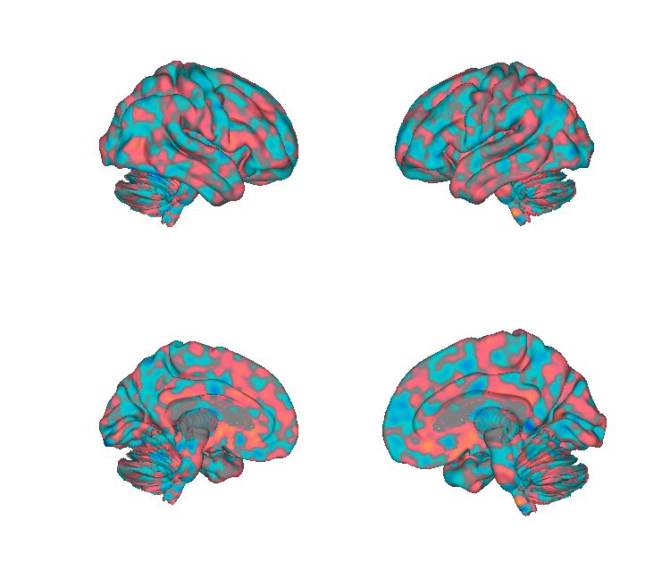
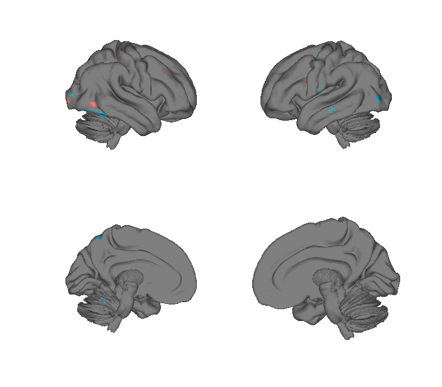
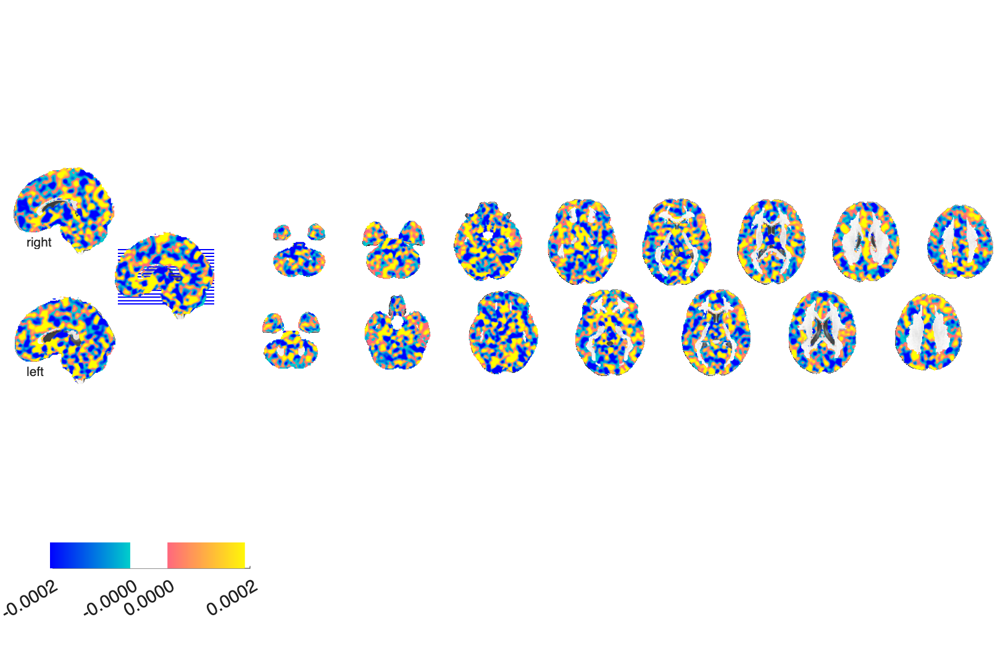
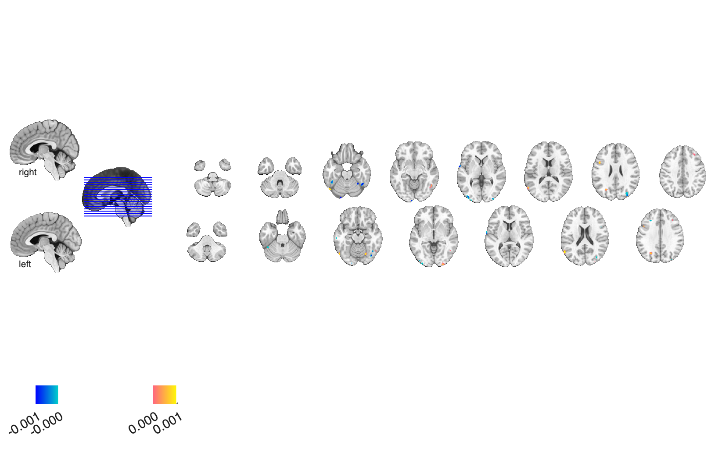

# PiFoneM — Pain-induced Fear of Negative-affect Marker (Murillo et al. 2026)

## Overview

The **PiFoneM** is a multivariate fMRI brain pattern targeting the
**fear-of-pain / negative-affect** dimension of pain experience. The
folder contains three views of the model:

- An **unthresholded** pattern (the canonical predictor),
- An **SVM-RFE importance map** computed via 5000×2500 with k=10,
- A **cross-validated, LASSO-PCR / bootstrap, FDR-thresholded** fear map.

**Primary reference.** Murillo, J. et al. (2026). *PiFoneM — Pain-induced
fear of negative-affect marker.* **The Journal of Pain.** See the local
[`Murillo J Pain 2026 PiFoneM.pdf`](./Murillo%20J%20Pain%202026%20PiFoneM.pdf)
for the canonical citation.

## Key images

| PiFoneM (unthresholded) | LASSO-PCR fear (FDR *q* < 0.05) |
| --- | --- |
|  |  |
|  |  |

The canonical PiFoneM predictor (left;
`PiFoneM_unthresholded.nii`) and the LASSO-PCR FDR *q* < 0.05
fear-thresholded display (right). The SVM-RFE feature-importance map
is also in `png_images/`
(`Murillo2026_SVM_RFE_importance_*.png`). Rendered by
[`visualize_contents.m`](./visualize_contents.m).

## How to load

Registered as the `'pifonem'` keyword in
[`load_image_set.m`](https://github.com/canlab/CanlabCore/blob/master/CanlabCore/Data_extraction/load_image_set.m):

```matlab
[obj, networknames, imagenames] = load_image_set('pifonem');
% networknames = {'pifonem'}
```

Or load directly:

```matlab
pifonem = fmri_data(which('PiFoneM_unthresholded.nii'));
```

## File inventory

| File | Type | What it is |
| --- | --- | --- |
| `PiFoneM_unthresholded.nii` | NIfTI | **PiFoneM pattern** — unthresholded weights. `load_image_set('pifonem')`. |
| `svm_rfe_importance_pcr_5000by2500_k10.nii` | NIfTI | SVM-RFE feature-importance map. |
| `cvlassopcr_boots_thresholdedFDR05_k10_fear.nii` | NIfTI | LASSO-PCR bootstrap, FDR q<0.05, k=10 thresholded fear pattern. |
| `Murillo J Pain 2026 PiFoneM.pdf` | PDF | Primary reference. |
| `visualize_contents.m` | MATLAB | Generates `png_images/`. |

## Citations

- See [`Murillo J Pain 2026 PiFoneM.pdf`](./Murillo%20J%20Pain%202026%20PiFoneM.pdf)
  for the full citation (*The Journal of Pain*, 2026).
