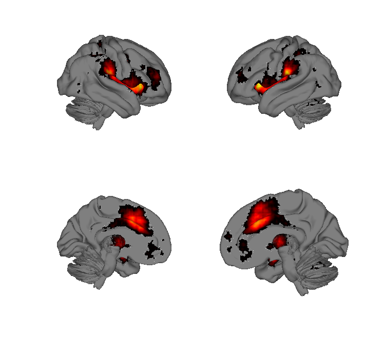
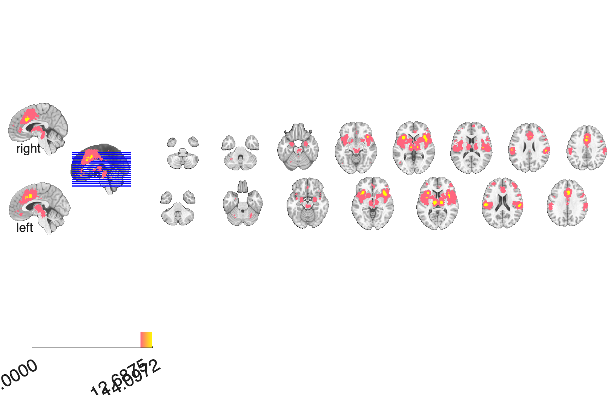

# Neurosynth 100-topic maps (v4 / v5)

## Overview

The **100-topic Neurosynth maps** (LDA topic model run v4 on the
Neurosynth 12-2015 abstract corpus, with a CANlab v5 visualisation
update). Each topic is provided in **two complementary forms**:

- **`pAgF`** — *probability of Activation given Feature* (forward inference)
- **`pFgA`** — *probability of Feature given Activation* (reverse inference)

Both are FDR q<0.01 thresholded z-maps. Together they support a wide
range of meta-analytic comparisons, including topic-based annotation of
user-supplied brain maps. The folder ships 50 topics × 2 = ~100 NIfTI
files in MNI space, plus combined CANlab `fmri_data` objects
(`neurosynth_topics_v4.mat`, `v5.mat`) and an LLM-derived topic label
file (`GPT5_labels.csv`).

**Primary reference.** Yarkoni, T., Poldrack, R. A., Nichols, T. E.,
Van Essen, D. C., & Wager, T. D. (2011). *Large-scale automated
synthesis of human functional neuroimaging data.* **Nature Methods,
8**(8), 665–670.
[doi:10.1038/nmeth.1635](https://doi.org/10.1038/nmeth.1635)
(open access via [PubMed Central](https://www.ncbi.nlm.nih.gov/pmc/articles/PMC3146590/))

The LDA 100-topic model itself is described in the
[Neurosynth documentation](https://neurosynth.org/decode/) — these are
the `v4-topics-100` set.

## Key images

| Pain topic — cortical surface | Pain topic — axial montage |
| --- | --- |
|  |  |

A representative LDA topic — topic 61 (*pain / painful / stimulation*),
forward-inference (pAgF) z-map. Surface / montage / isosurface
triplets for a curated subset of topics (cognitive control, working
memory, language, social/empathy, depression, PTSD, etc.) are also
in `png_images/`; produced by [`visualize_contents.m`](./visualize_contents.m).
To render additional topics, edit the script's `whichtopics` array.
`neurosynth_topics_v5_visualization.pptx` contains author-curated
slides.

## How to load

Registered in
[`load_image_set.m`](https://github.com/canlab/CanlabCore/blob/master/CanlabCore/Data_extraction/load_image_set.m)
under three keywords:

```matlab
% Forward inference (pAgF) topics:
[obj, ~, ~] = load_image_set('neurosynth_topics_forwardinference');
% Reverse inference (pFgA) topics:
[obj, ~, ~] = load_image_set('neurosynth_topics_reverseinference');
% First Neurosynth feature set (older single-feature maps):
[obj, ~, ~] = load_image_set('neurosynth');
```

The combined `.mat` objects are pre-built `fmri_data` objects with all
50 topics in one stack and a `metadata_table` that maps `Topic name`
to columns. Load directly:

```matlab
S = load(which('neurosynth_topics_v4.mat'));
S.topic_obj_forwardinference                % .image_names, .metadata_table
```

To annotate a new map with its top Neurosynth topic, use the
CanlabCore helper:

```matlab
new_data = fmri_data('my_contrast.nii');
[~, topics] = neurosynth_feature_labels(new_data, 'topics_ri');
disp(topics{1}.Term_or_Topic_highest(1:5));
```

## File inventory

| File pattern | Count | What it is |
| --- | --- | --- |
| `v4-topics-100_<id>_<terms>_pAgF_z_FDR_0.01.nii.gz` | 50 | Forward-inference topic maps (FDR q<0.01). |
| `v4-topics-100_<id>_<terms>_pFgA_z_FDR_0.01.nii.gz` | 50 | Reverse-inference topic maps. |
| `neurosynth_topics_v4.mat` | 1 | Combined `fmri_data` + metadata, v4 build. |
| `neurosynth_topics_v5.mat` | 1 | Same with updated v5 metadata / labels. |
| `neurosynth_topics_v4_FI_21_factors.mat` | 1 | 21-factor reduction of the topic forward-inference set. |
| `Neurosynth_Topics_v4-topics-100.csv` | 1 | Per-topic term lists (v4). |
| `GPT5_labels.csv` | 1 | LLM-generated short labels for the 50 topics (Nov 2025). |
| `words.csv` | 1 | Aggregate word-frequency table for the topics. |
| `neurosynth_topics_v5_visualization.pptx` | 1 | Author-curated slide deck. |
| `neurosynth_topics_clusters.m` | 1 | Builds topic clusters and saves them. |
| `neurosynth_topics_prep_factor_maps.mlx` | 1 | Live-script that prepares factor maps from the topics. |
| `Prep_v4_v5_Neurosynth_Topics.mlx` | 1 | Live-script comparing v4 and v5 builds. |
| `visualize_contents.m` | 1 | Generates `png_images/`. |

## Citations

- Yarkoni T, Poldrack RA, Nichols TE, Van Essen DC, Wager TD (2011).
  Large-scale automated synthesis of human functional neuroimaging
  data. *Nat Methods* 8:665–670.
  [doi:10.1038/nmeth.1635](https://doi.org/10.1038/nmeth.1635)
- Neurosynth: [neurosynth.org](https://neurosynth.org) (see also
  [github.com/neurosynth/neurosynth-data](https://github.com/neurosynth/neurosynth-data)
  for the underlying corpus and topic model files).
