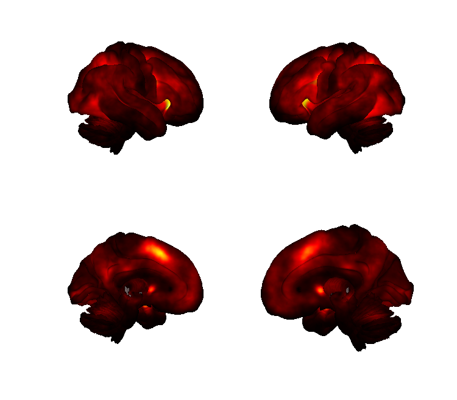
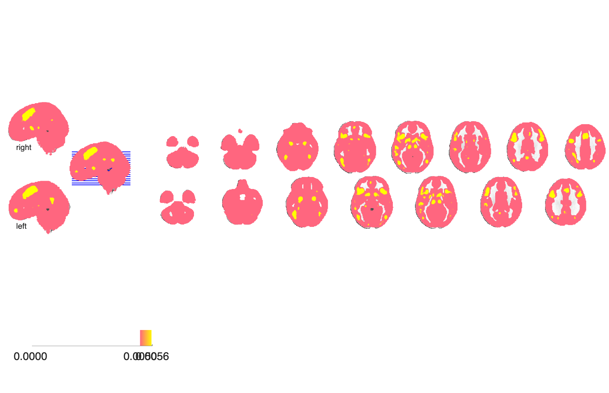

# MKDA outputs over the Neurosynth corpus

## Overview

CANlab **Multilevel Kernel Density Analysis (MKDA)** intermediate
outputs computed over the Neurosynth coordinate corpus. MKDA convolves
each study's reported peak coordinates with an indicator kernel and
aggregates across studies to obtain a voxel-wise activation-proportion
map (and inference structures for permutation testing). The folder
holds the CANlab MKDA `SETUP` / `MC_Info` MAT-files plus a single
summary `Activation_proportion` image; these are produced by
`Neurosynth_maps/scripts/ns_matlab_prep_MKDA.m` as part of the
Neurosynth build pipeline and are reused by other CANlab analyses
(co-activation, seed maps, etc.).

## Primary reference

Derived from the [Neurosynth](https://neurosynth.org) coordinate
database as part of the CANlab build pipeline; the MKDA method itself
is:

- Wager, T. D., Lindquist, M., & Kaplan, L. (2007). *Meta-analysis of
  functional neuroimaging data: Current and future directions.*
  **Social Cognitive and Affective Neuroscience, 2**(2), 150–158.
  [doi:10.1093/scan/nsm015](https://doi.org/10.1093/scan/nsm015)
- Wager, T. D., Lindquist, M. A., Nichols, T. E., Kober, H., & Van
  Snellenberg, J. X. (2009). *Evaluating the consistency and
  specificity of neuroimaging data using meta-analysis.*
  **NeuroImage, 45**(1, Suppl.), S210–S221.
  [doi:10.1016/j.neuroimage.2008.10.061](https://doi.org/10.1016/j.neuroimage.2008.10.061)

For the underlying corpus see Yarkoni et al. 2011 *Nat Methods*
(linked from `../2016_Neurosynth_100_topics/contents_description.md`).

## Key images

| Cortical surface | Axial montage |
| --- | --- |
|  |  |

The MKDA-summary `Activation_proportion` map — the voxel-wise
proportion of Neurosynth studies reporting activation at each
location. The matching isosurface is in
`png_images/Neurosynth_MKDA_Activation_proportion_isosurface.png`;
rendered by [`visualize_contents.m`](./visualize_contents.m).

## How to load

Not in `load_image_set`. Load the summary image directly:

```matlab
ap = fmri_data(which('Activation_proportion.img'));
```

The `.mat` files are CANlab MKDA structures and are intended to be
consumed by CANlab MKDA helpers (`Meta_Activation_FWE`, `Meta_Setup`,
permutation-test runners). For example:

```matlab
load(which('SETUP.mat'));      % SETUP struct
load(which('MC_Info.mat'));    % Monte-Carlo permutation info
```

## File inventory

| File | Type | What it is |
| --- | --- | --- |
| `Activation_proportion.img` / `.hdr` | Analyze | Voxel-wise proportion of Neurosynth studies reporting activation. |
| `SETUP.mat` | MAT | CANlab MKDA SETUP structure (study list, kernels, contrasts). |
| `MC_Info.mat` | MAT | Monte-Carlo / permutation info used for FWE inference. |
| `visualize_contents.m` | MATLAB | Renders the activation-proportion map to `png_images/`. |

## Citations

- Wager TD, Lindquist M, Kaplan L (2007). Meta-analysis of functional
  neuroimaging data. *SCAN* 2:150–158.
  [doi:10.1093/scan/nsm015](https://doi.org/10.1093/scan/nsm015)
- Wager TD, Lindquist MA, Nichols TE, Kober H, Van Snellenberg JX
  (2009). Evaluating the consistency and specificity of neuroimaging
  data using meta-analysis. *NeuroImage* 45:S210–S221.
  [doi:10.1016/j.neuroimage.2008.10.061](https://doi.org/10.1016/j.neuroimage.2008.10.061)
- Yarkoni T, Poldrack RA, Nichols TE, Van Essen DC, Wager TD (2011).
  Large-scale automated synthesis of human functional neuroimaging
  data. *Nat Methods* 8:665–670.
  [doi:10.1038/nmeth.1635](https://doi.org/10.1038/nmeth.1635)
