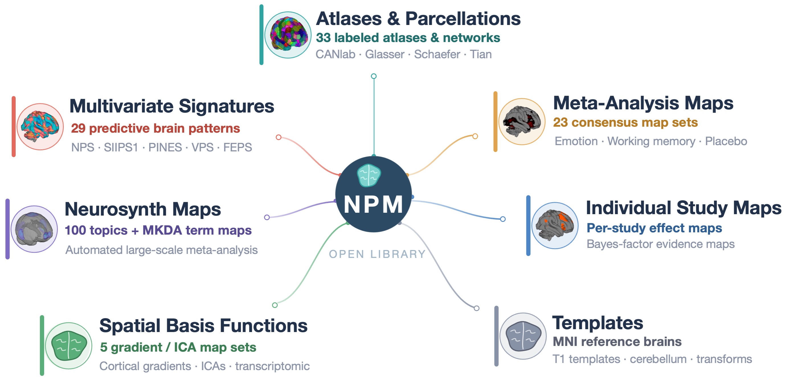
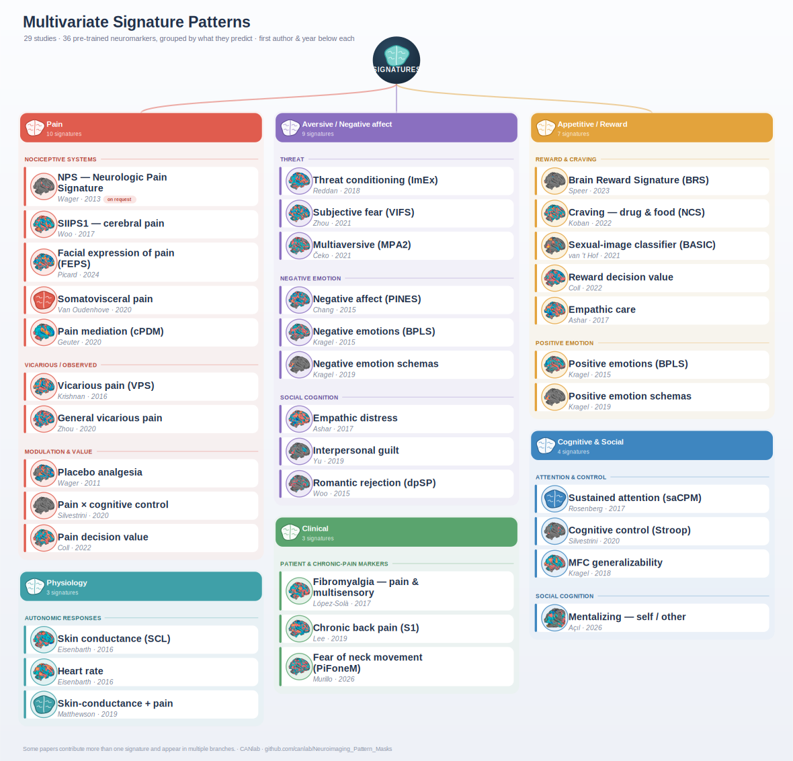

# Neuroimaging_Pattern_Masks

This repository contains pre-defined brain "signatures" (multivariate predictive patterns), atlases of local regions and networks, and masks and regions derived from published meta-analyses of neuroimaging data. It includes a fairly comprehensive set of such resources developed by the Cognitive and Affective Neuorscience Lab (Tor Wager, PI) and our collaborators, and also includes some products from other groups shared publically or by permission from the creators. [Documentation is here](docs/README.md).  

  

The repository is organized into seven collections of brain maps and reference resources. This figure is a fully editable vector graphic — open [`docs/npm_repository_overview.svg`](docs/npm_repository_overview.svg) directly in PowerPoint or Illustrator.

Some of these resources are used in other toolboxes, particularly <a href = "https://github.com/canlab/CanlabCore">Canlab Core Tools</a> and the CANlab’s <a href = "https://github.com/canlab/CANlab_help_examples">Help Examples and Batch Scripts</a> repository. They are also very useful when doing interactive analysis with the CAN lab's object-oriented neuroimaging toolbox, <a href = "https://github.com/canlab/CanlabCore">Canlab Core Tools</a>. 

The three types of brain maps included are:
- Pre-defined brain "signatures" (aka multivariate predictive patterns, brain biomarkers, or "neuromarkers") that can be applied to new individual participants to generate predictions and validate predictive models. Most CANlab signatures are publically available and can be downloaded here. A few, the Neurologic Pain Signature (NPS) and fibromyalgia-predictive patterns, are available for research use upon request (contact Prof. Tor Wager). 

- Atlases with pre-defined brain parcels (regions) and networks. This can reduce brain space to a smaller set of (hopefully) meaningful units of analysis. These are saved as Analyze (.img) or NIFTI (.nii) files, and also as "atlas"-type objects, an object type defined in <a href = "https://github.com/canlab/CanlabCore">Canlab Core Tools</a> that facilitates working with brain atlases.

- Brain maps from published meta-analyses of neuroimaging data, which define consensus regions across studies for multiple psychological/task categories -- e.g., emotion, working memory, PTSD, and more. These masks can be used to specify a priori regions of interest or as "patterns of interest" in new studies.

Multivariate signatures at a glance:
------------------------------------------------------------
The pre-trained signatures span six domains — **pain**, **physiology**, **aversive / negative affect**, **appetitive / reward**, **cognitive & social**, and **clinical** — each broken into finer sub-branches. Several papers contribute more than one signature and appear in multiple branches. The full list, with citations and loading keywords, is in the [signatures README](Multivariate_signature_patterns/README.md).

  

Editable vector source: [`docs/multivariate_signature_taxonomy.svg`](docs/multivariate_signature_taxonomy.svg).

Getting help and additional information:
------------------------------------------------------------
We have several sources of documentation for this repository. 
See [the online documentation for each map set](docs/README.md).

[This website](https://sites.google.com/dartmouth.edu/canlab-brainpatterns/home) is older but may also be useful.

1.  You can use any software to load, view, and apply the models. We have an object-oriented Matlab toolbox that makes it easy to load and apply the models. For the philosophy behind the  object-oriented toolbox and code walkthroughs in Matlab, see canlab.github.io. For function-by-function help documents on the Core Tools objects and functions, see the <a href = http://canlabcore.readthedocs.org/en/latest/>help pages on Readthedocs</a>. The code to create the walkthroughs, and a batch script system that uses the CanlabCore object-oriented tools for second-level neuroimaging analysis, is here: <a href='https://github.com/canlab/CANlab_help_examples'>CANlab_help_examples github repository</a>

2. The CANlab website is https://sites.google.com/dartmouth.edu/, and information on analysis toolboxes, repositories, etc. is at <a href='https://canlab.github.io'>canlab.github.io</a>.  For more information on fMRI analysis generally, see <a href = "https://leanpub.com/principlesoffmri">Martin and Tor's online book</a> and our free Coursera videos and classes <a href = "https://www.coursera.org/learn/functional-mri">Principles of fMRI Part 1</a> and <a href = "https://www.coursera.org/learn/functional-mri-2">Part 2 </a>.

Dependencies: These tools are not required to use the image files, but are helpful for viewing and analyzing them
------------------------------------------------------------
Matlab www.mathworks.com

<recommended> Matlab statistics toolbox
  
<recommended> Matlab signal processing toolbox
  
<recommended> Statistical Parametric Mapping (SPM) software https://www.fil.ion.ucl.ac.uk/spm/

<recommended> the CANlab Core Tools repository https://github.com/canlab/CanlabCore
  
Want to contribute? Please get in touch
------------------------------------------------------------  
Most of the maps/models come from our lab, but some are those that other groups have agreed to share and which we find particularly useful. We'd love to grow the collection, so if you want to contribute an atlas, meta-analysis results, or multivariate model, please get in touch! 
