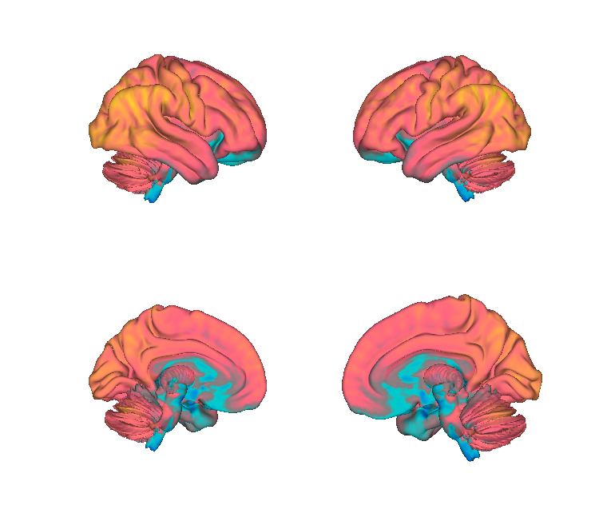

# HCP PTN1200 group-ICA spatial maps

## Overview

**Group-ICA spatial maps** from the Human Connectome Project (HCP)
PTN1200 resting-state release, distributed at three model orders —
**d = 15, 25, and 50** independent components — in both CIFTI
grayordinate (`.dscalar.nii`) and volumetric NIfTI (`.nii.gz`) forms.
These are the off-the-shelf group ICAs computed across 1003 healthy
adults on MSMAll-aligned dense resting-state data; they are useful as
a parsimonious spatial basis for resting-state network analyses and
as templates for dual-regression-style decompositions in new datasets.

> See [`README.md`](./README.md) for the authoritative methods notes,
> including the caveat that these are **standard dual-regression**
> components, not the iterated-weighted-dual-regression maps that
> Glasser et al. use for functional alignment. Higher-d ICAs (100,
> 200, 300) are not included locally and can be downloaded from the
> HCP S3 bucket.

**Primary reference.** Smith, S. M., Beckmann, C. F., Andersson, J.,
Auerbach, E. J., Bijsterbosch, J., Douaud, G., Duff, E., Feinberg,
D. A., Griffanti, L., Harms, M. P., Kelly, M., Laumann, T., Miller,
K. L., Moeller, S., Petersen, S., Power, J., Salimi-Khorshidi, G.,
Snyder, A. Z., Vu, A. T., Woolrich, M. W., Xu, J., Yacoub, E.,
Uğurbil, K., Van Essen, D. C., Glasser, M. F., & WU-Minn HCP
Consortium. (2013). *Resting-state fMRI in the Human Connectome
Project.* **NeuroImage, 80**, 144–168.
[doi:10.1016/j.neuroimage.2013.05.039](https://doi.org/10.1016/j.neuroimage.2013.05.039)

Release notes:
[HCP1200 Dense Connectome PTN Appendix (July 2017)](https://www.humanconnectome.org/storage/app/media/documentation/s1200/HCP1200-DenseConnectome+PTN+Appendix-July2017.pdf).

## Key images

| Cortical surface (d=25) | Axial montage (d=25) |
| --- | --- |
|  |  |

The 25-component HCP group ICA stack. Renderings for the d=15 and
d=50 model orders, plus matching isosurfaces, are also in
`png_images/`; produced by
[`visualize_contents.m`](./visualize_contents.m). The dscalar
versions are best viewed in
[Connectome Workbench](https://www.humanconnectome.org/software/get-connectome-workbench)
on a 32k_fs_LR surface.

## How to load

Not registered in `load_image_set`. Load the volumetric versions
directly with CanlabCore:

```matlab
ic15 = fmri_data(which('hcp_d15_ICs.nii.gz'));   % 15-IC stack
ic25 = fmri_data(which('hcp_d25_ICs.nii.gz'));
ic50 = fmri_data(which('hcp_d50_ICs.nii.gz'));
```

For CIFTI handling:

```matlab
cii = cifti_read(which('hcp_d50_ICs.dscalar.nii'));
% cii.cdata is grayordinates x 50
```

## File inventory

| File | Type | What it is |
| --- | --- | --- |
| `hcp_d15_ICs.dscalar.nii` | CIFTI | 15 group ICs on HCP 91k grayordinates. |
| `hcp_d15_ICs.nii.gz` | NIfTI | Same components, volumetric (subcortex + projected cortex). |
| `hcp_d25_ICs.dscalar.nii` | CIFTI | 25 group ICs, grayordinate. |
| `hcp_d25_ICs.nii.gz` | NIfTI | 25 group ICs, volumetric. |
| `hcp_d50_ICs.dscalar.nii` | CIFTI | 50 group ICs, grayordinate. |
| `hcp_d50_ICs.nii.gz` | NIfTI | 50 group ICs, volumetric. |
| `README.md` | Markdown | Methods notes (B. Petre, 11/14/2024). |
| `visualize_contents.m` | MATLAB | Generates `png_images/`. |

## Citations

- Smith SM, Beckmann CF, Andersson J, et al. (2013). Resting-state
  fMRI in the Human Connectome Project. *NeuroImage* 80:144–168.
  [doi:10.1016/j.neuroimage.2013.05.039](https://doi.org/10.1016/j.neuroimage.2013.05.039)
- Beckmann CF, Smith SM (2004). Probabilistic independent component
  analysis for functional magnetic resonance imaging. *IEEE Trans Med
  Imaging* 23:137–152.
  [doi:10.1109/TMI.2003.822821](https://doi.org/10.1109/TMI.2003.822821)
- Glasser MF, Smith SM, Marcus DS, et al. (2016). The Human
  Connectome Project's neuroimaging approach. *Nat Neurosci*
  19:1175–1187.
  [doi:10.1038/nn.4361](https://doi.org/10.1038/nn.4361)
