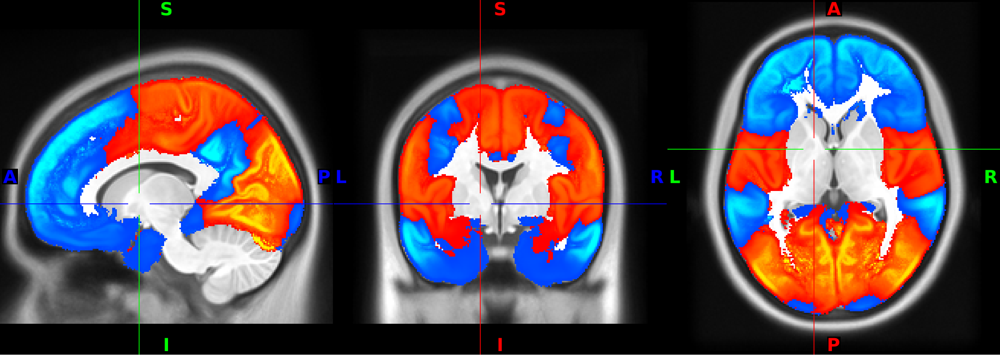
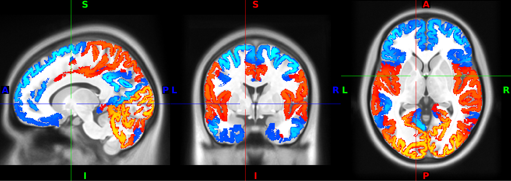

### Principal Gradient of Cortical organization

The gradient included here is from the Margulies et al. 2016 PNAS paper. This
paper provided several gradients of cortical organization, the first of which
is supposed to correspond to Marcel Mesulem's unimodal to transmodal division.

Margulies et al also discuss additional functional gradients of significance,
but I have not been able to find public versions of them. Their existence
though makes this a spatial basis function though, because they're all
orthogonal.

### Methods

This gradient was published in surface format. I (BP) projected it back to
volumetric space using registration fusion (Wu et al. 2018 Human Brain 
Mapping). To achieve this I combined subject specific transformations from
88 BMRK5 participants, 208 unrelated PainGen participants and 112 SpaceTop 
participants. I then averaged the resulting maps balancing across studies (so 
that each study contributes 1/3 even though they have different sample sizes). 
Surface models and native space to template volumetric alignments were 
estimated by running fmriprep 20.2.3 (BMRK5, PainGen) or 21.0.2 (SpaceTop) on 
subject data. Linear interpolation was used for native to template space 
volumetric transforms and nnfr (forward and reverse nearest neighbor) was 
used for fsaverage6 to subject specific surface transformations.

When averaging data within voxel each voxel was divided by the number of 
participants with non-zero data at that voxel, not the total number of 
participants. This is to avoid confounding gradient loading values with tissue 
class probabilities. It's not a perfect solution. If you look at the gradient
maps you'll see that you can still make out the cortical folding patterns with
the naked eye. 

This may be due to partial voluming effects around tissue boundaries. For
instance, consider the figure below where you can see that the cortical width
of is homogeneous intensity but is wrapped at the tissue boundaries by a 
lower intensity voxel that may be a partial volume. 

At any rate the tissue boundary effect is less pronounced than were I to have
simply taken the naive average. It may make sense to smooth these maps with
a standard group-analysis smoothing kernel (e.g. 6mm).

If you want corresponding tissue probabilities you can get them by a 
conjunction of canlab2024 or glasser volumetric parcels, which used the same 
source data for their registration fusion based projections to volumetric 
space. This could be useful after a smoothing operation to erode bleedover 
of the maps into whitematter and extra-cerebral space.
