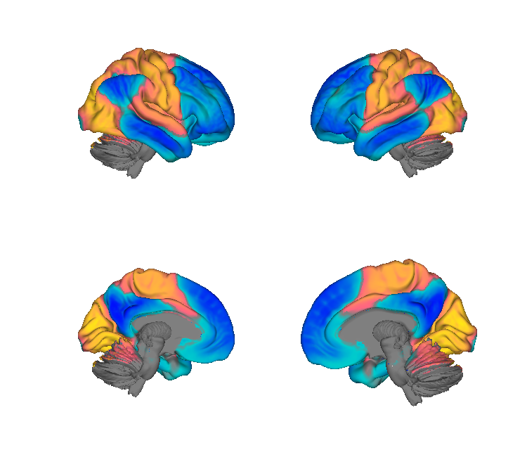

# Margulies principal cortical gradient (Margulies et al. 2016)

## Overview

The **first principal gradient** of cortical functional organisation
from Margulies et al. 2016 *PNAS* — a continuous unimodal-to-transmodal
axis (sensory/motor at one pole, default-mode network at the other) that
recapitulates Mesulam's classical hierarchical scheme. Distributed here
as a **volumetric** projection of the gradient in two MNI templates,
built from the original surface gradient using **registration fusion**
(Wu et al. 2018 HBM) across 408 CANlab participants (88 BMRK5, 208
PainGen, 112 SpaceTop).

> See [`README.md`](./README.md) for the authoritative methods write-up,
> including caveats about partial-volume bleed-over at tissue boundaries
> and a recommended thresholding recipe using `canlab2024` tissue
> probabilities.

**Primary reference.** Margulies, D. S., Ghosh, S. S., Goulas, A.,
Falkiewicz, M., Huntenburg, J. M., Langs, G., Bezgin, G., Eickhoff, S. B.,
Castellanos, F. X., Petrides, M., Jefferies, E., & Smallwood, J. (2016).
*Situating the default-mode network along a principal gradient of
macroscale cortical organization.* **PNAS, 113**(44), 12574–12579.
[doi:10.1073/pnas.1608282113](https://doi.org/10.1073/pnas.1608282113)
(open access via [PubMed Central](https://www.ncbi.nlm.nih.gov/pmc/articles/PMC5098630/))

PDF not yet checked in — fetch from the DOI above.

## Key images

| MNI152NLin6Asym (FSL) | MNI152NLin2009cAsym (fmriprep) |
| --- | --- |
|  |  |

The classic unimodal-to-transmodal gradient — sensorimotor /
early-visual cool, default-mode and association warm. Rendered by
[`visualize_contents.m`](./visualize_contents.m); matching montages
and isosurfaces are also in `png_images/`. Diagnostic figures
(`extras/MNI152NLin6Asym_slice.png`, `extras/example_segmentation.png`)
are referenced in the README.

## How to load

Registered in
[`load_image_set.m`](https://github.com/canlab/CanlabCore/blob/master/CanlabCore/Data_extraction/load_image_set.m)
under keywords `'marg'` / `'transmodal'` / `'principalgradient'`
(fmriprep / MNI152NLin2009cAsym) and `'margfsl'`
(FSL / MNI152NLin6Asym):

```matlab
[grad_obj, ~, ~] = load_image_set('marg');       % MNI152NLin2009cAsym
[grad_obj, ~, ~] = load_image_set('margfsl');    % MNI152NLin6Asym
```

Or load directly:

```matlab
grad1 = fmri_data(which('MNI152NLin6Asym_margulies_grad1.nii.gz'));
```

The README recommends masking by `canlab2024` grey-matter to suppress
partial-volume bleed-over before downstream use:

```matlab
canlab2024 = load_atlas('canlab2024_fsl6_1mm');
gray = canlab2024.threshold(0.2);
gray.dat(gray.dat ~= 0) = 1;
grad1 = apply_mask(grad1, fmri_mask_image(gray));
```

## File inventory

| File | Type | What it is |
| --- | --- | --- |
| `MNI152NLin2009cAsym_margulies_grad1.nii.gz` | NIfTI | **Volumetric principal gradient** in fmriprep default space. `load_image_set('marg')`. |
| `MNI152NLin6Asym_margulies_grad1.nii.gz` | NIfTI | Same gradient in FSL default space. `load_image_set('margfsl')`. |
| `extras/` | dir | Methods diagnostic figures referenced in `README.md`. |
| `README.md` | Markdown | Methods write-up and usage recipe. |
| `visualize_contents.m` | MATLAB | Generates `png_images/`. |

## Citations

- Margulies DS, Ghosh SS, Goulas A, et al. (2016). Situating the
  default-mode network along a principal gradient of macroscale
  cortical organization. *PNAS* 113:12574–12579.
  [doi:10.1073/pnas.1608282113](https://doi.org/10.1073/pnas.1608282113)
- Wu J, Ngo GH, Greve D, Li J, He T, Fischl B, Eickhoff SB, Yeo TT
  (2018). Accurate nonlinear mapping between MNI volumetric and
  FreeSurfer surface coordinate systems. *Hum Brain Mapp* 39:3793–3808.
  [doi:10.1002/hbm.24213](https://doi.org/10.1002/hbm.24213)
