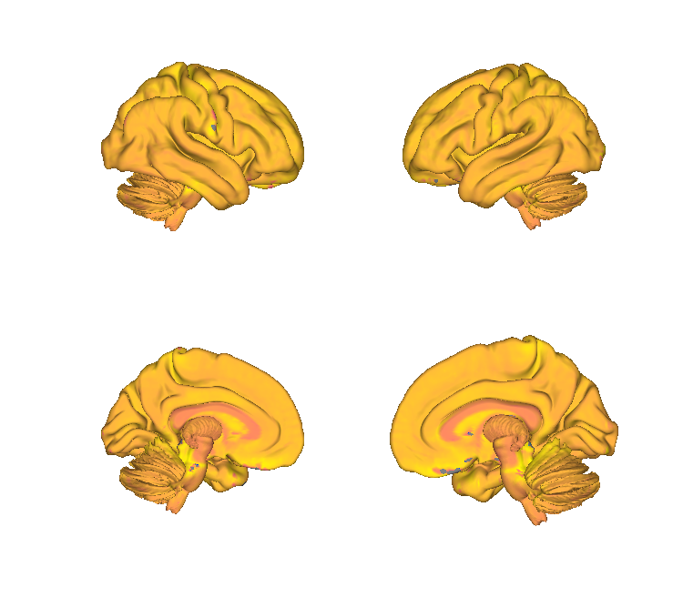
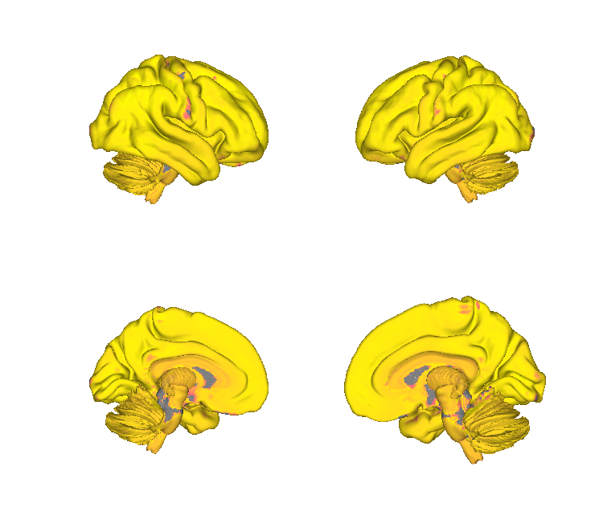
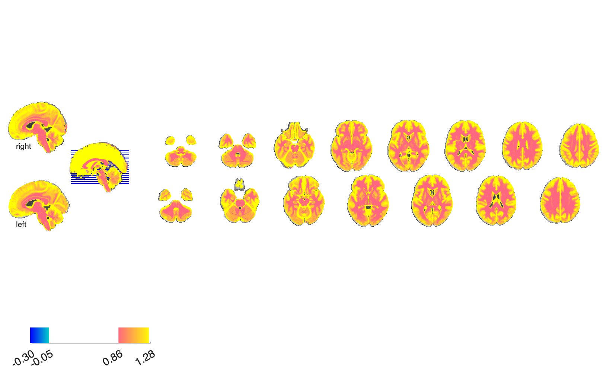
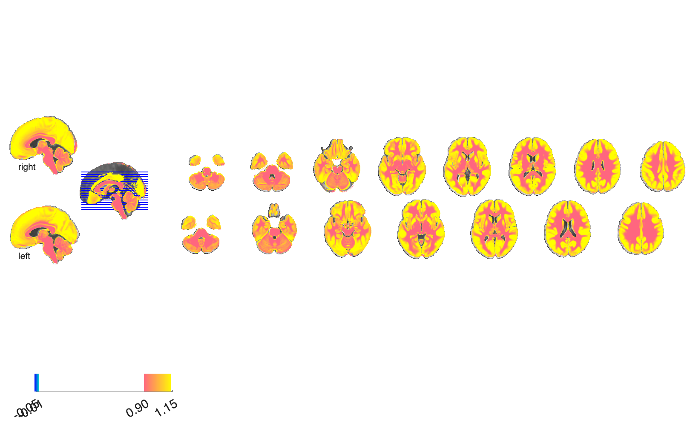

# Mitochondrial pathway maps (Mosharov / Picard 2025)

## Overview

Six whole-brain **mitochondrial pathway maps** from Mosharov, Rosenberg,
Monzel et al. (2025) *Nature* — the first molecular-scale, voxel-level
characterisation of mitochondrial respiratory-chain and biogenesis
proteins across the human brain. Each map quantifies the regional
density / activity of a key component of oxidative phosphorylation
machinery, in MNI space, suitable for spatial-correlation analyses
against functional, transcriptomic, or connectivity maps.

- **CI / CII / CIV** — respiratory chain complexes I, II, IV
- **MitoD** — mitochondrial density
- **MRC** — mitochondrial respiratory capacity (composite)
- **TRC** — total respiratory chain content

A combined CANlab `fmri_data` object (`mito_maps.mat`) bundles all six
maps with metadata for one-line loading.

**Primary reference.** Mosharov, E. V., Rosenberg, A. M., Monzel,
A. S., Osto, C. A., Stiles, L., Rosoklija, G. B., Dwork, A. J., Bindra,
S., Junker, A., Zhang, Y., Fujita, M., Mariani, M. B., Bakalian, M.,
Sulzer, D., De Jager, P. L., Menon, V., Shirihai, O. S., Mann, J. J.,
Underwood, M. D., Boldrini, M., Argyrou, L., & Picard, M. (2025).
*A human brain map of mitochondrial respiratory capacity and diversity.*
**Nature** (advance online publication).
[doi:10.1038/s41586-025-09455-4](https://doi.org/10.1038/s41586-025-09455-4)
· [local PDF](./Mosharov_2025_Nature.pdf)

The folder also ships an exploratory live-script in `scripts/` that
walks through the six maps and demonstrates basic spatial-similarity
analyses.

## Key images

| Mitochondrial Respiratory Capacity (MRC) | Mitochondrial Density (MitoD) |
| --- | --- |
|  |  |
|  |  |

Two representative pathway maps. The remaining four — CI, CII, CIV,
TRC — and matching isosurfaces are also in `png_images/`; produced by
[`visualize_contents.m`](./visualize_contents.m).

## How to load

Not (yet) registered in `load_image_set`. Load the combined object:

```matlab
S = load(which('mito_maps.mat'));   % loads an fmri_data object
```

Or load individual maps directly:

```matlab
ci     = fmri_data(which('CI.nii.gz'));
cii    = fmri_data(which('CII.nii.gz'));
civ    = fmri_data(which('CIV.nii.gz'));
mitod  = fmri_data(which('MitoD.nii.gz'));
mrc    = fmri_data(which('MRC.nii.gz'));
trc    = fmri_data(which('TRC.nii.gz'));
```

## File inventory

| File | Type | What it is |
| --- | --- | --- |
| `CI.nii.gz` | NIfTI | Respiratory chain Complex I density / activity. |
| `CII.nii.gz` | NIfTI | Respiratory chain Complex II. |
| `CIV.nii.gz` | NIfTI | Respiratory chain Complex IV. |
| `MitoD.nii.gz` | NIfTI | Mitochondrial density. |
| `MRC.nii.gz` | NIfTI | Mitochondrial respiratory capacity (composite). |
| `TRC.nii.gz` | NIfTI | Total respiratory chain content. |
| `mito_maps.mat` | MAT | Combined `fmri_data` object stacking all 6 maps. |
| `Mosharov_2025_Nature.pdf` | PDF | Primary reference. |
| `scripts/` | dir | Exploratory live-script(s). |
| `visualize_contents.m` | MATLAB | Generates `png_images/`. |

## Citations

- Mosharov EV, Rosenberg AM, Monzel AS, et al. (2025). A human brain
  map of mitochondrial respiratory capacity and diversity. *Nature*.
  [doi:10.1038/s41586-025-09455-4](https://doi.org/10.1038/s41586-025-09455-4)
- Picard M, McEwen BS (2018). Psychological stress and
  mitochondria: A conceptual framework. *Psychosom Med* 80:126–140.
  [doi:10.1097/PSY.0000000000000544](https://doi.org/10.1097/PSY.0000000000000544)
