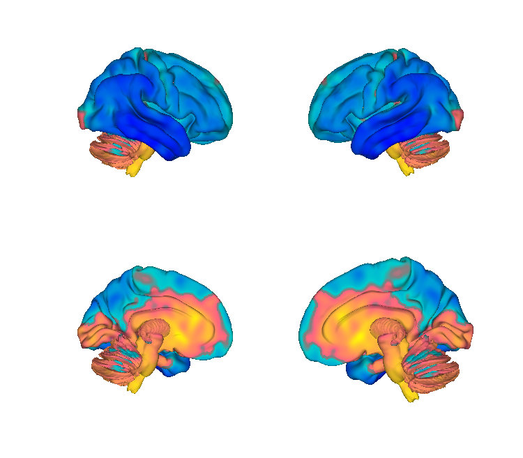

# Transcriptomic gradients (Allen Human Brain Atlas)

## Overview

The **first three principal gradients of transcriptomic variation**
across the cortex and subcortex, computed in Euclidean space from the
six post-mortem brains of the Allen Human Brain Atlas (AHBA). These
three spatial axes capture the directions along which gene expression
varies most strongly — interpreted by Vogel et al. (2024) as candidate
axes of morphogen diffusion during development, and offering an
objective whole-brain orientation that is independent of cytoarchitecture
or function. Distributed here in two MNI templates plus a CIFTI
grayordinate version produced via registration fusion.

> See [`README.md`](./README.md) for the authoritative methods write-up,
> including the source-template ambiguity in the AHBA coordinates, the
> 6 mm smoothing kernel applied to absorb that uncertainty, and the
> CIFTI registration-fusion construction.

**Primary reference.** Vogel, J. W., Alexander-Bloch, A. F., Wagstyl,
K., Bertolero, M. A., Markello, R. D., Pines, A., Sydnor, V. J.,
Diaz-Papkovich, A., Hansen, J. Y., Evans, A. C., Bernhardt, B.,
Misic, B., Satterthwaite, T. D., & Seidlitz, J. (2024).
*Deciphering the functional specialization of whole-brain
spatiomolecular gradients in the adult brain.* **PNAS, 121**(23),
e2219137121.
[doi:10.1073/pnas.2219137121](https://doi.org/10.1073/pnas.2219137121)

The underlying transcriptomic atlas is from Hawrylycz et al. 2012
*Nature* (see Citations). Construction code is in
[`create_gradients.py`](./create_gradients.py); the upstream pipeline
lives at
[PennLINC/Vogel_PLS_Tx-Space](https://github.com/PennLINC/Vogel_PLS_Tx-Space).

## Key images

| Cortical surface (MNI152NLin2009cSym) | Axial montage (MNI152NLin2009cSym) |
| --- | --- |
|  |  |

The three principal transcriptomic gradients in fmriprep space. The
matching MNI152NLin6Asym (FSL-space) and isosurface renderings are
also in `png_images/`; produced by
[`visualize_contents.m`](./visualize_contents.m). The CIFTI version
is best viewed in
[Connectome Workbench](https://www.humanconnectome.org/software/get-connectome-workbench).

## How to load

Registered in
[`load_image_set.m`](https://github.com/canlab/CanlabCore/blob/master/CanlabCore/Data_extraction/load_image_set.m)
under the keyword `'transcriptomic_gradients'`:

```matlab
[grad_obj, ~, ~] = load_image_set('transcriptomic_gradients');
```

Or load a specific template directly:

```matlab
% FSL / MNI152NLin6Asym
g_fsl  = fmri_data(which('transcriptomic_gradients_MNI152NLin6Asym.nii.gz'));
% fmriprep / MNI152NLin2009cSym
g_fmp  = fmri_data(which('transcriptomic_gradients_MNI152NLin2009cSym.nii.gz'));
% CIFTI / 91k grayordinates
cii    = cifti_read(which('transcriptomic_gradients.dscalar.nii'));
```

Each 4D NIfTI holds three volumes — gradient 1, 2, 3 — in that order.

## File inventory

| File | Type | What it is |
| --- | --- | --- |
| `transcriptomic_gradients_MNI152NLin6Asym.nii.gz` | NIfTI 4D | First 3 AHBA expression gradients in FSL/MNI152NLin6Asym space. |
| `transcriptomic_gradients_MNI152NLin2009cSym.nii.gz` | NIfTI 4D | Same gradients in fmriprep/MNI152NLin2009cSym space. |
| `transcriptomic_gradients.dscalar.nii` | CIFTI | Grayordinate version (registration fusion). |
| `create_gradients.py` | Python | Construction script, condensed from PennLINC's Vogel_PLS_Tx-Space. |
| `README.md` | Markdown | Methods write-up (B. Petre, 11/28/2024). |
| `visualize_contents.m` | MATLAB | Generates `png_images/`. |

## Citations

- Vogel JW, Alexander-Bloch AF, Wagstyl K, et al. (2024). Deciphering
  the functional specialization of whole-brain spatiomolecular
  gradients in the adult brain. *PNAS* 121:e2219137121.
  [doi:10.1073/pnas.2219137121](https://doi.org/10.1073/pnas.2219137121)
- Hawrylycz MJ, Lein ES, Guillozet-Bongaarts AL, et al. (2012). An
  anatomically comprehensive atlas of the adult human brain
  transcriptome. *Nature* 489:391–399.
  [doi:10.1038/nature11405](https://doi.org/10.1038/nature11405)
- Gorgolewski KJ, Fox AS, Chang L, et al. (2014). Tight fitting genes:
  finding relations between statistical maps and gene expression
  patterns. *OHBM* (poster +
  [neurovault scripts](https://github.com/NeuroVault/NeuroVault/blob/master/scripts/preparing_AHBA_data.py)).
- Markello RD, Arnatkeviciute A, Poline JB, Fulcher BD, Fornito A,
  Misic B (2021). Standardizing workflows in imaging transcriptomics
  with the abagen toolbox. *eLife* 10:e72129.
  [doi:10.7554/eLife.72129](https://doi.org/10.7554/eLife.72129)
